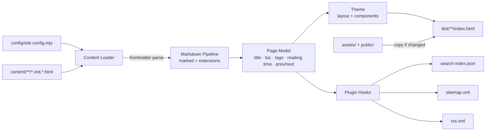
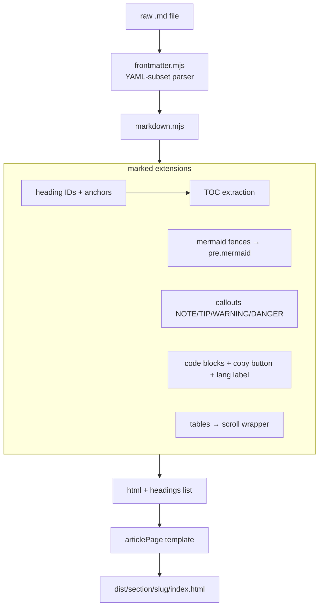
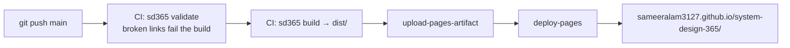

# sd365 — Architecture

`sd365` is the custom static site generator that powers System Design 365. It is
built from scratch on Node.js (zero npm dependencies — the only third-party code
is a vendored copy of the `marked` markdown parser) and turns the Markdown in
`content/` into the static site deployed to GitHub Pages.

## Why a custom SSG?

| Decision | Rationale | Trade-off accepted |
|---|---|---|
| Custom generator, no framework | Full control, no version churn, the generator is itself a teaching artifact for this repo | We maintain it ourselves |
| Zero npm dependencies | `git clone` → `node scripts/sd365.mjs build` just works; no lockfile drift, no supply-chain surface | No ecosystem plugins for free |
| Vendored `marked` (MIT, 90 KB) | CommonMark + GFM parsing is the one problem not worth re-solving | Vendored file must be bumped manually |
| Server-side rendering to plain HTML | SEO, instant first paint, works with JS disabled (search/mermaid degrade gracefully) | Interactivity is layered on with a small client runtime |
| Mermaid + highlight.js from CDN at runtime | Mermaid is ~2 MB — shipping it in the repo or rendering at build time isn't worth it | Diagrams need JS; pages still readable without it |
| Inline SVG icon set, no emoji | Emoji render differently per OS/font and carry no semantics; inline SVG inherits `currentColor` and font size, so icons stay optically aligned in both themes | Icons are hand-maintained in one module |
| Pretty URLs (`/case-studies/001-url-shortener/`) | Clean canonical URLs on GitHub Pages without server rewrites | One folder per page in `dist/` |

## Repository layout

```
system-design-365/
├── content/            # ALL site content — Markdown (+ raw HTML passthrough)
│   ├── case-studies/   #   001-…100 numbered case studies
│   ├── hld/  lld/      #   high/low-level design topics
│   ├── patterns/  trade-offs/  interview/  security/  glossary/  notes/
├── templates/          # Markdown scaffolds used by `sd365 new`
├── config/             # site.config.mjs — the single source of truth
├── generator/          # the SSG itself
│   ├── build.mjs       #   orchestrator
│   ├── serve.mjs       #   dev server (watch + rebuild)
│   ├── new.mjs         #   content scaffolding
│   ├── validate.mjs    #   content linting (links, frontmatter)
│   ├── lib/            #   frontmatter, markdown, content loader, icons, plugin runner
│   ├── theme/          #   layout + components + page templates (JS functions)
│   ├── plugins/        #   search-index, sitemap, rss, og-meta
│   └── vendor/         #   marked.esm.js (vendored)
├── assets/             # theme CSS + client JS + favicon (copied to dist)
├── public/             # static passthrough (robots.txt, .nojekyll)
├── scripts/sd365.mjs   # CLI entry point
└── dist/               # build output (gitignored, deployed by CI)
```

## Build pipeline



Every stage is a pure function over the page model, so the whole build is
deterministic: same input → byte-identical `dist/`. Files are only rewritten
when their content changes, which keeps watch-mode rebuilds (~50 ms for
110 pages) and CI deploys fast. The build also tracks every path it owns and
prunes anything else from `dist/`, so renamed or deleted content can't linger
as an orphaned page.

## Rendering pipeline (per page)



## Content model

Frontmatter is optional — every field degrades gracefully so a bare markdown
file (or a placeholder) still renders:

```yaml
---
title: Rate Limiter            # falls back to first heading, then filename
description: One-line summary  # falls back to first paragraph
tags: [redis, token-bucket]
difficulty: easy | medium | hard
author: Sameer Alam            # falls back to site author
created: 2026-07-28
updated: 2026-08-01
status: published | draft      # draft renders with a "planned" banner
references: []
---
```

Derived automatically: reading time (220 wpm), word count, numeric prefix
(`001-` → #001 ordering + badge), placeholder detection, prev/next links,
on-page TOC from `h2`/`h3`, search text.

## Plugin architecture

A plugin is one ES module in `generator/plugins/` with up to three hooks;
enable and order them via the `plugins` array in `config/site.config.mjs`:

```js
export default {
  name: "my-plugin",
  setup(ctx)        {},  // before rendering — may mutate ctx
  onPage(page, ctx) {},  // every page, before it is written
  onDone(ctx)       {},  // after rendering — ctx.emit(path, contents) extra files
};
```

`ctx` carries `{ config, sections, pages, outDir, emit }` — enough to build
search indexes, feeds, OG images, PDF exports, analytics manifests, etc.
Shipped plugins: `search-index`, `sitemap`, `rss`, `og-meta` (SEO lint).

## Client runtime (assets/js/app.js, ~7 KB)

No framework. Progressive enhancement on top of server-rendered HTML:

- **Search** — fetches `search-index.json` on first open; AND-semantics term
  scoring (exact title > title prefix > title > tags > body; unwritten pages
  demoted), section filter chips, `↑↓/↵` navigation, match highlighting.
- **Reading mode** — the sidebar collapses once the reader scrolls into an
  article, giving long-form content the full column width, and comes back at
  the top of the page. A manual toggle (topbar button or `\`) overrides it and
  is remembered in `localStorage`; set `theme.autoHideSidebar: false` in the
  config to disable the automatic behavior entirely.
- **Shortcuts** — `/` or `Ctrl/⌘-K` search · `\` sidebar · `[` `]` prev/next
  page · `t` theme · `Esc` close.
- **Theme** — light/dark/auto with a pre-paint `localStorage` read (no flash,
  and the same read restores the sidebar state); Mermaid re-renders and
  highlight.js restyles on toggle.
- **Diagrams** — Mermaid rendered client-side, click to zoom in an overlay.
- Reading-progress bar, TOC scrollspy (IntersectionObserver), copy-code buttons,
  mobile drawer navigation.

## Icons

`generator/lib/icons.mjs` is the single source of every glyph — 24×24 stroke
paths that inherit `currentColor`, plus the GitHub brand mark. Sections declare
an icon by name in `config/site.config.mjs` (`icon: "layers"`), callouts map
kinds to icons, and `icon(name, extraClass)` renders one. There are no emoji and
no icon font, so glyphs look identical across platforms and in both themes.

## Deployment



GitHub Pages must be set to **Source: GitHub Actions** (Settings → Pages).
`public/.nojekyll` disables Jekyll processing; `robots.txt` + generated
`sitemap.xml`/`rss.xml`/JSON-LD cover SEO.

## CLI

```
node scripts/sd365.mjs build                      # build into dist/
node scripts/sd365.mjs serve [port]               # dev server + watch (default :4365)
node scripts/sd365.mjs new case-studies "Title"   # scaffold next-numbered case study
node scripts/sd365.mjs validate                   # lint links + frontmatter (CI gate)
```

(or `npm run build|serve|validate`)

## Roadmap

- Versioned docs (`content@v2/` + version switcher in the topbar)
- i18n (`content/<lang>/` mirrors + `hreflang`)
- Build-time OG image generation (SVG → PNG per page)
- PDF export plugin (print-CSS driven)
- Interactive/animated architecture diagrams
- Content analytics (privacy-friendly, plugin-emitted manifest)
