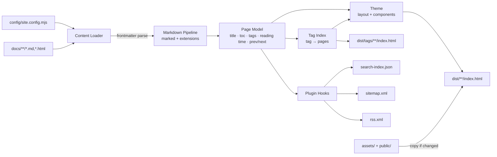
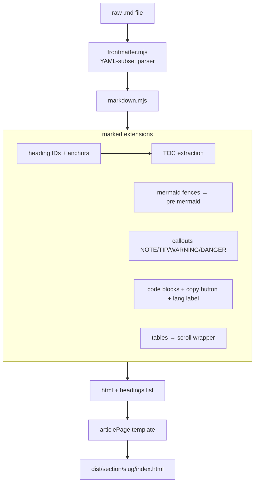
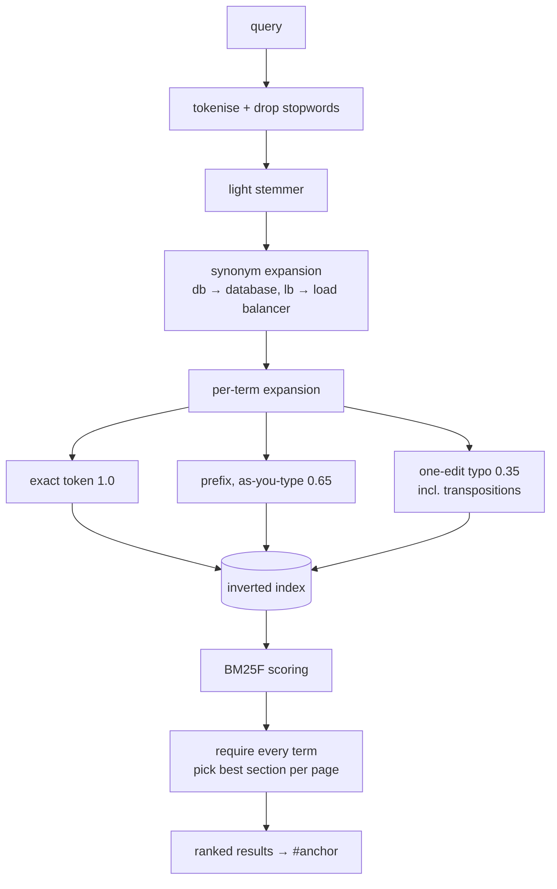
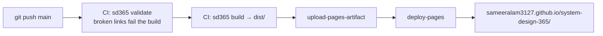

# sd365 — Architecture

`sd365` is the custom static site generator that powers System Design 365. It is
built from scratch on Node.js (zero npm dependencies — the only third-party code
is a vendored copy of the `marked` markdown parser) and turns the Markdown in
`docs/` into the static site deployed to GitHub Pages.

## Why a custom SSG?

| Decision | Rationale | Trade-off accepted |
|---|---|---|
| Custom generator, no framework | Full control, no version churn, the generator is itself a teaching artifact for this repo | We maintain it ourselves |
| Zero npm dependencies | `git clone` → `node scripts/sd365.mjs build` just works; no lockfile drift, no supply-chain surface | No ecosystem plugins for free |
| Vendored `marked` (MIT, 90 KB) | CommonMark + GFM parsing is the one problem not worth re-solving | Vendored file must be bumped manually |
| Server-side rendering to plain HTML | SEO, instant first paint, works with JS disabled (search/mermaid degrade gracefully) | Interactivity is layered on with a small client runtime |
| Mermaid + highlight.js from CDN, loaded per page | Mermaid alone is 3.3 MB, so it is requested only by the pages that actually contain a diagram (2 of 108 today) rather than by every visitor. Both are pinned with Subresource Integrity | Diagrams need JS; pages still readable without it |
| Inline SVG icon set, no emoji | Emoji render differently per OS/font and carry no semantics; inline SVG inherits `currentColor` and font size, so icons stay optically aligned in both themes | Icons are hand-maintained in one module |
| Pretty URLs (`/case-studies/001-url-shortener/`) | Clean canonical URLs on GitHub Pages without server rewrites | One folder per page in `dist/` |

## Repository layout

```
system-design-365/
├── docs/               # ALL site content — Markdown (+ raw HTML passthrough)
│   ├── case-studies/   #   001-…100 numbered case studies
│   ├── hld/  lld/      #   high/low-level design topics
│   ├── patterns/  trade-offs/  interview/  security/  glossary/  notes/
├── templates/          # Markdown scaffolds used by `sd365 new`
├── config/             # site.config.mjs — the single source of truth
├── generator/          # the SSG itself
│   ├── build.mjs       #   orchestrator
│   ├── serve.mjs       #   dev server (watch + rebuild)
│   ├── init.mjs        #   scaffold a brand-new site
│   ├── new.mjs         #   content scaffolding
│   ├── validate.mjs    #   content linting (links, frontmatter)
│   ├── doctor.mjs      #   config/setup diagnostics
│   ├── lib/            #   frontmatter, markdown, admonitions, emoji, tags,
│   │                   #   content loader, icons, cli output, plugin runner
│   ├── theme/          #   layout + components + page templates (JS functions)
│   ├── plugins/        #   search-index, sitemap, rss, og-meta, minify
│   └── vendor/         #   marked.esm.js (vendored)
├── assets/             # theme CSS + client JS + favicon (copied to dist)
├── public/             # static passthrough (robots.txt, .nojekyll)
├── scripts/sd365.mjs   # CLI entry point
└── dist/               # build output (gitignored, deployed by CI)
```

## Build pipeline



Every stage is a pure function over the page model, so the whole build is
deterministic: same input → byte-identical `dist/`. Files are only rewritten
when their content changes, which keeps watch-mode rebuilds (~50 ms for
110 pages) and CI deploys fast. The build also tracks every path it owns and
prunes anything else from `dist/`, so renamed or deleted content can't linger
as an orphaned page.

## Rendering pipeline (per page)



## Content model

Frontmatter is optional — every field degrades gracefully so a bare markdown
file (or a placeholder) still renders:

```yaml
---
title: Rate Limiter            # falls back to first heading, then filename
description: One-line summary  # falls back to first paragraph
tags: [redis, token-bucket]
difficulty: easy | medium | hard
author: Sameer Alam            # falls back to site author
created: 2026-07-28
updated: 2026-08-01
status: published | draft      # draft renders with a "planned" banner
references: []
---
```

Derived automatically: reading time (220 wpm), word count, numeric prefix
(`001-` → #001 ordering + badge), placeholder detection, prev/next links,
on-page TOC from `h2`/`h3`, search text.

## Plugin architecture

A plugin is one ES module in `generator/plugins/` with up to three hooks;
enable and order them via the `plugins` array in `config/site.config.mjs`:

```js
export default {
  name: "my-plugin",
  setup(ctx)        {},  // before rendering — may mutate ctx
  onPage(page, ctx) {},  // every page, before it is written
  onDone(ctx)       {},  // after rendering — ctx.emit(path, contents) extra files
};
```

`ctx` carries `{ config, sections, pages, outDir, emit, written }` — enough to
build search indexes, feeds, OG images, PDF exports, or to post-process the
emitted output. Shipped plugins: `search-index`, `sitemap`, `rss`, `og-meta`
(SEO lint), and `minify` (which reads `ctx.written` and must run last).

## Client runtime (assets/js/app.js, ~7 KB)

No framework. Progressive enhancement on top of server-rendered HTML:

- **Search** — BM25F ranking over an inverted index, prefetched while idle;
  section filter chips, `↑↓/↵` navigation, match highlighting, and results
  that resolve to a heading anchor. See [Search](#search) below.
- **Reading mode** — the sidebar collapses once the reader scrolls into an
  article, giving long-form content the full column width, and comes back at
  the top of the page. A manual toggle (topbar button or `\`) overrides it and
  is remembered in `localStorage`; set `theme.autoHideSidebar: false` in the
  config to disable the automatic behavior entirely.
- **Shortcuts** — `/` or `Ctrl/⌘-K` search · `\` sidebar · `[` `]` prev/next
  page · `t` theme · `Esc` close.
- **Theme** — light/dark/auto with a pre-paint `localStorage` read (no flash,
  and the same read restores the sidebar state); Mermaid re-renders and
  highlight.js restyles on toggle.
- **Diagrams** — Mermaid rendered client-side, click to zoom in an overlay.
- Reading-progress bar, TOC scrollspy (IntersectionObserver), copy-code buttons,
  mobile drawer navigation.

## Layout: why content never moves

The sidebar is `position: fixed`, deliberately. If it occupied layout space,
the content column would re-centre in whatever space was left over — so
toggling the sidebar, or moving between a page with a table of contents and
one without, would slide the text sideways.

Instead the article is centred against the *viewport* and stays there:

```
--rail: <sidebar width>                 space reserved on BOTH sides
--cw:   min(--content-w,                the ideal measure, narrowed only
             100vw - 2*(--rail+gutter)) when the viewport can't fit it
.article { max-width: var(--cw); margin: 0 auto; }
.toc     { position: fixed; left: calc(50% + var(--cw)/2 + gutter); }
```

Because the reservation is symmetric, the content column is exactly
viewport-centred, and because neither rail nor width depends on sidebar
state, showing or hiding it changes nothing about where the text sits —
only how much empty space is beside it. Verified at 1280/1440/1600 px and on
mobile: the article's centre is within 1 px of the viewport centre in every
state.

Below 1200 px the sidebar becomes an overlay drawer and the rail drops to
zero, so narrow screens get the full width instead of a squeezed column.

## Search

Client-side, no service, in `assets/js/search.js` (~10 KB). The pipeline:



Design decisions worth naming:

- **Two index scopes.** Page fields (title, tags) and section fields (heading,
  body) are indexed separately. Page fields lift the whole document but are
  excluded from choosing *which* section to link to — otherwise a tag present
  in every section decides the anchor, and BM25's length normalisation makes
  the shortest section win. Getting this wrong sent "token bucket" to
  *2. Requirements* instead of *3.4 Token Bucket*.
- **BM25F**, not raw term counts: term frequency saturates (`k1 = 1.4`) so
  repetition stops paying, and length normalisation (`b = 0.72`) stops long
  sections from crowding out short precise ones. IDF is computed over units.
- **Typo tolerance includes transpositions** (Damerau, distance 1). "reids"
  for "redis" is one of the most common typing slips and plain edit distance
  scores it as two edits, so it would otherwise be missed.
- **Fuzzy matching only runs when the exact term is unknown**, so a correctly
  spelled query is never diluted by near-misses.
- **AND semantics** across terms, but a term may match via any field or
  synonym, so precision stays high without punishing vocabulary mismatch.

Cost on this corpus: 216 scoring units, 1,289 vocabulary terms, ~5 ms to build
the index once, **0.007 ms per query** — the whole index is 50 KB and is
prefetched while the browser is idle.

## Icons

`generator/lib/icons.mjs` is the single source of every glyph — 24×24 stroke
paths that inherit `currentColor`, plus the GitHub brand mark. Sections declare
an icon by name in `config/site.config.mjs` (`icon: "layers"`), callouts map
kinds to icons, and `icon(name, extraClass)` renders one. There are no emoji and
no icon font, so glyphs look identical across platforms and in both themes.

## Packaging

`PKG_ROOT` (where sd365 lives) and `ROOT` (`process.cwd()`, the project being
built) are kept separate, which is what allows the generator to be installed
from npm and run against someone else's content. Theme assets, templates, and
plugins resolve from the project first and fall back to the package, so a
consumer only ships the files they actually override.

The one thing that deliberately does *not* fall back is `config/site.config.mjs`
— resolving that from the package would silently build sd365's own site inside
a user's directory instead of telling them what is missing. `sd365 init`
scaffolds it.

## Deployment



GitHub Pages must be set to **Source: GitHub Actions** (Settings → Pages).
`public/.nojekyll` disables Jekyll processing; `robots.txt` + generated
`sitemap.xml`/`rss.xml`/JSON-LD cover SEO.

## CLI

```
node scripts/sd365.mjs build                      # build into dist/
node scripts/sd365.mjs serve [port]               # dev server + watch (default :4365)
node scripts/sd365.mjs new case-studies "Title"   # scaffold next-numbered case study
node scripts/sd365.mjs validate                   # lint links + frontmatter (CI gate)
```

(or `npm run build|serve|validate`)

## Security posture

- **Content-Security-Policy** on every page with SHA-256 hashes for the two
  inline scripts, so scripts need no `'unsafe-inline'`. `object-src 'none'`,
  `base-uri 'self'`, `form-action 'none'`.
- **Subresource Integrity** plus `crossorigin` and `referrerpolicy` on both
  CDN scripts — a mutated CDN file is refused rather than executed.
- **No CDN stylesheets.** Syntax-highlight colors live in `theme.css`, so
  `style-src` stays on `'self'`.
- **Mermaid runs at `securityLevel: "antiscript"`**, not `loose`, so a diagram
  can't carry markup into the page.
- **`<script>`-embedded JSON is escaped** (`\u003c`), because `JSON.stringify`
  leaves `<` alone and a page title containing `</script>` would otherwise
  break out of the JSON-LD block.
- **URL slugs are restricted** to `[A-Za-z0-9._~-]`, so a filename can't inject
  an attribute into the `href` of every link that points at it.

## Roadmap

- Versioned docs (`content@v2/` + version switcher in the topbar)
- i18n (`docs/<lang>/` mirrors + `hreflang`)
- Build-time OG image generation (SVG → PNG per page)
- PDF export plugin (print-CSS driven)
- Interactive/animated architecture diagrams
- Content analytics (privacy-friendly, plugin-emitted manifest)
