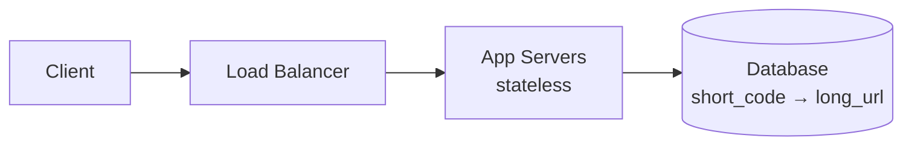
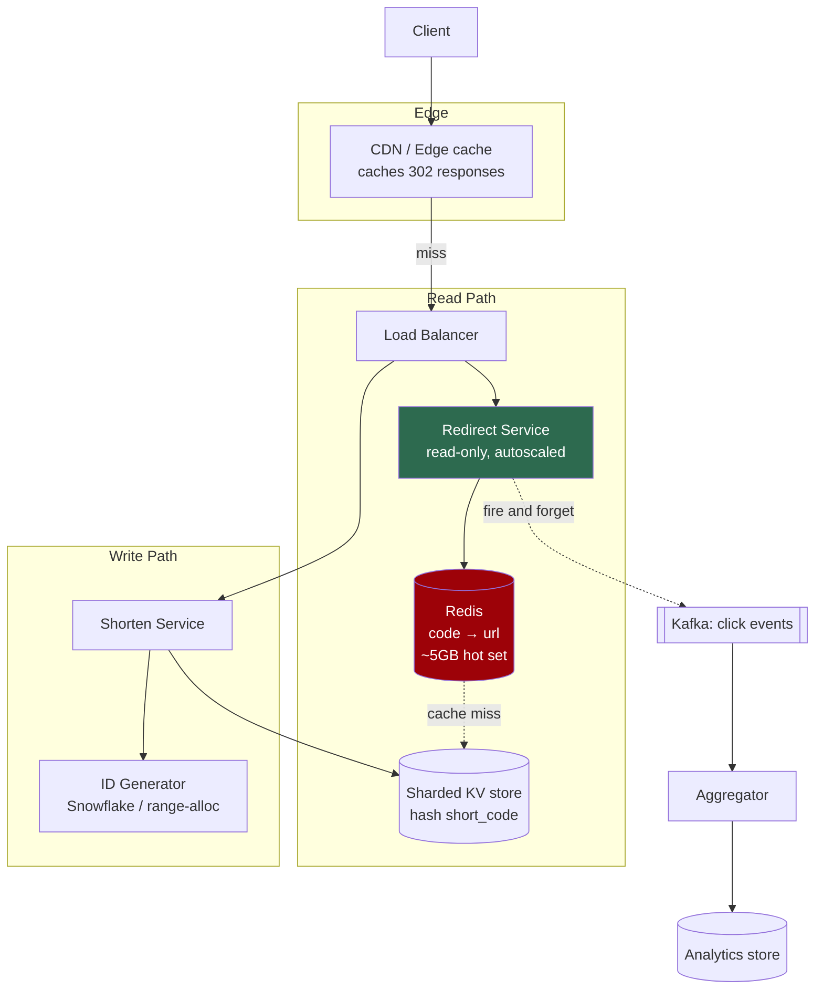
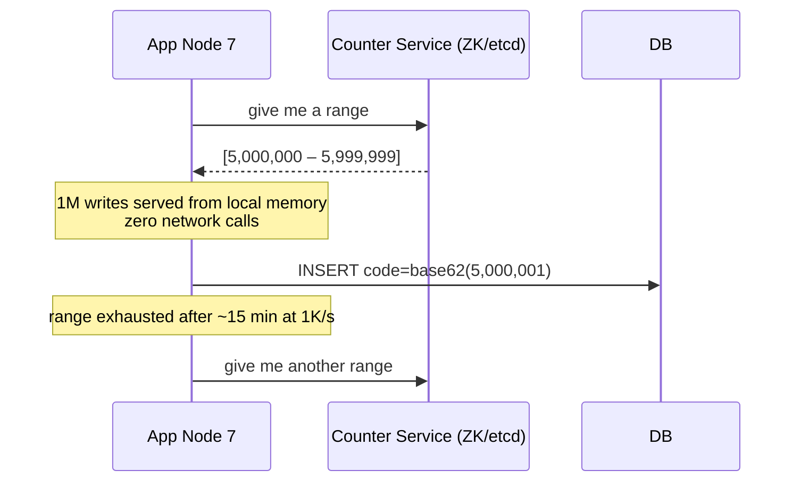
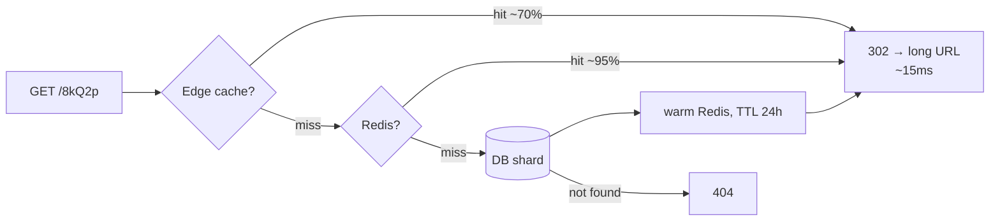

# 001 — Design a URL Shortener

> **The scenario:** It's 10:02 AM. The interviewer shares a blank whiteboard and says:
> *"A marketing team wants to turn long campaign links into short ones. Design it. You have 45 minutes."*
>
> Most candidates start drawing boxes at 10:03. That's the first mistake.

**Difficulty:** ⭐⭐☆☆☆ (deceptively easy — the trap is that it's *too* easy)
**Really tests:** ID generation, read-heavy caching, and whether you can pick a number and defend it.
**Companies:** Amazon, Google, Meta, Atlassian, Stripe — usually as a warm-up before a harder follow-up.

---

## The 45-Minute Clock

Keep this in your head. If you're still on requirements at minute 12, you will not finish.

| Time | Phase | What you're proving |
|------|-------|---------------------|
| 0–5 | Clarify | You don't build the wrong thing |
| 5–10 | Napkin math | You reason about scale, not vibes |
| 10–15 | API + data model | You can define a contract |
| 15–25 | High-level boxes | You can architect |
| 25–40 | **Deep dive** ← the actual interview | You're senior |
| 40–45 | Trade-offs + "what I'd do next" | You know what you *didn't* build |

> 💡 **The 25–40 block is where you get hired or dinged.** Everything before it is setup. Rush the setup on purpose.

---

## Act 1 — Three Questions That Change Everything

Don't ask ten questions. Ask the three whose answers actually move boxes on the whiteboard.

**You:** *"Are short codes ever custom, like `/black-friday`, or always system-generated?"*
**Interviewer:** *"Both. Marketing wants vanity links."*
→ 💥 You just inherited a **uniqueness check on the write path**. Pure counter-based IDs no longer work alone.

**You:** *"Do we need click analytics — counts, geo, referrer?"*
**Interviewer:** *"Counts are enough for v1."*
→ 💥 You just avoided building a whole Kafka + OLAP pipeline. And you can now say *"I'd fire-and-forget click events to a queue so analytics never slows the redirect."* That single sentence reads as senior.

**You:** *"Can a link ever be edited or deleted after creation?"*
**Interviewer:** *"Deleted, yes. Edited, no."*
→ 💥 Mappings are **immutable**. That means you can cache them forever with no invalidation logic. Huge simplification — say it out loud.

### ❌ The questions that waste your time

- "What programming language?" (nobody cares)
- "Cloud or on-prem?" (assume cloud)
- "What's the team size?" (this isn't a management round)

---

## Act 2 — Napkin Math (Say the Numbers Out Loud)

The interviewer isn't checking your arithmetic. They're checking whether you **anchor on a number and design against it.**

**Given:** 100M new links/day, read:write ratio 1000:1.

```
WRITES
  100,000,000 / 86,400 s   ≈  1,160 writes/sec   → call it ~1K/s
  Peak (3× burst)          ≈  3.5K writes/sec

READS
  100M × 1000 = 100B/day … that's absurd, push back:
  "1000:1 gives 1.1M reads/sec. That's Google-scale.
   I'll assume the ratio is closer to 100:1 → ~116K reads/sec,
   peak ~350K/s. Does that match your expectation?"

STORAGE
  short_code(8) + long_url(~200) + timestamps(16) + user_id(8) ≈ 250 B
  100M/day × 250 B    ≈  25 GB/day
  × 365               ≈  9 TB/year
  × 5 years           ≈  45 TB  → sharded, but nothing scary

CACHE (80/20 rule — 20% of links get 80% of traffic)
  Daily hot set ≈ 20M links × 250 B ≈ 5 GB
  → Fits in a single Redis node. Two for HA. Cheap.
```

> 🎯 **Steal this move:** notice how the candidate *rejected the interviewer's own premise* when the math came out absurd. That's the highest-signal thing in this whole section. Interviewers plant unrealistic ratios to see if you'll blindly multiply.

**Read this off the napkin:** ~1K writes/s, ~100K+ reads/s, 45 TB over five years, 5 GB working set. **This is a caching problem wearing a database problem's clothes.**

---

## Act 3 — Draw the Naive Version First (Then Break It)

Always sketch the dumb version. It buys you a shared vocabulary, and *you* get to be the one who finds its flaws.



**You:** *"This works — and it dies at about 5K reads/sec. Let me break it myself."*

| What breaks | Why | Fix |
|---|---|---|
| DB read load | 100K/s of point lookups | Cache in front |
| ID generation | Auto-increment = one node writing | Distributed IDs |
| Single region latency | Sydney → us-east-1 is 200ms | Edge / CDN |
| One viral link | Single Redis key gets 40K/s | Hot-key replication |

Now the real design:



> 🔑 **Split reads from writes into separate services.** Redirects are 100× the traffic and must never be starved by a slow write. This one decision shows you think about blast radius.

---

## Act 4 — The Deep Dive: How Do You Make the Code?

This is the heart of the problem. Here's the showdown.

### Contender A — Auto-increment ID + Base62

```
id = 125_871_921  →  base62  →  "8kQ2p"
```

Alphabet: `[a-zA-Z0-9]` = 62 chars. 62⁷ ≈ **3.5 trillion** codes in 7 characters.

✅ Zero collisions, ever. Shortest possible codes. Dead simple.
❌ The counter is a single point of write contention.
❌ **Sequential codes are enumerable** — I can crawl `/1`, `/2`, `/3` and scrape every private link in your system. This is a real breach class, not a hypothetical.

### Contender B — Hash the URL, take the first N chars

```
md5("https://example.com/very/long")[0:7]  →  "a3f9c2b"
```

✅ Same URL → same code (free dedup).
❌ **Birthday paradox.** With 7 base62 chars (3.5T space), at 36B links your collision probability isn't negligible — you need a read-before-write check on every insert, which is exactly the bottleneck you were avoiding.

### Contender C — Random code + collision retry

```
code = random 7 chars from base62
INSERT ... IF NOT EXISTS   ← atomic, single round trip
retry on conflict (astronomically rare while the table is sparse)
```

✅ Unguessable. No coordination. Scales linearly.
⚠️ Retry rate climbs as the space fills — fine until you're >1% full.

### Contender D — Pre-allocated ranges (the pragmatic winner) ⭐

A tiny coordination service hands each app node a **block of one million IDs**.



✅ One coordination call per **million** writes.
✅ No collisions by construction.
✅ Node crash? You leak a range. Ranges are free — leak them.
❌ Still sequential-ish → **fix by XOR-ing the ID with a secret constant before Base62 encoding.** Keeps uniqueness, kills enumeration.

> 🏆 **What to say:** *"I'd go with pre-allocated ranges plus an XOR obfuscation step. It gives me collision-free codes with effectively zero coordination, and it closes the enumeration hole that plain auto-increment leaves open."*

### 🪤 Custom aliases break all of this

Vanity links (`/black-friday`) live in the **same keyspace**. Two guardrails:

1. `INSERT ... IF NOT EXISTS` — never `SELECT` then `INSERT` (classic TOCTOU race; two users grab `/sale` simultaneously).
2. Reserve a **namespace prefix** for generated codes, or a **blocklist** so a generated code never collides with a future vanity name. Cheap, and interviewers love that you saw it.

---

## Act 5 — The Redirect Path (Where the Traffic Actually Is)



### 🪤 The 301 vs 302 trap — this question is *always* asked

| | `301 Moved Permanently` | `302 Found` |
|---|---|---|
| Browser caches it | **Forever** (aggressively) | No |
| Your servers see repeat clicks | ❌ No | ✅ Yes |
| Analytics | Broken after the first click | Works |
| Can you ever delete the link? | ❌ **No** — cached in millions of browsers | ✅ Yes |
| Latency for the user | Best (0 network hops) | One hop |

**Answer:** *"302 by default. A 301 permanently gives away control — I can't revoke a link or count a click, and abuse takedown becomes impossible. If a customer explicitly wants max speed on a permanent link, I'd offer 301 as an opt-in flag."*

Naming the **takedown problem** is the detail that separates a memorized answer from a real one.

---

## Act 6 — Failure Drills 🔥

The interviewer's job in the last 15 minutes is to break your system. Rehearse these.

<details>
<summary><b>🔥 "A celebrity tweets one link. 500K requests/sec hit a single Redis key."</b></summary>

A single hot key pins one Redis shard's CPU to 100% while the other 15 idle.

**Fix, in escalating order:**
1. **Local in-process cache** on each app node (30s TTL). 200 nodes × 1 key = the origin sees 200 req/30s instead of 500K/s. Solves ~99% of it for free.
2. **Key replication:** store the entry as `8kQ2p:0` … `8kQ2p:9` across shards; readers pick a random suffix. Spreads load 10×.
3. **CDN edge caching** of the 302 itself — the request never reaches your region.

Mappings are immutable (you established that in Act 1!), so aggressive caching is *safe*. Call back to it.
</details>

<details>
<summary><b>🔥 "Redis goes down completely. What happens?"</b></summary>

100K reads/sec slam the database simultaneously — a **thundering herd** that takes the DB down too, and now you can't recover because every restart re-stampedes.

**Fix:**
- **Request coalescing / singleflight:** 10,000 concurrent misses for the same key issue *one* DB query; the rest wait on it.
- **Bounded concurrency** to the DB (a semaphore, e.g. 500 in-flight) — shed load rather than die.
- **Warm the cache before taking traffic** on restart.
- Local in-process caches keep serving the hot 1% throughout the outage.
</details>

<details>
<summary><b>🔥 "Someone shortens a phishing link and it goes viral."</b></summary>

This is a **product** answer, and most candidates have none.

- Check submissions against Google Safe Browsing at write time (async — don't block the write path).
- A `status` column: `active | flagged | disabled`. Disabled codes serve an interstitial warning page, not a 404 — users deserve to know why.
- Takedown must **purge the CDN and Redis** by key. This is exactly why you chose 302 over 301.
- Rate limit by API key and by source IP to stop bulk spam generation.
</details>

<details>
<summary><b>🔥 "You need to serve Europe with under 50ms latency."</b></summary>

- Redirects are read-only and mappings are immutable → **replicate the read path globally**, no consistency headache.
- Writes stay in one **home region** (keeps ID allocation simple), then replicate asynchronously.
- ⚠️ **Real race:** a user creates a link in us-east and shares it in Frankfurt before replication lands → 404 on a link that exists. Mitigation: return the link only after the write is durable, plus a read-through fallback to the home region on a miss. **Naming this race unprompted is a strong-hire signal.**
</details>

<details>
<summary><b>🔥 "Storage is now 45 TB. How do you shard?"</b></summary>

**Shard by `hash(short_code)`,** not by range or by `created_at`.

- Range/time sharding → all of today's writes land on one shard (hotspot).
- Hash sharding → uniform writes, and every read is a point lookup that computes its own shard. No cross-shard queries anywhere in this design.

Use consistent hashing so adding shard 17 moves ~1/17 of keys, not all of them.
</details>

---

## Act 7 — Trade-Off Flashcards

| Decision | Chose | Because | Gave up |
|---|---|---|---|
| SQL vs NoSQL | **NoSQL KV** (DynamoDB/Cassandra) | Every access is a point lookup by PK; no joins, no scans | Ad-hoc querying, transactions |
| Consistency | **Eventual** | A 200ms delay before a new link resolves is invisible; availability is not | Read-your-writes across regions |
| 301 vs 302 | **302** | Retain control: analytics, revocation, takedown | ~20ms per repeat visit |
| ID scheme | **Range-alloc + XOR** | No coordination, no collisions, not enumerable | Slight complexity over `AUTO_INCREMENT` |
| Analytics | **Async via queue** | The redirect path must never wait on a write | Real-time click counts (a few seconds stale) |

---

## Weak Answer vs Strong Answer

> **Weak:** *"I'd use a hash function to generate the short code and store it in a database with a cache in front."*
>
> Correct. Also indistinguishable from a blog post. No numbers, no failure mode, no trade-off.

> **Strong:** *"At 100K reads/sec with an immutable mapping, this is fundamentally a caching problem — the DB is almost decorative on the read path. I'll use pre-allocated ID ranges so writes need one coordination call per million, XOR-obfuscated so codes aren't enumerable. 302 not 301, because a 301 costs me revocation and takedown forever. The failure mode I actually worry about is a single viral link hot-keying one Redis shard, so I'd add a 30-second in-process cache on every app node before I'd reach for anything cleverer."*
>
> Same system. One of these gets a callback.

---

## Self-Check (Close the File and Answer)

<details>
<summary>1. Why is 7 base62 characters enough forever?</summary>

62⁷ ≈ 3.5 trillion. At 100M links/day you'd exhaust it in ~96 years — and 8 characters gives you 218 trillion. Codes are never the constraint.
</details>

<details>
<summary>2. Why not use UUIDs as short codes?</summary>

A UUID is 36 characters. `short.ly/550e8400-e29b-41d4-a716-446655440000` is longer than most URLs you're shortening. The entire product value is brevity.
</details>

<details>
<summary>3. Where exactly does the click-count increment happen, and why not inline?</summary>

Fire-and-forget onto Kafka *after* the 302 is written to the socket. Inline would add a write to the hottest read path in the system, and it would mean a queue outage takes down redirects. Analytics is allowed to lose data; redirects are not.
</details>

<details>
<summary>4. You must delete a link right now. Everything that has to be purged?</summary>

DB row (or `status=disabled`), Redis key, every app node's in-process cache (TTL-bounded, so just wait 30s), and the CDN edge cache by key. If you'd served 301s, browsers hold a copy you can never reach — which is the whole argument.
</details>

<details>
<summary>5. Two users request the vanity alias <code>/sale</code> in the same millisecond. What happens?</summary>

With `SELECT` then `INSERT`, both see it free and one silently overwrites the other. With a single atomic `INSERT ... IF NOT EXISTS` (or a conditional put), exactly one wins and the other gets a clean 409.
</details>

---

## If You Only Have 5 Minutes (Revision Card)

```
CLARIFY   custom aliases? analytics? deletable?  → immutable = cache freely
MATH      1K w/s · 100K+ r/s · 45TB/5yr · 5GB hot set  → caching problem
WRITE     range-allocated IDs → XOR → base62(7)  → atomic INSERT IF NOT EXISTS
READ      CDN → Redis (95% hit) → sharded KV by hash(code) → 302
SCALE     in-process cache kills hot keys · singleflight kills stampedes
ABUSE     Safe Browsing scan · status flag · rate limit · 302 keeps takedown possible
NEXT      analytics via Kafka → OLAP · multi-region reads · vanity namespace
```

---

## Where to Go Deeper

Pick one and go one level down — this is the natural follow-up question:

- **Snowflake ID generator** — clock skew, the leap-second bug, what happens when NTP jumps backwards
- **Consistent hashing** — virtual nodes, and why naive `hash % N` is a resharding disaster
- **Analytics pipeline** — Kafka → Flink → ClickHouse, and approximate distinct counts with HyperLogLog
- **Rate limiting** — token bucket vs sliding window (that's [002](002-rate-limiter.md))
