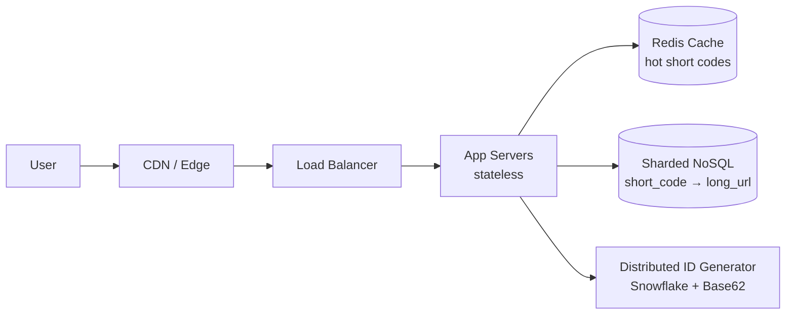
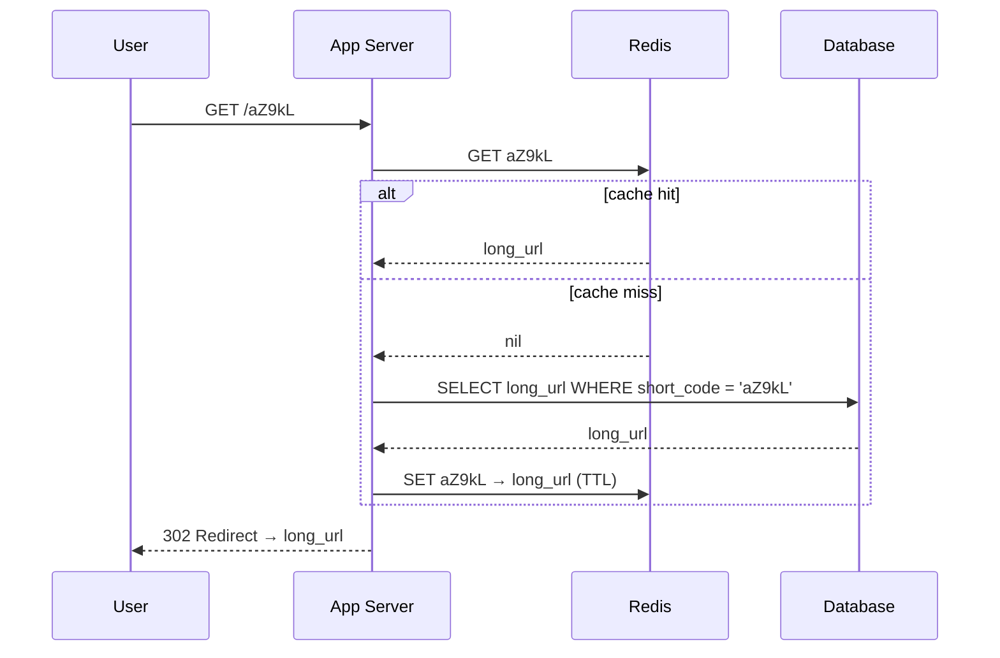

## 1. Clarify Requirements

Before jumping into architecture, we need to pin things down:

### Functional requirements

- Shorten a long URL → return a short URL
- Redirect short URL → original URL
- Optional:
  - Custom aliases?
  - Expiration time?
  - Analytics (click count, geo, etc.)?

### Non-functional requirements

- High availability (redirects must work almost always)
- Low latency (redirects should be ~10–50ms)
- Massive scale (millions/billions of URLs)
- Read-heavy system (redirects >> writes)

Let’s assume:

- 100M new URLs/day
- 1000:1 read/write ratio

---

## 2. High-Level Design

At a high level, the system has two main flows:



### A. Write path (shorten URL)

1. User submits long URL
2. Generate short code
3. Store mapping: `short_code → long_url`
4. Return short URL

### B. Read path (redirect)

1. User hits short URL
2. Lookup short_code
3. Redirect (HTTP 301/302) to long URL

---

## 3. Core Components

### 1. API Layer

- `POST /shorten`
- `GET /{short_code}` → redirect

### 2. Application Servers

Stateless, horizontally scalable

### 3. Database

Stores mapping:

```
short_code (PK) | long_url | created_at | expiration | user_id
```

### 4. Cache (Redis)

- Cache hot URLs
- Reduce DB load on redirects

---

## 4. Short Code Generation (Critical Design Choice)

This is where most of the complexity lies.

### Option A: Auto-increment ID + Base62 encoding

- DB generates unique ID
- Convert ID → Base62 (e.g., `aZ9kL`)

**Pros**

- Simple
- Guaranteed uniqueness
- Compact

**Cons**

- DB becomes bottleneck for ID generation at scale

---

### Option B: Distributed ID generation (better)

Use something like:

- Snowflake IDs (Twitter style)
- Or pre-allocated ID ranges

Flow:

1. Generate unique ID in app layer
2. Encode to Base62

**Pros**

- Scales horizontally
- No central bottleneck

---

### Option C: Hash of URL (not ideal alone)

- Hash long URL → take first N chars

**Problems**

- Collisions
- Need collision resolution anyway

---

👉 Best practical choice: **Distributed ID + Base62**

---

## 5. Database Design

### Schema (simple version)

```
Table: url_mapping

short_code (PK, indexed)
long_url
created_at
expiration_at (nullable)
```

### Scaling the DB

At large scale:

- Use **sharding** by `short_code`
- Use **NoSQL (e.g., DynamoDB, Cassandra)** for:
  - High write throughput
  - Horizontal scaling

---

## 6. Read Optimization (Critical)

Reads dominate, so optimize heavily:

### Cache layer

- Redis:

  ```
  key: short_code
  value: long_url
  ```

- Cache hot entries

### Flow:

1. Check cache
2. If miss → DB
3. Populate cache



---

## 7. Handling Scale

Let’s sanity-check:

### Storage

100M URLs/day → ~36B/year

If each record ≈ 200 bytes:
→ ~7.2 TB/year

👉 Totally manageable with sharding

---

### Traffic

If 1000:1 read/write:

- Writes: 100M/day ≈ 1.1K/sec
- Reads: 1B/day ≈ 11.5K/sec

Peak could be 10x:

- ~100K reads/sec

👉 Needs:

- CDN (optional)
- Aggressive caching

---

## 8. CDN Optimization (Advanced)

You can cache redirects at edge:

- CDN stores:
  short URL → redirect response

**Benefit**

- Ultra-low latency globally
- Offloads origin servers

---

## 9. Reliability & Edge Cases

### Expiration

- TTL field
- Lazy deletion or background cleanup

### Custom aliases

- Need uniqueness check
- Slightly slower writes

### Abuse prevention

- Rate limiting
- Spam detection

---

## 10. Trade-offs to Think About

Here’s where interviews go deeper:

- **Consistency vs availability**
  - Is eventual consistency acceptable? (Usually yes)

- **Cache invalidation**
  - What if URL changes? (rare)

- **Hot keys**
  - Viral links → Redis hotspots

- **ID generation**
  - Centralized vs distributed

---

## 11. Deep Dive (Let’s Go Further)

If you want to push this toward senior-level discussion, we can zoom into one area:

- Designing a **Snowflake ID generator**
- **Sharding strategy** (range vs hash)
- Handling **hot URLs at scale**
- **Analytics pipeline** (Kafka + OLAP)
- Designing **custom aliases at scale**

---
