## 1. Problem Statement

Take a long URL, hand back a short one, and send anyone who follows the short
one to the original. Two operations, one table.

It is the smallest system in this series that is still genuinely interesting,
and it is worth doing carefully because it is *mostly read path*. At a 100:1
read/write ratio the design has one job: **serve a 200-byte lookup a few hundred
thousand times a second, worldwide, without touching a database.** Everything
else — the storage engine, the ID generator, the schema — exists to support that
one sentence.

Three decisions look trivial here and are not:

1. **How the code is minted.** It determines whether you have a central
   bottleneck, how long your links are, and whether anyone can enumerate every
   link you have ever issued.
2. **Which redirect status you return.** `301` and `302` differ by one digit and
   by whether you can ever measure, change, or revoke a link again.
3. **What happens when one link goes viral.** A single key doing 100 K req/s is
   not a scaling problem, it is a hot-key problem, and horizontal scaling does
   not fix it.

The one-line contrast with [Pastebin](003-pastebin.md), which is otherwise the
same shape: a shortener stores a **pointer**, Pastebin stores the **payload**.
That is why this system's bottleneck is lookups and Pastebin's is bytes.

---

## 2. Use Cases

### 2.1 Actors and what they want

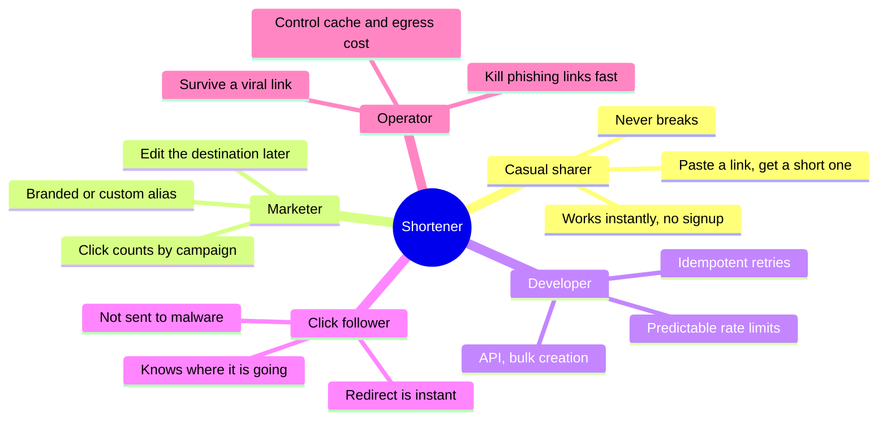
```mermaid
mindmap
  root((Shortener))
    Casual sharer
      Paste a link, get a short one
      Works instantly, no signup
      Never breaks
    Marketer
      Branded or custom alias
      Click counts by campaign
      Edit the destination later
    Developer
      API, bulk creation
      Idempotent retries
      Predictable rate limits
    Click follower
      Redirect is instant
      Knows where it is going
      Not sent to malware
    Operator
      Kill phishing links fast
      Control cache and egress cost
      Survive a viral link
```

### 2.2 Primary use cases

| # | Use case | Actor | Trigger | Success outcome |
|---|---|---|---|---|
| UC-1 | Shorten a URL | Anyone | Submits a long URL | Short code returned in < 100 ms |
| UC-2 | Follow a short link | Click follower | Opens `/aZ9kL` | Redirected in < 50 ms |
| UC-3 | Custom alias | Marketer | Requests `/summer-sale` | Reserved, or `409` if taken |
| UC-4 | Bulk create via API | Developer | POSTs 1 000 URLs | All created, idempotent on retry |
| UC-5 | Link with expiry | Marketer | Sets a TTL | Returns `410` after expiry |
| UC-6 | Click analytics | Marketer | Opens dashboard | Counts by day, referrer, country |
| UC-7 | Edit destination | Marketer | Repoints an existing alias | New clicks follow the new target |
| UC-8 | Delete or disable | Owner, Operator | Abuse report or manual delete | Link stops resolving |
| UC-9 | Viral link | Click follower | 100 K req/s on one code | Served from edge, origin untouched |
| UC-10 | Malicious link | Operator | Scanner flags phishing | Blocked, serves an interstitial |

### 2.3 The journey that sets the latency budget

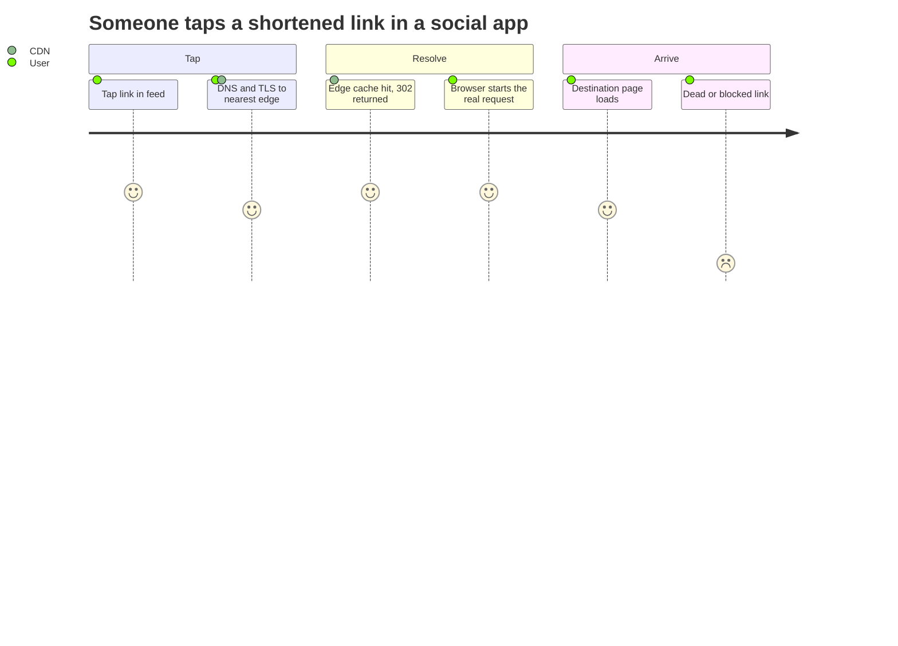
```mermaid
journey
  title Someone taps a shortened link in a social app
  section Tap
    Tap link in feed: 5: User
    DNS and TLS to nearest edge: 4: User, CDN
  section Resolve
    Edge cache hit, 302 returned: 5: CDN
    Browser starts the real request: 5: User
  section Arrive
    Destination page loads: 4: User
    Dead or blocked link: 1: User
```

The redirect is **pure overhead inserted into someone else's page load**. Nobody
ever wanted to visit the shortener; they wanted the destination. That framing
sets the whole budget: the hop must be fast enough to be invisible, and the last
row is why expired and blocked links must fail instantly and clearly.

### 2.4 Out of scope

Link previews and unfurling ([URL Preview Service](051-url-preview-service.md)),
QR generation ([QR Code Platform](052-qr-code-platform.md)), the full analytics
warehouse ([Analytics Pipeline](018-analytics-pipeline.md)), and A/B or
geo-targeted destination routing — a genuinely different product where a code
maps to a *rule*, not a URL.

---

## 3. Requirements

### Functional

- Shorten a URL of up to 2 048 characters, returning a short code.
- Redirect a short code to its destination.
- Optional custom alias, reserved on a first-come basis.
- Optional expiry; expired links stop resolving.
- Delete or disable a link (owner or operator).
- Click analytics: counts by day, referrer, country, device.
- Bulk creation via an authenticated API.

### Non-functional

- **Read-heavy: ~100:1.** The read path is the system; the write path is a form.
- **Redirect latency p99 < 50 ms** at the edge, globally.
- **Availability 99.99% for redirects.** A broken redirect breaks somebody
  else's content, on a page you do not control, permanently — links live in
  printed material, in old tweets, in QR codes on posters.
- **Durability of mappings.** A code that has been handed out must resolve
  forever unless deliberately expired. Losing a mapping is unrecoverable: nobody
  can reconstruct which long URL `aZ9kL` meant.
- **Codes are short.** Every character costs the user something in a
  character-limited or printed context. Seven is the target.
- Eventual consistency is acceptable for reads: a link resolving a few hundred
  milliseconds later in a far region is fine.

### Constraints and assumptions

- Mappings are effectively **immutable** in the common case, which is what makes
  aggressive multi-tier caching safe. Editable destinations are a paid feature
  and carry an explicit invalidation cost (Section 12.2).
- Codes are **public by construction**. Unlike Pastebin, there is no "unlisted"
  semantic to protect, so sequential-derived codes are acceptable — a decision
  revisited in Section 8.4.
- The destination is a third party we do not control and cannot vouch for.

---

## 4. Capacity Estimation

Assumptions: **100 M new links/day**, **100:1 read/write**, ~200 bytes stored per
mapping, five-year retention.

> [!NOTE]
> The read:write ratio is the single most important assumption in this document,
> so it is worth stating rather than inheriting. Public shorteners see roughly
> 10–100 clicks per link created; 100:1 is the aggressive end and sizing for it
> means the cache tier is over-provisioned rather than under.

### Traffic

| Metric | Calculation | Result |
|---|---|---|
| Writes | 100 M / 86 400 | **~1 160 writes/s** |
| Writes (peak 3×) | | **~3 500 writes/s** |
| Reads | 10 B / 86 400 | **~116 000 reads/s** |
| Reads (peak 3×) | | **~350 000 reads/s** |

### Storage

| Metric | Calculation | Result |
|---|---|---|
| Bytes/day | 100 M × 200 B | **20 GB/day** |
| Per year | | **~7.3 TB/year** |
| 5 years, raw | | **~36 TB** |
| With 3× replication | | **~110 TB** |
| Click events/day (raw) | 10 B × 100 B | **1 TB/day → rolled up hourly** |

The mappings are small enough to be unremarkable — 110 TB over five years is a
modest cluster. **The click events are 50× the mappings**, which is why analytics
lives on a separate pipeline with its own retention (Section 9.6) and never
shares a store with the redirect path.

### Key space

Base62 (`a–z A–Z 0–9`) over *n* characters:

| Length | Key space | Consumed per year at 100 M/day | Verdict |
|---|---|---|---|
| 5 | 9.2 × 10⁸ | **4 000%** | Exhausted in nine days |
| 6 | 5.7 × 10¹⁰ | **64%** | Exhausted in under two years |
| **7** | **3.5 × 10¹²** | **~1%** | Comfortable for a century |
| 8 | 2.2 × 10¹⁴ | 0.02% | A wasted character |

**Seven characters.** Six looks tempting and dies in eighteen months; the eighth
character buys nothing anyone will live to need.

### Cache working set

Clicks follow a steep recency and popularity curve — a small set of links
absorbs most traffic.

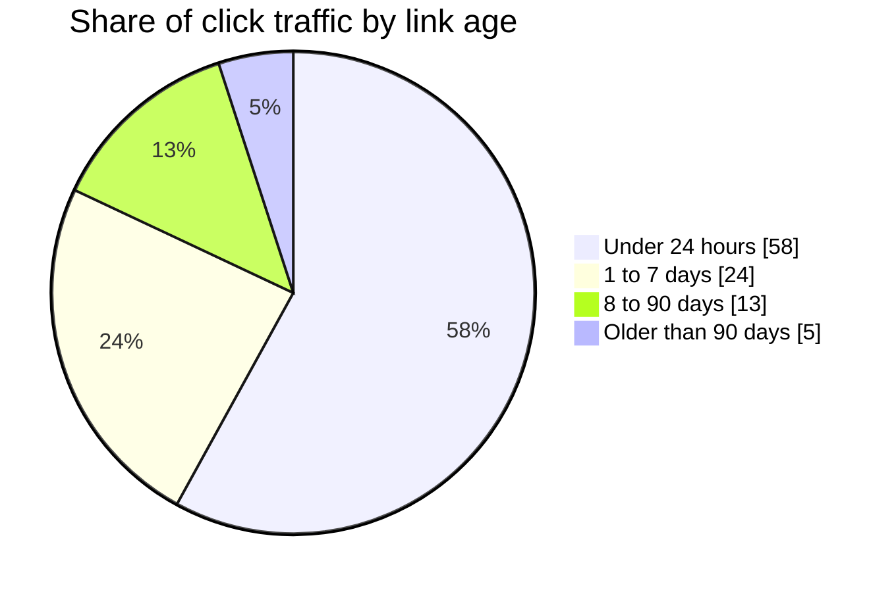
```mermaid
pie showData
  title Share of click traffic by link age
  "Under 24 hours" : 58
  "1 to 7 days" : 24
  "8 to 90 days" : 13
  "Older than 90 days" : 5
```

A day of links is 100 M × 200 B = 20 GB. Budget **~50 GB of Redis** across the
fleet — roughly 250 M entries — which covers two days of creation plus the
long-tail hot set and delivers a 95%+ hit rate. The remaining misses are cheap
point lookups.

### Bandwidth

A redirect response is headers only, ~500 bytes. 116 K/s × 500 B ≈ **58 MB/s**
average, ~175 MB/s peak. Ingress is negligible.

Note what this means: **the shortener is a latency and request-rate problem, not
a bandwidth problem.** Pastebin, serving the same request count, would be moving
a thousand times the bytes.

---

## 5. API Design

| Endpoint | Method | Purpose |
|---|---|---|
| `/v1/links` | POST | Create. Body: `{long_url, alias?, expires_at?, tags?}` |
| `/v1/links/{code}` | GET | Metadata: destination, created, expiry, state |
| `/v1/links/{code}` | PATCH | Repoint the destination (paid feature) |
| `/v1/links/{code}` | DELETE | Disable the link |
| `/v1/links/batch` | POST | Up to 1 000 URLs in one call |
| `/v1/links/{code}/stats` | GET | Aggregated clicks by day, referrer, country |
| `/{code}` | GET | **The redirect.** The only endpoint that matters at scale |

Points worth defending in review:

- **Create is idempotent** via an `Idempotency-Key` header. A client that times
  out and retries must get the same code back, not a second code pointing at the
  same destination.
- **Create does not deduplicate by URL by default.** Two users shortening the
  same URL get different codes, because their analytics, expiry, and ownership
  are different. Dedupe is offered as an explicit `reuse_existing: true` flag —
  Section 12.5 explains why making it the default is a mistake.
- **Custom aliases return `409 Conflict`**, never a silently altered alias.
  Handing back `summer-sale-2` when someone asked for `summer-sale` produces a
  link that goes in a print run and points somewhere unexpected.
- **Status codes carry meaning**: unknown code `404`; expired or deleted `410
  Gone`; blocked for abuse `451` behind an interstitial. Distinguishing these
  costs nothing and makes the failure legible to whoever is debugging a dead
  link months later.
- **The redirect endpoint takes no query parameters and does no work.** Anything
  that must happen per click — counting, scanning, enrichment — happens
  asynchronously after the response is written.

---

## 6. High-Level Design

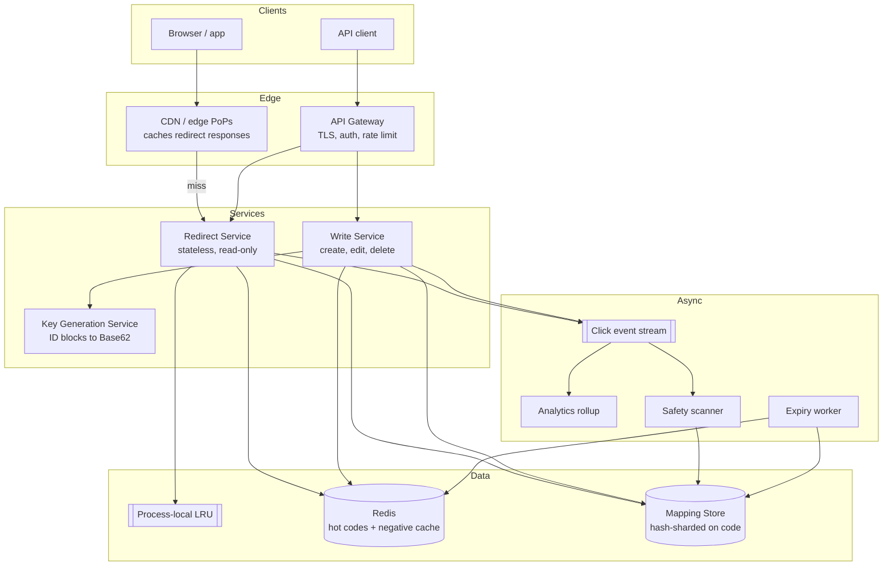
```mermaid
flowchart TB
  subgraph Clients
    B[Browser / app]
    D[API client]
  end

  subgraph Edge
    CDN[CDN / edge PoPs<br/>caches redirect responses]
    GW[API Gateway<br/>TLS, auth, rate limit]
  end

  subgraph Services
    RS[Redirect Service<br/>stateless, read-only]
    WS[Write Service<br/>create, edit, delete]
    KGS[Key Generation Service<br/>ID blocks to Base62]
  end

  subgraph Data
    L1[[Process-local LRU]]
    RC[("Redis<br/>hot codes + negative cache")]
    DB[("Mapping Store<br/>hash-sharded on code")]
  end

  subgraph Async
    Q[[Click event stream]]
    AG[Analytics rollup]
    SC[Safety scanner]
    GC[Expiry worker]
  end

  B --> CDN
  D --> GW
  CDN -->|miss| RS
  GW --> WS
  GW --> RS
  RS --> L1
  RS --> RC
  RS --> DB
  RS --> Q
  WS --> KGS
  WS --> DB
  WS --> RC
  WS --> Q
  Q --> AG
  Q --> SC
  SC --> DB
  GC --> DB
  GC --> RC
```

### Component responsibilities

| Component | Owns | Explicitly does not own |
|---|---|---|
| CDN | Edge-cached redirect responses, TLS termination | Any business rule |
| API Gateway | Auth, rate limits, request shaping | Redirect logic |
| Redirect Service | Cache lookups, state checks, emitting the 302 | Any write to the mapping store |
| Write Service | Validation, code allocation, alias reservation | Serving redirects |
| KGS | Unique IDs, Base62 encoding, block leasing | Knowing what a link is |
| Mapping store | Durable `code → url` and its state | Analytics |
| Click stream | Every click, exactly once per response | Blocking the redirect |
| Workers | Rollups, scanning, expiry | Anything a user waits on |

**Why the redirect service is physically separate from the write service.** They
scale on different axes (100:1), they fail differently — a write outage is a
form that errors, a read outage breaks every link ever shared — and they deploy
at different rates. Separating them means you can freeze and shed the write path
during an incident to protect the read path, which is a lever you want at 3 a.m.

**Why there is no relational database in the diagram.** The only access pattern
is an exact point lookup on a high-cardinality key with no joins, no range
scans, and no transactions beyond a single-row conditional insert. That is the
precise shape a hash-partitioned key-value store is built for, and paying for a
relational engine's guarantees here buys nothing.

---

## 7. Data Model

### 7.1 Entities

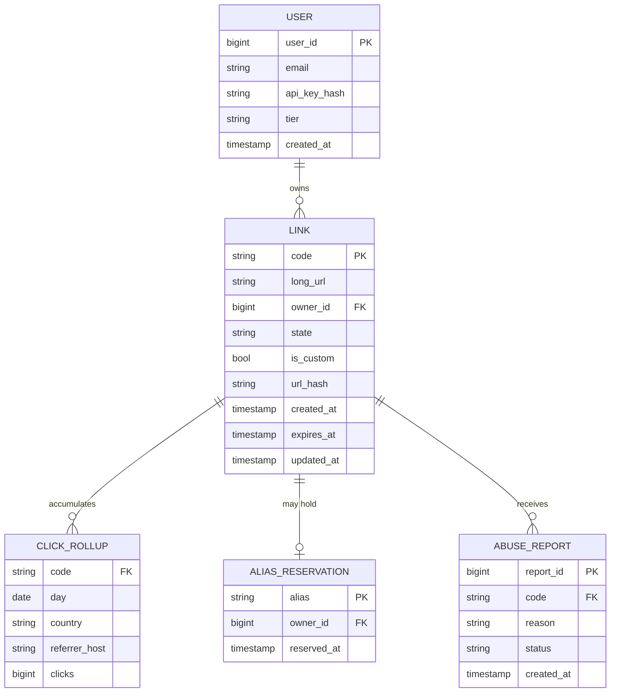
```mermaid
erDiagram
  USER ||--o{ LINK : owns
  LINK ||--o{ CLICK_ROLLUP : accumulates
  LINK ||--o| ALIAS_RESERVATION : "may hold"
  LINK ||--o{ ABUSE_REPORT : receives

  USER {
    bigint user_id PK
    string email
    string api_key_hash
    string tier
    timestamp created_at
  }

  LINK {
    string code PK
    string long_url
    bigint owner_id FK
    string state
    bool is_custom
    string url_hash
    timestamp created_at
    timestamp expires_at
    timestamp updated_at
  }

  ALIAS_RESERVATION {
    string alias PK
    bigint owner_id FK
    timestamp reserved_at
  }

  CLICK_ROLLUP {
    string code FK
    date day
    string country
    string referrer_host
    bigint clicks
  }

  ABUSE_REPORT {
    bigint report_id PK
    string code FK
    string reason
    string status
    timestamp created_at
  }
```

### 7.2 Choosing the store

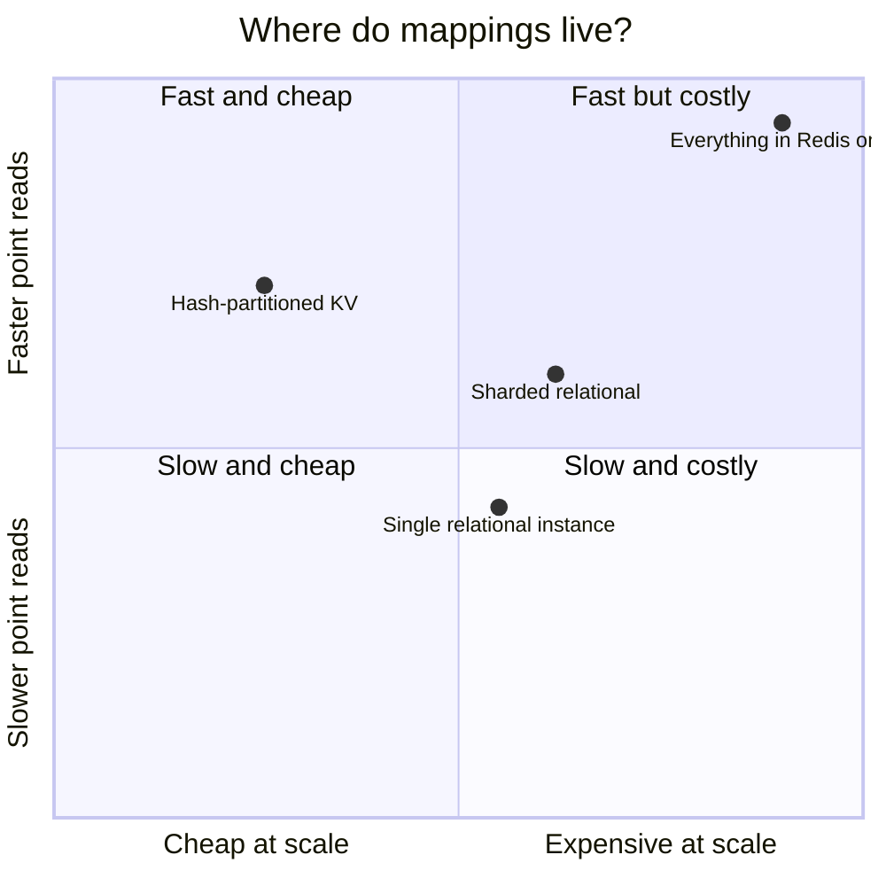
```mermaid
quadrantChart
  title Where do mappings live?
  x-axis "Cheap at scale" --> "Expensive at scale"
  y-axis "Slower point reads" --> "Faster point reads"
  quadrant-1 "Fast but costly"
  quadrant-2 "Fast and cheap"
  quadrant-3 "Slow and cheap"
  quadrant-4 "Slow and costly"
  "Single relational instance": [0.55, 0.42]
  "Sharded relational": [0.62, 0.60]
  "Hash-partitioned KV": [0.26, 0.72]
  "Everything in Redis only": [0.90, 0.94]
```

- **Single relational instance**: fine until it is not. One machine cannot hold
  36 TB with a working index and absorb 3 500 writes/s alongside every cache
  miss.
- **Sharded relational**: workable, but you are paying for transactions, joins,
  and secondary indexes that this workload never issues.
- **Hash-partitioned key-value (chosen)**: exact-match reads, uniform key
  distribution, horizontal writes, replication built in.
- **Redis as the system of record**: fastest and the most expensive way to lose
  data. Memory is the cache tier, not the durable one.

### 7.3 Partitioning and indexes

- **Hash-shard on `code`.** Every read is a point lookup, so hashing spreads
  load uniformly with no hot shard and no range-scan requirement to preserve.
- **`(owner_id, created_at DESC)`** as a secondary index for the user's
  dashboard — a low-traffic authenticated path, fanned out across shards and
  merged at the service.
- **`expires_at` on a partial predicate** (`WHERE expires_at IS NOT NULL`) so the
  expiry sweep touches only the minority of links that can expire.
- **`url_hash`** indexed to support opt-in dedupe (Section 12.5).

Do **not** shard by `owner_id`: anonymous links dominate and would pile onto a
single null-owner partition.

---

## 8. Short Code Generation

The code is the product. It must be unique, short, and cheap to mint at 3 500/s
with no coordination on the hot path.

### 8.1 Four approaches

| Approach | Uniqueness | Coordination cost | Code length | Verdict |
|---|---|---|---|---|
| Hash of the URL, first 7 chars | Collisions certain | Read-before-write on every create | 7 | Rejected — the collision check is the bottleneck it was meant to avoid |
| Random 7 chars, check-and-retry | Probabilistic | One read per create, more as the space fills | 7 | Rejected at this volume |
| DB auto-increment → Base62 | Guaranteed | **A single global sequence** | Shortest possible | Rejected — one machine gates every write |
| **Distributed IDs → Base62 (chosen)** | Guaranteed | None on the hot path | 7 | Scales horizontally, no read-before-write |

The decisive property is **no read-before-write**. Hash and random approaches
must ask the store "is this taken?" before every insert, which converts a pure
write into a read plus a conditional write and gets worse as the key space
fills. A generated-unique ID never asks.

### 8.2 Snowflake-style IDs

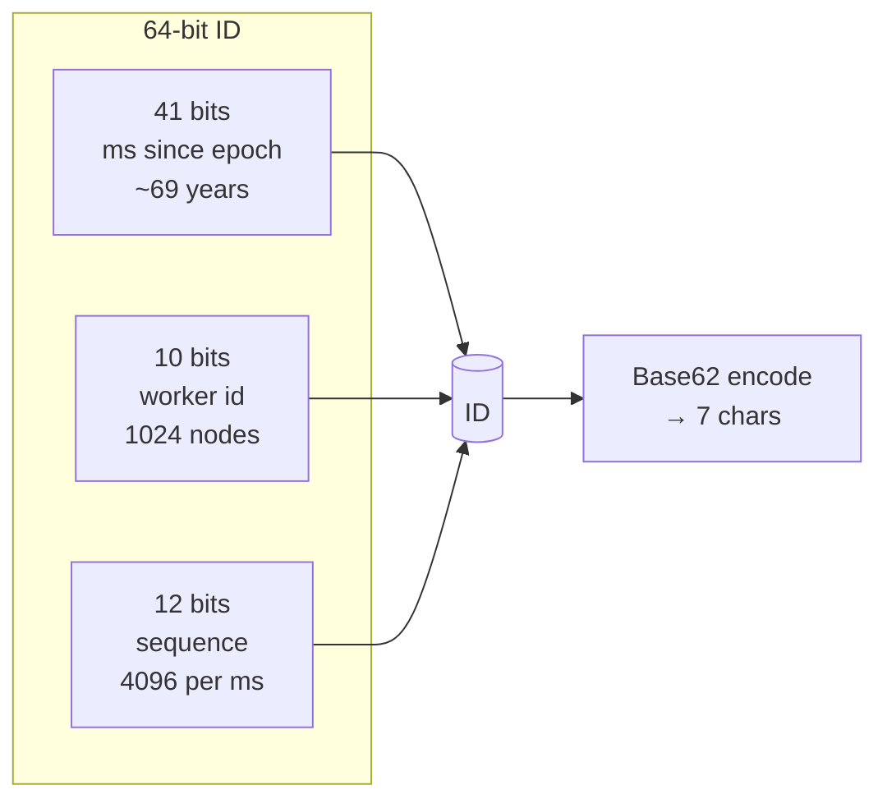
```mermaid
flowchart LR
  subgraph "64-bit ID"
    T["41 bits<br/>ms since epoch<br/>~69 years"]
    W["10 bits<br/>worker id<br/>1024 nodes"]
    S["12 bits<br/>sequence<br/>4096 per ms"]
  end
  T --> ID[(ID)]
  W --> ID
  S --> ID
  ID --> B62["Base62 encode<br/>→ 7 chars"]
```

4 096 IDs per millisecond per worker is 4.1 M/s per node — three orders of
magnitude above what we need, so the sequence field never saturates and the
generator never blocks.

The two failure modes worth naming: **clock skew backwards** (an NTP correction
can reissue a timestamp; the generator must refuse to move backwards and stall
until it catches up) and **worker ID collision** (two nodes with the same ID mint
duplicates, so IDs come from coordinated assignment such as a ZooKeeper
ephemeral sequence, never from configuration a human types).

### 8.3 Block allocation, the simpler alternative

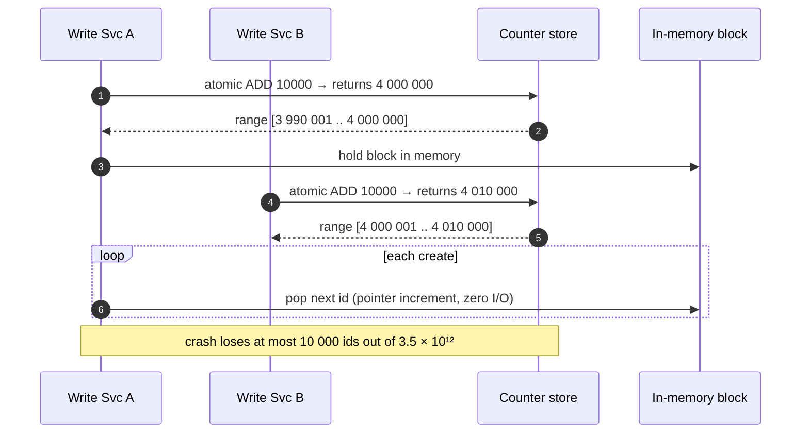
```mermaid
sequenceDiagram
  autonumber
  participant W1 as Write Svc A
  participant W2 as Write Svc B
  participant CTR as Counter store
  participant M as In-memory block

  W1->>CTR: atomic ADD 10000 → returns 4 000 000
  CTR-->>W1: range [3 990 001 .. 4 000 000]
  W1->>M: hold block in memory
  W2->>CTR: atomic ADD 10000 → returns 4 010 000
  CTR-->>W2: range [4 000 001 .. 4 010 000]
  loop each create
    W1->>M: pop next id (pointer increment, zero I/O)
  end
  Note over W1,CTR: crash loses at most 10 000 ids out of 3.5 × 10¹²
```

One atomic counter, leased in blocks of 10 000, gives a per-create cost of a
pointer increment and one round trip per 10 000 creates. Losing a block on crash
costs nothing measurable against a key space of 3.5 trillion.

**This is the design I would actually ship.** Snowflake is the better answer when
you need IDs to be roughly time-sortable or the counter store is itself a
liability; block allocation is fewer moving parts and no clock dependency at all.
Reach for the more complex option only when a requirement demands it.

### 8.4 Sequential codes are enumerable — and that is acceptable here

Base62-encoded counters produce adjacent codes for adjacent creations, so anyone
can walk the space and discover every link. For this system that is tolerable:
short links are handed out publicly and carry no secret by design.

It is **not** tolerable in [Pastebin](003-pastebin.md), where "unlisted" is a
product promise, and the difference is worth stating out loud in an interview —
it shows the choice was made rather than inherited. If unguessability is ever
required here, the fix is to apply format-preserving encryption to the counter
so codes stay dense and unique but appear random, not to bolt on a random
generator and reintroduce collision checks.

Two consequences to accept: competitors can measure your creation rate from
code progression, and scanners will crawl the space. The second is a real abuse
vector and is handled in Section 14.

---

## 9. Dynamic Workflows

### 9.1 Create a link

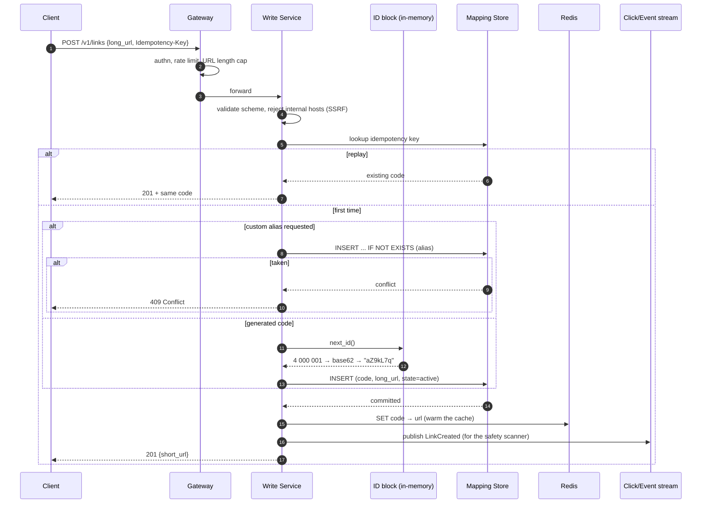
```mermaid
sequenceDiagram
  autonumber
  participant C as Client
  participant GW as Gateway
  participant W as Write Service
  participant K as ID block (in-memory)
  participant DB as Mapping Store
  participant RC as Redis
  participant Q as Click/Event stream

  C->>GW: POST /v1/links {long_url, Idempotency-Key}
  GW->>GW: authn, rate limit, URL length cap
  GW->>W: forward
  W->>W: validate scheme, reject internal hosts (SSRF)
  W->>DB: lookup idempotency key
  alt replay
    DB-->>W: existing code
    W-->>C: 201 + same code
  else first time
    alt custom alias requested
      W->>DB: INSERT ... IF NOT EXISTS (alias)
      alt taken
        DB-->>W: conflict
        W-->>C: 409 Conflict
      end
    else generated code
      W->>K: next_id()
      K-->>W: 4 000 001 → base62 → "aZ9kL7q"
      W->>DB: INSERT (code, long_url, state=active)
    end
    DB-->>W: committed
    W->>RC: SET code → url (warm the cache)
    W->>Q: publish LinkCreated (for the safety scanner)
    W-->>C: 201 {short_url}
  end
```

The generated-code path has **no read before the write**, which is what keeps
creates cheap. The custom-alias path does need a conditional insert, and it is
the store — not a distributed lock — that arbitrates the race (Section 9.3).

### 9.2 The redirect — the hot path

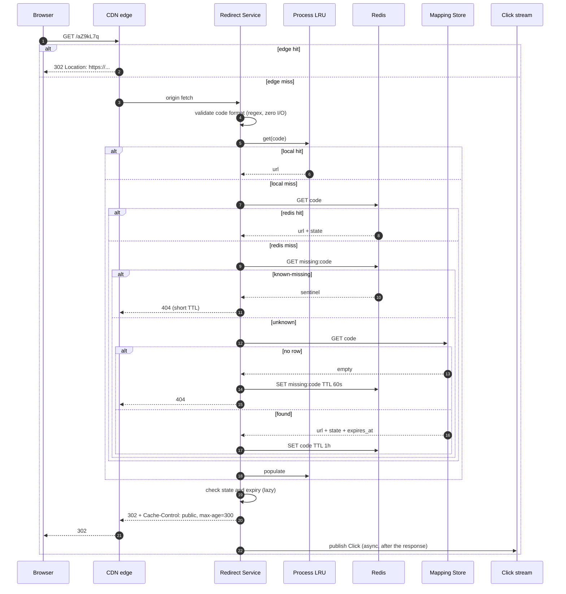
```mermaid
sequenceDiagram
  autonumber
  participant U as Browser
  participant CDN as CDN edge
  participant R as Redirect Service
  participant L1 as Process LRU
  participant RC as Redis
  participant DB as Mapping Store
  participant Q as Click stream

  U->>CDN: GET /aZ9kL7q
  alt edge hit
    CDN-->>U: 302 Location: https://...
  else edge miss
    CDN->>R: origin fetch
    R->>R: validate code format (regex, zero I/O)
    R->>L1: get(code)
    alt local hit
      L1-->>R: url
    else local miss
      R->>RC: GET code
      alt redis hit
        RC-->>R: url + state
      else redis miss
        R->>RC: GET missing:code
        alt known-missing
          RC-->>R: sentinel
          R-->>CDN: 404 (short TTL)
        else unknown
          R->>DB: GET code
          alt no row
            DB-->>R: empty
            R->>RC: SET missing:code TTL 60s
            R-->>CDN: 404
          else found
            DB-->>R: url + state + expires_at
            R->>RC: SET code TTL 1h
          end
        end
      end
      R->>L1: populate
    end
    R->>R: check state and expiry (lazy)
    R-->>CDN: 302 + Cache-Control: public, max-age=300
    CDN-->>U: 302
    R->>Q: publish Click (async, after the response)
  end
```

Four cache tiers, each earning its place: the **CDN** removes geography and the
majority of request volume; the **process-local LRU** absorbs a viral link
without hammering Redis; **Redis** is the shared warm tier across the fleet; the
**store** is the truth. A negative cache stops the scanner traffic from Section
14 turning into database load.

The click event is published **after the response is written**, never before.
Counting must not be able to slow or fail a redirect.

### 9.3 The custom alias race

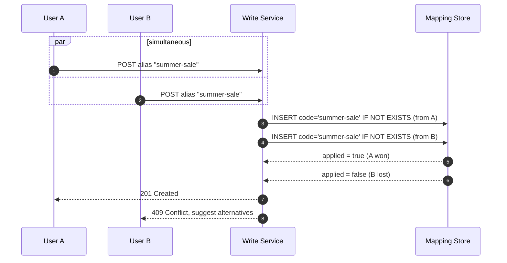
```mermaid
sequenceDiagram
  autonumber
  participant A as User A
  participant B as User B
  participant W as Write Service
  participant DB as Mapping Store

  par simultaneous
    A->>W: POST alias "summer-sale"
  and
    B->>W: POST alias "summer-sale"
  end
  W->>DB: INSERT code='summer-sale' IF NOT EXISTS  (from A)
  W->>DB: INSERT code='summer-sale' IF NOT EXISTS  (from B)
  DB-->>W: applied = true  (A won)
  DB-->>W: applied = false (B lost)
  W-->>A: 201 Created
  W-->>B: 409 Conflict, suggest alternatives
```

**The conditional insert is the lock.** Two writers attempt the same state
transition and the store arbitrates on a single partition — no lock service, no
read-then-write window. Any design that reads "is this alias free?" and then
inserts has a race between the two statements, and at 3 500 writes/s that race
will be lost regularly.

Reserved words (`api`, `admin`, `login`, `terms`) are rejected at validation, or
a custom alias becomes a route-hijacking primitive against your own domain.

### 9.4 A link goes viral

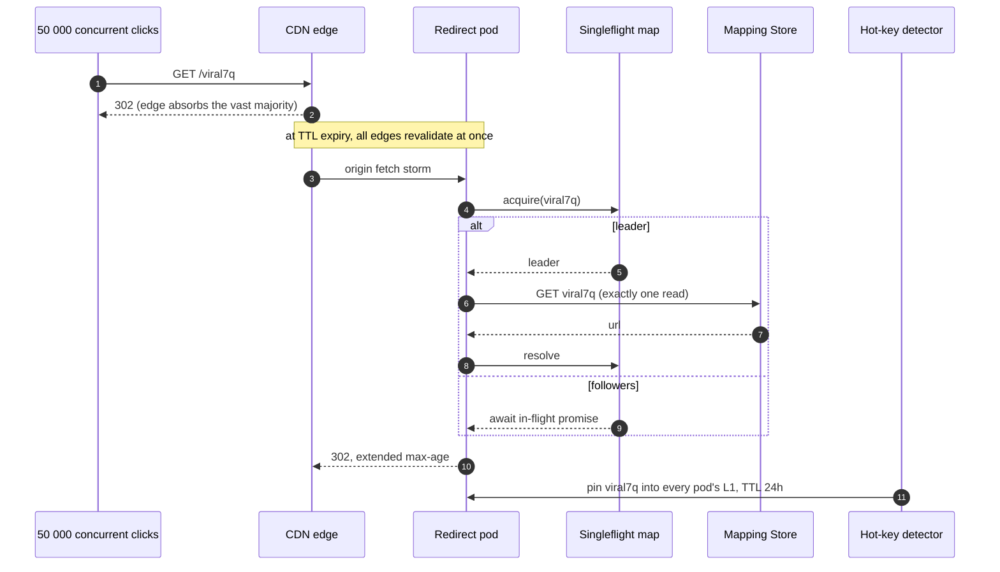
```mermaid
sequenceDiagram
  autonumber
  participant M as 50 000 concurrent clicks
  participant CDN as CDN edge
  participant R as Redirect pod
  participant SF as Singleflight map
  participant DB as Mapping Store
  participant HOT as Hot-key detector

  M->>CDN: GET /viral7q
  CDN-->>M: 302 (edge absorbs the vast majority)
  Note over CDN,R: at TTL expiry, all edges revalidate at once
  CDN->>R: origin fetch storm
  R->>SF: acquire(viral7q)
  alt leader
    SF-->>R: leader
    R->>DB: GET viral7q (exactly one read)
    DB-->>R: url
    R->>SF: resolve
  else followers
    SF-->>R: await in-flight promise
  end
  R-->>CDN: 302, extended max-age
  HOT->>R: pin viral7q into every pod's L1, TTL 24h
```

Three mechanisms stack here: the **CDN** absorbs the bulk, **singleflight**
collapses N simultaneous origin misses into one store read, and the **hot-key
detector** pins the code into every pod's local memory so subsequent expiries
cost nothing. Without singleflight, one popular link's cache expiry sends
thousands of identical reads at a single shard — a self-inflicted hot partition.

Jittered TTLs matter as much: identical expiry times across edges synchronise the
stampede that singleflight then has to absorb.

### 9.5 Expiry, deletion, and takedown

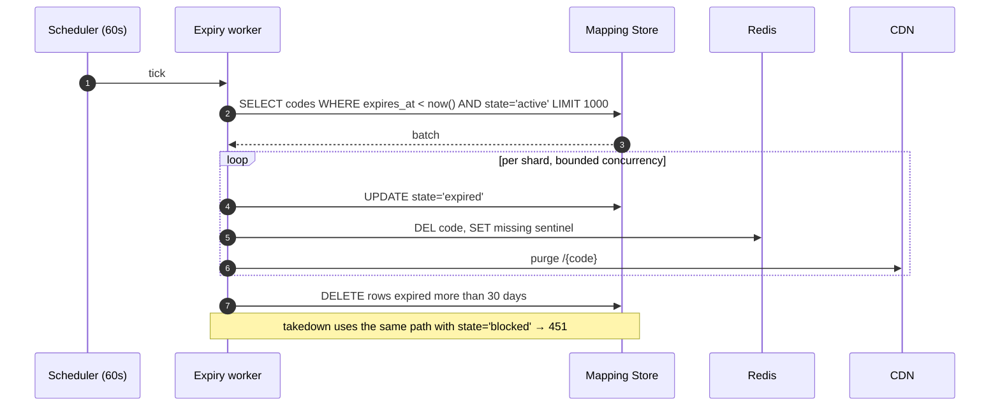
```mermaid
sequenceDiagram
  autonumber
  participant T as Scheduler (60s)
  participant GC as Expiry worker
  participant DB as Mapping Store
  participant RC as Redis
  participant CDN as CDN

  T->>GC: tick
  GC->>DB: SELECT codes WHERE expires_at < now() AND state='active' LIMIT 1000
  DB-->>GC: batch
  loop per shard, bounded concurrency
    GC->>DB: UPDATE state='expired'
    GC->>RC: DEL code, SET missing sentinel
    GC->>CDN: purge /{code}
  end
  GC->>DB: DELETE rows expired more than 30 days
  Note over GC,DB: takedown uses the same path with state='blocked' → 451
```

Expiry is **also enforced lazily on read** — the redirect service checks
`expires_at` and `state` after the cache fetch, because a cached entry can
outlive its own expiry. That makes the worker responsible for reclaiming
*space*, never for enforcing *semantics*: a stalled worker becomes a cost
problem, not a correctness one.

Deletion is a state change, never a row delete. Takedowns get appealed and
reversed, and a deleted row cannot be un-deleted.

### 9.6 Click analytics, entirely off the hot path

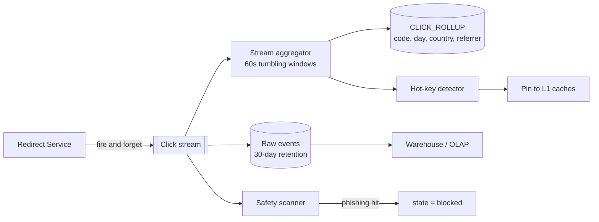
```mermaid
flowchart LR
  R[Redirect Service] -->|fire and forget| Q[[Click stream]]
  Q --> AGG[Stream aggregator<br/>60s tumbling windows]
  AGG --> RU[("CLICK_ROLLUP<br/>code, day, country, referrer")]
  AGG --> HOT[Hot-key detector] --> PIN[Pin to L1 caches]
  Q --> RAW[(Raw events<br/>30-day retention)]
  RAW --> WH[Warehouse / OLAP]
  Q --> SC[Safety scanner] -->|phishing hit| BLK[state = blocked]
```

Ten billion clicks a day is 1 TB of raw events — 50× the mappings themselves. It
gets its own stream, its own retention, and its own store. A synchronous counter
increment per click would add a write to 350 K reads/s to make a dashboard
number fresher than any human needs.

The same stream feeds the hot-key detector and the safety scanner, which is the
argument for emitting one well-formed event rather than three special-purpose
side effects.

---

## 10. Link Lifecycle

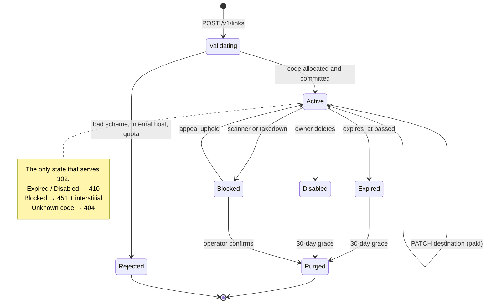
```mermaid
stateDiagram-v2
  [*] --> Validating: POST /v1/links
  Validating --> Rejected: bad scheme, internal host, quota
  Validating --> Active: code allocated and committed
  Active --> Active: PATCH destination (paid)
  Active --> Expired: expires_at passed
  Active --> Disabled: owner deletes
  Active --> Blocked: scanner or takedown
  Blocked --> Active: appeal upheld
  Expired --> Purged: 30-day grace
  Disabled --> Purged: 30-day grace
  Blocked --> Purged: operator confirms
  Purged --> [*]
  Rejected --> [*]

  note right of Active
    The only state that serves 302.
    Expired / Disabled → 410
    Blocked → 451 + interstitial
    Unknown code → 404
  end note
```

The `Blocked → Active` edge is the one people forget. Takedowns are reversed;
blocking must therefore be reversible, which means it cannot be implemented as
a delete.

**Codes are never recycled.** A purged code stays retired forever, because
reissuing it would silently redirect old links — printed on posters, embedded in
old messages — to a stranger's destination. The key space is large enough that
retiring codes costs nothing; reusing them is a security incident waiting for a
schedule.

---

## 11. Low-Level Design

### 11.1 Service objects

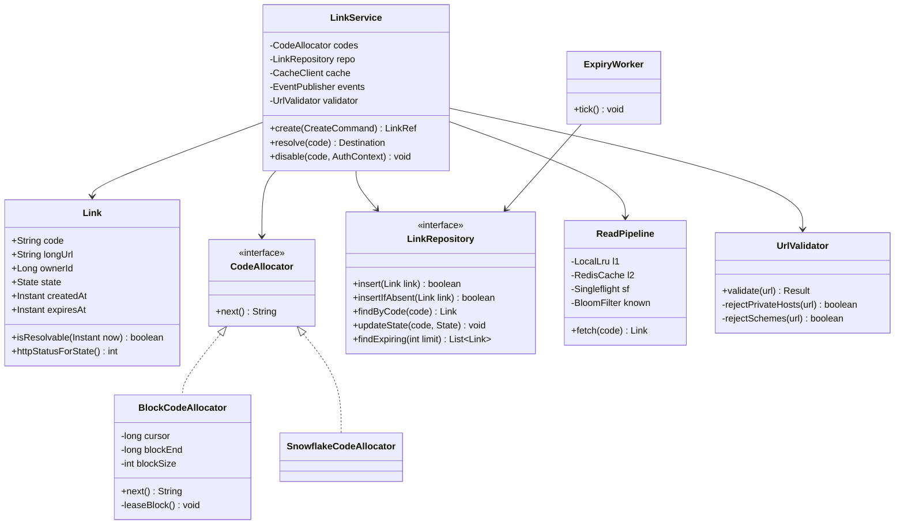
```mermaid
classDiagram
  class LinkService {
    -CodeAllocator codes
    -LinkRepository repo
    -CacheClient cache
    -EventPublisher events
    -UrlValidator validator
    +create(CreateCommand) LinkRef
    +resolve(code) Destination
    +disable(code, AuthContext) void
  }

  class Link {
    +String code
    +String longUrl
    +Long ownerId
    +State state
    +Instant createdAt
    +Instant expiresAt
    +isResolvable(Instant now) boolean
    +httpStatusForState() int
  }

  class CodeAllocator {
    <<interface>>
    +next() String
  }
  class BlockCodeAllocator {
    -long cursor
    -long blockEnd
    -int blockSize
    +next() String
    -leaseBlock() void
  }
  class SnowflakeCodeAllocator

  class LinkRepository {
    <<interface>>
    +insert(Link link) boolean
    +insertIfAbsent(Link link) boolean
    +findByCode(code) Link
    +updateState(code, State) void
    +findExpiring(int limit) List~Link~
  }

  class ReadPipeline {
    -LocalLru l1
    -RedisCache l2
    -Singleflight sf
    -BloomFilter known
    +fetch(code) Link
  }

  class UrlValidator {
    +validate(url) Result
    -rejectPrivateHosts(url) boolean
    -rejectSchemes(url) boolean
  }

  class ExpiryWorker {
    +tick() void
  }

  LinkService --> CodeAllocator
  LinkService --> LinkRepository
  LinkService --> ReadPipeline
  LinkService --> UrlValidator
  LinkService --> Link
  CodeAllocator <|.. BlockCodeAllocator
  CodeAllocator <|.. SnowflakeCodeAllocator
  ExpiryWorker --> LinkRepository
```

`CodeAllocator` is an interface because it is the one component with two
defensible implementations (Section 8.3) and because tests need a deterministic
counter rather than a clock-dependent generator.

### 11.2 Create, in code shape

```
function create(cmd, auth):
    v = validator.validate(cmd.longUrl)          # scheme, length, private-host, blocklist
    if not v.ok: return Rejected(v.reason)

    if cmd.idempotencyKey:
        existing = repo.findByIdempotencyKey(auth.clientId, cmd.idempotencyKey)
        if existing: return LinkRef(existing.code)

    if cmd.alias:
        assert not RESERVED_WORDS.contains(cmd.alias)
        link = Link(cmd.alias, cmd.longUrl, auth.userId, ACTIVE, isCustom = true)
        if not repo.insertIfAbsent(link):        # conditional insert IS the lock
            return Conflict(suggestions(cmd.alias))
    else:
        code = codes.next()                      # pointer increment, zero I/O
        link = Link(code, cmd.longUrl, auth.userId, ACTIVE, isCustom = false)
        repo.insert(link)                        # no read-before-write

    cache.set(link.code, link, TTL_1H)           # author's own click will hit
    events.publish(LinkCreated(link.code, cmd.longUrl, auth.clientId))
    return LinkRef(link.code)
```

### 11.3 Resolve, in code shape

```
function resolve(code):
    if not CODE_PATTERN.matches(code): return NotFound   # reject before any I/O
    if not bloom.mightExist(code):     return NotFound   # random scans never reach the DB

    link = l1.get(code) ?? l2.get(code)
    if link == null:
        if l2.get("missing:" + code): return NotFound    # negative cache
        link = singleflight.do(code, () => {
            found = repo.findByCode(code)
            if found == null:
                l2.set("missing:" + code, SENTINEL, TTL_60S)
                return null
            return found
        })
        if link == null: return NotFound
        l2.set(code, link, jitter(TTL_1H))               # jitter prevents synchronized expiry
    l1.set(code, link)

    if link.state == BLOCKED:            return Interstitial(451)
    if not link.isResolvable(now()):     return Gone(410)   # lazy expiry is authoritative

    events.publishAsync(Click(code, now(), requestContext()))   # never blocks
    return Redirect(302, link.longUrl)
```

Two details worth defending: the **format check and Bloom filter run before any
I/O**, so a scanner spraying random seven-character codes costs microseconds
rather than a store round trip each; and **state and expiry are checked after the
cache read**, because a cached entry can outlive the state change that
invalidated it.

### 11.4 Concurrency inventory

| Race | Mechanism |
|---|---|
| Two clients claiming one alias | `INSERT ... IF NOT EXISTS`; the store arbitrates on one partition |
| Two creates with the same idempotency key | Unique index on `(client_id, idempotency_key)`; loser reads the winner's row |
| ID generator issuing a duplicate | Disjoint leased blocks, or coordinated Snowflake worker IDs |
| Cache stampede at TTL expiry | Singleflight plus jittered TTLs |
| Clock moving backwards (Snowflake) | Generator refuses to regress; stalls until the clock catches up |
| Redirect during a takedown | State re-checked after the cache fetch; worst case one stale edge hit for `max-age` |
| Expiry worker vs. an in-flight read | Two-phase: state flips first, row deletion is 30 days behind |

---

## 12. Optimization

Everything above is a working system. This section is what makes it fast and
cheap, which for a read-heavy service are the same problem.

### 12.1 The read path as a funnel

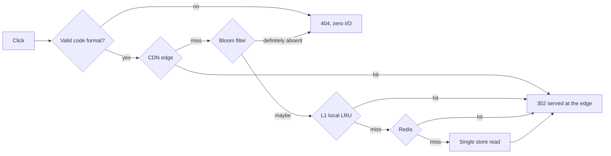
```mermaid
flowchart LR
  A[Click] --> B{Valid code format?}
  B -->|no| X4[404, zero I/O]
  B -->|yes| C{CDN edge}
  C -->|hit| OK[302 served at the edge]
  C -->|miss| D{Bloom filter}
  D -->|definitely absent| X4
  D -->|maybe| E{L1 local LRU}
  E -->|hit| OK
  E -->|miss| F{Redis}
  F -->|hit| OK
  F -->|miss| G[Single store read] --> OK
```

The cumulative effect is that the CDN absorbs the large majority of clicks before
they reach us at all, and of what remains, the great majority never reaches the
store. **The mapping store — the slowest and per-request costliest tier — should
see low single-digit percentages of original click volume.** If it sees more,
the cache tier is mis-sized, and that is a monitoring signal, not a scaling one.

### 12.2 `301` versus `302`: the decision you cannot take back

This is the most consequential one-character choice in the system.

| | `301 Moved Permanently` | `302 Found` (chosen) |
|---|---|---|
| Browser caches the redirect | **Yes, often indefinitely** | No, or briefly |
| Repeat clicks reach you | No | Yes |
| Analytics | Only the first click per browser, ever | Every click |
| Can you repoint the destination? | **No — cached browsers never ask again** | Yes |
| Can you revoke a phishing link? | **Not for anyone who already clicked it** | Yes, immediately |
| Origin load and cost | Minimal | Full click volume |
| Latency for repeat clicks | Zero network hop | One edge round trip |

`301` is faster and cheaper and permanently forfeits measurement, editing, and
revocation. **Revocation is the argument that ends it**: a shortener that cannot
kill a link it has already served is an abuse platform. Serve `302` with a short
`Cache-Control: max-age` (300 s) so edges still absorb the volume while the
origin keeps control.

> [!WARNING]
> The `max-age` is a takedown-latency dial, not a performance dial. Five minutes
> of exposure after a takedown is usually the honest trade; a regulated or
> high-abuse context should shorten it and pay for the extra origin traffic, and
> pair it with an explicit CDN purge.

### 12.3 Caching decisions

- **Jitter every TTL** by ±10%. Identical TTLs across a fleet produce
  synchronised expiry and a self-inflicted stampede.
- **Negative-cache misses for 60 s.** Enumeration scans generate enormous 404
  volume; without a negative cache each one is a store read.
- **Cache the whole link record, not just the URL**, so state and expiry can be
  checked without a second lookup.
- **Warm the cache on create.** The author almost always clicks their own link
  first, and it costs one `SET` on a path that is 100× less busy than the read
  path.

### 12.4 Hot links

The detector in the click stream pins hot codes into every pod's L1 with an
extended TTL, and the CDN raises `max-age` for them adaptively. Combined with
singleflight, a link doing 100 K req/s performs approximately zero store reads.
Same class of problem, same tools as [Distributed Cache](014-distributed-cache.md).

### 12.5 Deduplication, and why it is opt-in

Indexing `url_hash` lets identical destinations share one code. It looks like
free storage savings and it is a trap by default:

- **Analytics collide.** Two campaigns pointing at the same landing page must not
  share a click count.
- **Deletion becomes shared.** One owner disabling "their" link breaks it for
  everyone else who was silently given the same code.
- **It leaks.** A create that returns an existing code tells you someone else
  already shortened that exact URL.

Offer it as an explicit per-request flag, scoped per owner. The storage saved is
not worth the semantics lost.

### 12.6 What deliberately is not optimized

- **Click counts are a minute stale.** No decision is made on them in real time.
- **Cross-region replication is asynchronous.** A link resolving in Frankfurt
  300 ms before Singapore is not a defect.
- **The owner dashboard fans out across shards.** It is a low-traffic
  authenticated path; denormalising an index for it would optimise the wrong
  0.01%.

---

## 13. Scaling and Failure Modes

### 13.1 Scaling levers, in the order you would pull them

1. **Widen CDN coverage and raise edge TTL** — removes load and cost with no code
   change.
2. **Scale redirect pods horizontally** — stateless, trivial.
3. **Grow the Redis tier** — more working set, fewer store reads.
4. **Add store shards** — hash partitioning spreads evenly; plan the shard count
   with headroom or use consistent hashing with virtual nodes from day one,
   because resharding is the expensive lever.
5. **Regional read replicas** — last, because it is the costliest and only helps
   the small fraction of traffic that misses every cache.

### 13.2 Failure matrix

| Failure | Blast radius | Behavior |
|---|---|---|
| Redis cluster down | Higher latency, more store load | Serve from L1 and the store; shed writes to protect reads |
| One store shard down | 1/N of codes unresolvable | Cached codes still resolve; other shards unaffected — the argument for hash sharding |
| Mapping store fully down | Cache-miss traffic fails | CDN and caches keep serving the hot set; return `503` with `Retry-After` for misses, never a wrong destination |
| ID generator unavailable | Creates fail | Redirects unaffected; write path degrades alone. Alert at 30% block depth remaining |
| CDN outage | Full click volume hits origin | Origin sized for ~3× normal to absorb it |
| Expiry worker stalled | Storage grows | Lazy expiry keeps correctness intact; alert on oldest-unpurged age |
| Click stream backed up | Analytics lag | Redirects unaffected by construction — the publish is fire-and-forget |
| Scanner offline | Malicious links live longer | Reactive takedown path still works; alert on scan queue age |

The theme: **every failure degrades to a correct redirect or an honest error, and
never to a wrong destination.** Sending a user somewhere unintended is the one
outcome this system must make impossible.

---

## 14. Security and Abuse

A URL shortener is an **obfuscation service that anyone can use for free**. That
is its product and its abuse surface, and treating abuse as an afterthought here
is the mistake.

- **Open redirect by design.** Every shortener is one, so the defences are
  scanning and revocation rather than prevention. Scan destinations on create and
  re-scan periodically — a benign page today can be compromised next week, and a
  create-time-only scan misses that entirely.
- **Show the destination on request.** A preview endpoint (`/{code}+` is the
  common convention) lets a cautious user see where a link goes without following
  it.
- **Interstitial for flagged links** rather than a silent block: it warns the
  user and gives an appeal path.
- **SSRF at create time.** Reject `localhost`, private ranges, link-local
  metadata addresses, and non-HTTP schemes (`file:`, `javascript:`, `data:`).
  Validate after DNS resolution, not before, or a hostname that resolves to
  169.254.169.254 walks straight through.
- **Redirect chains.** Refuse to shorten another shortener's link beyond a small
  depth; chains defeat scanners and inflate latency.
- **Enumeration.** Sequential codes mean the space is walkable. Rate-limit per IP
  on 404s and on redirect volume, and treat a sustained high 404 rate from one
  source as an enumeration attempt to block, not merely a metric to graph.
- **Referrer leakage.** The redirect response should carry a restrictive
  `Referrer-Policy` so the shortener's URL — and any campaign identifiers in
  it — do not leak to the destination.
- **PII in long URLs.** People shorten links containing session tokens and
  password-reset links. Codes are public and enumerable, so treat stored URLs as
  sensitive: encrypt at rest and keep them out of logs.
- **Quotas** per tier on creation rate, total links, and custom aliases.

---

## 15. Monitoring

| Signal | Why it matters | Alert on |
|---|---|---|
| Redirect p50/p99 by tier (edge / L1 / Redis / store) | Locates a slowdown to a layer | p99 > 100 ms |
| Cache hit rate per tier | Leading indicator of store load | Redis hit rate < 90% |
| Store read rate as a share of clicks | The funnel in 12.1 is working | > 5% of click volume |
| ID block depth | Silent, then it stops every write | < 30% remaining |
| 404 rate by source IP | Enumeration attempts | Sustained spike from one source |
| 410 / 451 rate | Expired-link and takedown volume | Sharp change |
| Create success rate and p99 | The write path, which fails independently | p99 > 300 ms |
| Click stream lag | Analytics freshness and hot-key detection | > 5 min |
| Scan queue age | How long a malicious link stays live | > 15 min |
| Codes issued vs. key space | Long-horizon capacity | > 10% consumed |

**Store read rate as a share of clicks is the health metric for the whole
design.** It should be a low single-digit percentage; when it drifts up, the
cause is a cache-tier problem or a change in traffic shape, and finding out from
this graph is much cheaper than finding out from a latency alert.

---

## 16. Trade-offs Summary

| Decision | Benefit | Cost |
|---|---|---|
| `302` over `301` | Analytics, editing, and revocation stay possible | Full click volume reaches the edge; every click costs something |
| Hash-partitioned KV over relational | Uniform point-lookup performance, easy horizontal growth | No range scans, no joins; resharding is painful |
| Distributed IDs over hash or random codes | No read-before-write; scales horizontally | Codes are enumerable; ordering leaks creation rate |
| Block allocation over Snowflake | Fewer moving parts, no clock dependency | Blocks lost on crash; IDs not time-sortable |
| Seven-character codes | ~1% of key space per year, no reissue pressure | One character longer than the minimum viable |
| Four cache tiers | Store sees a few percent of click volume | Four places for a stale entry to hide |
| Lazy expiry plus a background worker | Correctness independent of worker health | Expired rows linger briefly |
| State changes instead of deletes | Takedowns are reversible; codes never recycled | Storage held past logical deletion |
| Async click events | Redirect path carries no writes | Counts ~1 min stale |
| Opt-in dedupe | Clean analytics, clean deletion, no leak | Duplicate storage for identical URLs |
| Separate read and write services | Independent scaling; shed writes to save reads | Two deployables, shared model code |

---

## 17. Interview Deep Dives

Where the conversation usually goes next:

- **"Why 302 and not 301?"** The table in Section 12.2, ending on revocation.
  This is the single best question in the problem and the answer separates people
  who have run one from people who have read about one.
- **"One link is doing 100 K req/s."** Hot keys, singleflight, jittered TTLs, L1
  pinning, adaptive edge TTLs — Section 9.4.
- **"Make the codes unguessable."** Format-preserving encryption over the
  counter, and why bolting on random generation reintroduces the collision check
  you designed away. Contrast with [Pastebin](003-pastebin.md).
- **"How do you stop it becoming a phishing platform?"** Section 14: scan on
  create *and* re-scan, interstitials, previews, and how quickly a takedown
  propagates given your `max-age`.
- **"Support 10 M custom aliases."** Alias namespace collisions, reserved words,
  and why the conditional insert is the whole concurrency story.
- **"Add per-country destinations."** Breaks the "code maps to a URL" assumption
  every cache tier depends on; the honest answer is that a code now maps to a
  *rule*, and rules must be evaluated somewhere cacheable — at the edge.
- **"Run it in five regions."** Regional caches, asynchronous replication, and
  read-your-writes for the creating region.
- **"Now store the content instead of a pointer."** That is
  [Pastebin](003-pastebin.md), and the bottleneck moves from lookups to bytes.

---

## 18. Key Takeaways

- A URL shortener is a **distributed hash table with a CDN in front**. Every
  design decision should be justified by the 100:1 read ratio, and anything that
  adds work to the redirect path needs an extremely good reason.
- **Immutability is what makes four cache tiers safe.** Because a mapping rarely
  changes, caches need no invalidation protocol — only deletion and takedown
  propagate, which is why editable destinations are priced as a feature rather
  than assumed.
- **`301` versus `302` is a product decision disguised as an HTTP detail.** The
  permanent redirect is faster and forfeits measurement, editing, and — decisively
  — revocation.
- **Generate IDs, do not search for them.** Any scheme that must ask "is this
  code taken?" before writing has put a read on the write path and gets worse as
  the key space fills.
- **Sequential codes are a security decision, not a performance one.** Acceptable
  here because links are public by design; disqualifying the moment anything
  unlisted exists.
- **Size the key space with arithmetic, not instinct.** Six characters looks fine
  and dies in eighteen months; seven lasts a century.
- **Never recycle a code.** Old links live in printed material and archived
  messages, and reissuing a code silently redirects them to a stranger.
- **Keep every write off the read path.** Counting, scanning, and rollups all
  belong behind the event stream.
