## 1. Problem Statement

An API platform is falling over. Some of the traffic is malicious — scraping,
credential stuffing — but most of it is not: it is a well-behaved client that
started retrying when a downstream service slowed down, and turned a partial
degradation into a total one. The platform needs a **rate limiter**: something
that caps how much any one client can consume, protecting the backend and
keeping capacity fair.

It is a small system with an unusual set of constraints, and they pull against
each other:

- **It is the busiest component you own.** It runs on every request to
  everything, so its throughput requirement is the sum of all your services'
  throughput.
- **It adds latency to the traffic it allows.** The 99.9% of requests that are
  under the limit pay for the 0.1% that are not.
- **Its worst failure mode is doing its job too well.** A rate limiter that
  becomes unavailable and blocks everything is a more effective outage than the
  overload it was installed to prevent.
- **It is deliberately approximate.** Exact counting across a distributed fleet
  is achievable and almost never worth what it costs.

So the thread running through this design: **the limiter must be accurate enough
to protect the backend, cheap enough to sit on every request, and unable to
become the outage itself.** Every decision below trades among those three.

---

## 2. Use Cases

### 2.1 Actors and what they want

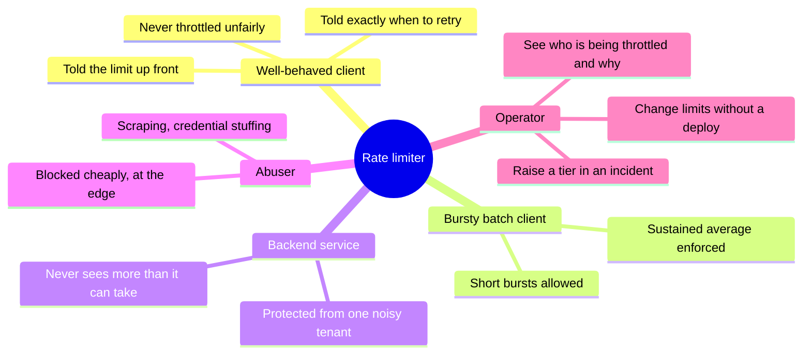

### 2.2 Primary use cases

| # | Use case | Actor | Trigger | Success outcome |
|---|---|---|---|---|
| UC-1 | Enforce a per-key limit | Any client | Every API request | Allowed under the limit, `429` over it |
| UC-2 | Tiered limits | Enterprise client | Request with a paid API key | 10 000 req/min instead of 100 |
| UC-3 | Absorb a legitimate burst | Batch client | 200 requests in 2 s, 60 req/min average | Burst allowed; sustained rate still enforced |
| UC-4 | Retry storm | Any client | Downstream fails, client retries hard | Throttled at the gateway; backend protected |
| UC-5 | Per-endpoint limits | Operator | Expensive endpoint needs a tighter cap | `POST /search` limited separately from `GET /me` |
| UC-6 | Credential stuffing | Attacker | Thousands of logins from many IPs | Per-account and per-IP limits both apply |
| UC-7 | Change a limit live | Operator | Incident: raise a partner's cap | Effective within seconds, no redeploy |
| UC-8 | Client self-throttles | Good client | Reads response headers | Slows down before hitting `429` |
| UC-9 | Limiter store outage | Operator | Redis cluster unavailable | Traffic keeps flowing; alert fires |
| UC-10 | Multi-region client | Global client | Requests land in three regions | Aggregate limit approximately enforced |

### 2.3 The journey the limiter exists to prevent

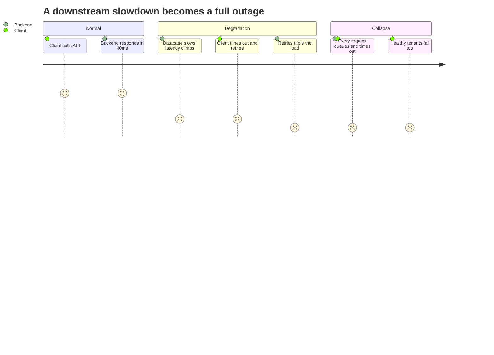

The critical detail is that **nobody in that story is malicious**. The client's
retries are correct behaviour in isolation; they are catastrophic in aggregate.
A limiter that only models attackers will not save you from your own customers,
which is why UC-4 is the one to design for.

### 2.4 Out of scope

The gateway itself ([API Gateway](013-api-gateway.md)), load shedding and
prioritisation once a backend is *already* saturated (a different control loop),
bot detection and fingerprinting, and quota billing — long-horizon accounting of
"10 M calls per month" is metering, with different accuracy and durability
requirements than a per-second guard.

---

## 3. Requirements

### Functional

- Limit requests per **client identity** — API key, user ID, or IP — to N per
  window.
- Support **per-tier** limits (free, pro, enterprise) and **per-endpoint**
  overrides.
- Support **multiple simultaneous limits** on one request (per-key *and* per-IP
  *and* per-endpoint), where the strictest wins.
- Return `429 Too Many Requests` with `Retry-After`, and expose limit state in
  response headers on every request.
- Update limits **without a redeploy**, effective within seconds.

### Non-functional

- **Latency: p99 under 2 ms added.** It is on the hot path of every request; the
  budget is small and non-negotiable.
- **Throughput: the sum of all protected services.** 1 M req/s at peak.
- **Availability: higher than the system it protects.** If the limiter is less
  available than the backend, installing it lowered your availability.
- **Accuracy: approximate, bounded.** Overshooting a limit by a few percent is
  acceptable. Overshooting by a factor of the fleet size is not.
- **Fairness**: one client hitting its limit must not degrade any other client,
  including through shared infrastructure such as a hot shard.

### Constraints and assumptions

- The gateway is **stateless and horizontally scaled across regions**, so
  consecutive requests from one client land on different nodes. Any state must
  be shared or explicitly approximated.
- Clients retry. Some retry badly. A `429` must not itself trigger an immediate
  retry storm, which is what `Retry-After` and jitter guidance are for.
- **Client identity can be forged.** IP-based limits are attacker-controlled in
  ways API keys are not (Section 14).

---

## 4. Capacity Estimation

Assumptions: **1 M req/s at peak** across 4 regions, 50 M distinct client
identities seen per day, ~2 M active in any given minute.

### Throughput

| Metric | Calculation | Result |
|---|---|---|
| Peak requests, global | | **1 000 000/s** |
| Peak per region | 1 M / 4 | **250 000/s** |
| Limiter checks per request | key + IP + endpoint, batched | **1 round trip** |
| Redis ops/s per region | 250 K × 1 | **250 000/s** |
| Redis shards per region (~80 K ops/s each, with headroom) | | **6 shards + replicas** |

> [!IMPORTANT]
> **The limiter's op rate equals the total request rate of everything it
> protects.** That single line is why the design cannot afford a second network
> hop, a multi-key transaction, or an algorithm that stores per-request data.

### Memory

| Metric | Calculation | Result |
|---|---|---|
| Token-bucket state per client | 2 fields + key + overhead | **~100 B** |
| Active clients in a minute | | **2 M → ~200 MB** |
| All clients seen in a day, if never expired | 50 M × 100 B | **~5 GB** |
| With 10-minute idle TTL | | **~300 MB steady state** |

**TTL on bucket keys is the mechanism that bounds memory.** Without expiry the
key space grows with every distinct identity ever seen — and for IP-keyed limits
that is unbounded and attacker-controlled. An idle bucket is indistinguishable
from a full one, so evicting it costs nothing but recreating it on the next
request.

This is also the argument against the sliding-window log (Section 7.2): storing a
timestamp per request would turn 100 B per client into 100 B × the client's rate,
and a single enterprise client at 10 000 req/min would hold 60 MB by itself.

### The economics

| Path | Cost per request |
|---|---|
| Rejected at the gateway | ~0.1 ms of gateway CPU, no backend contact |
| Allowed through to a backend | ~40 ms of backend time, a DB connection, downstream calls |

Rejecting early is roughly **two to three orders of magnitude cheaper** than
serving. That ratio is the entire business case, and it also explains why the
limiter belongs at the gateway rather than in each service: a request rejected
after it has already fanned out has consumed most of the resources it was
supposed to save.

---

## 5. API and Contract

### 5.1 What clients see

| Element | Value | Purpose |
|---|---|---|
| `429 Too Many Requests` | Status | The rejection |
| `Retry-After: 3` | Seconds | **When to come back.** Without it, clients retry immediately and stay throttled |
| `RateLimit-Limit: 100` | Requests per window | Lets clients self-throttle |
| `RateLimit-Remaining: 12` | Tokens left | The early warning |
| `RateLimit-Reset: 41` | Seconds until refill | Removes the need to guess |

Headers go on **every response, not just rejections**. A client that can see it
has 12 requests left can slow down; a client that only learns at the moment of
rejection can only react after the damage. Publishing limit state is the cheapest
throughput you will ever buy.

Two rules that matter more than they look:

- **`Retry-After` must carry jitter guidance, and clients should apply it.** If a
  thousand clients are all told "retry in 3 seconds", they synchronise into a
  spike exactly 3 seconds later — the limiter has reshaped a storm rather than
  removed it.
- **A `429` must be cheap.** It should never touch a database, render a template,
  or log a stack trace. Under attack, rejections are the majority of traffic and
  an expensive rejection path is a denial-of-service amplifier.

### 5.2 Configuration API

| Endpoint | Method | Purpose |
|---|---|---|
| `/admin/limits` | GET | Current rule set with version |
| `/admin/limits` | PUT | Publish a new rule set (versioned, audited) |
| `/admin/limits/{tier}` | PATCH | Adjust one tier — the incident lever |
| `/admin/overrides` | POST | Temporary per-client override with a mandatory TTL |

Overrides **require an expiry**. An override without one is a permanent
exemption created during an incident and never revisited, and every mature
platform has a handful of clients that are unlimited for reasons nobody
remembers.

---

## 6. High-Level Design

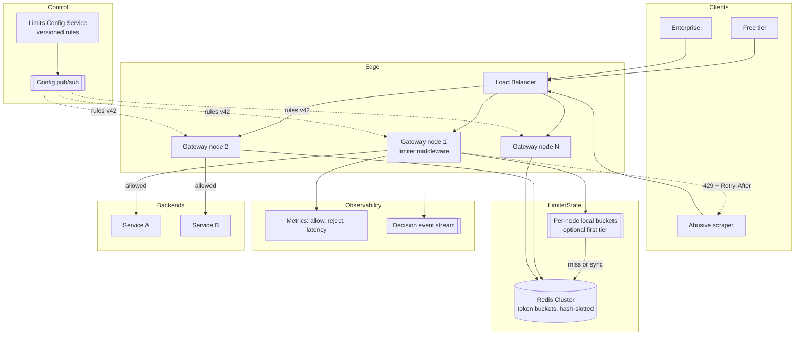

### Component responsibilities

| Component | Owns | Explicitly does not own |
|---|---|---|
| Gateway middleware | Identity extraction, rule matching, the allow/deny decision | Storing counters durably |
| Local bucket tier | Sub-millisecond decisions for hot keys | Being correct on its own |
| Redis cluster | Shared, atomic bucket state | Business rules or tiers |
| Config service | Versioned rules, tiers, overrides, audit | Per-request state |
| Config pub/sub | Pushing rule changes in seconds | Enforcement |
| Decision stream | Every allow/reject, asynchronously | Blocking the request |

**Why the limiter is middleware in the gateway, not a service.** A separate
rate-limit *service* adds a network hop to every request — the one thing the
latency budget cannot absorb — and makes the limiter's availability a hard
dependency of every call. Keeping the logic in-process and only the *state*
remote means a Redis problem degrades to a policy decision rather than an
outage.

**Why the rules are pushed, not pulled.** Polling for configuration means a
change takes as long as the poll interval, and a stampede of gateway nodes
polling on the same schedule is its own load problem. Pub/sub with a versioned
snapshot and a periodic reconciliation poll gets seconds of propagation and
self-heals a missed message.

---

## 7. Algorithms

Five classic approaches. They differ in memory, burst tolerance, and precision,
and the differences are not academic — each fails in a specific way.

### 7.1 Fixed window counter

A counter per `(client, window)`, reset each window. One integer per client, and
one increment per request.

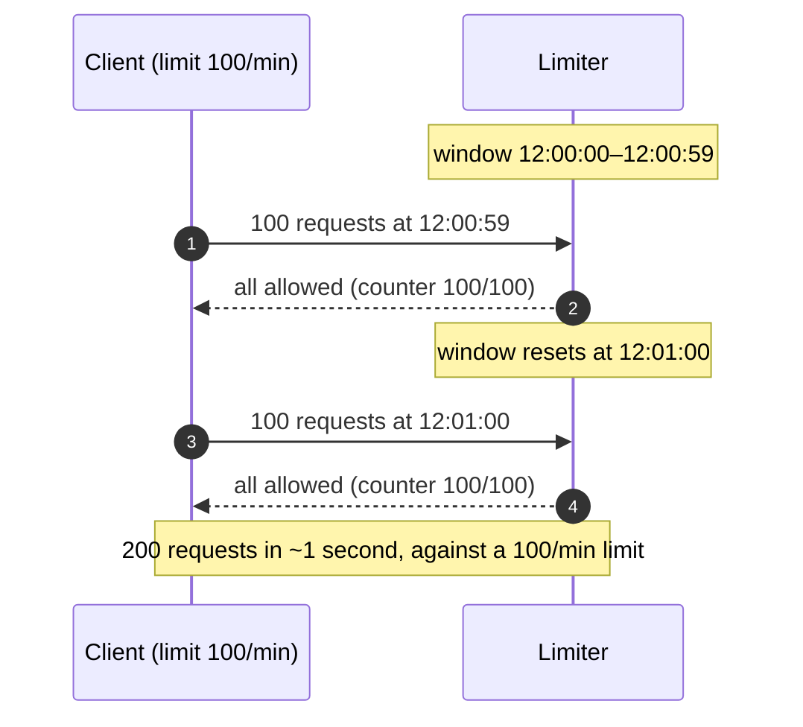

**The boundary burst is not an edge case, it is the normal behaviour of a client
that retries on a wall-clock schedule.** Cheapest of the five, and it lets
through twice the limit at exactly the moment a synchronised client population is
most likely to hit it.

### 7.2 Sliding window log

Store a timestamp per request in a sorted set; count entries inside the trailing
window; drop older ones.

Perfectly accurate, and it stores **per-request data**. At 10 000 req/min for one
client that is 10 000 members in one sorted set, rewritten continuously — the
memory and CPU cost scale with traffic rather than with client count, which is
the wrong axis. Correct for low-volume, high-value limits (password resets,
payment attempts); wrong for general API traffic.

### 7.3 Sliding window counter

Keep the current and previous fixed-window counters, and weight the previous one
by how much of it still overlaps the trailing window:

```
estimate = current + previous × (overlap fraction of the previous window)
```

At 12:00:30 with a one-minute window, a client with 80 requests in the previous
window and 30 in the current is charged `30 + 80 × 0.5 = 70`.

Two counters per client, no per-request storage, and the boundary burst is
smoothed away. It assumes traffic was **uniformly distributed** within the
previous window, so it under-counts a client that front-loaded its requests. That
error is small, bounded, and in practice acceptable.

### 7.4 Token bucket

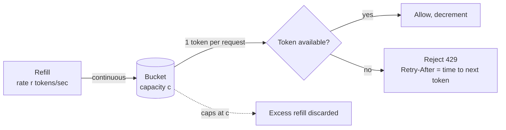

Two numbers per client — `tokens` and `last_refill_time` — and refill computed
lazily on access rather than by a background timer, so an idle client costs
nothing.

The property that matters: **capacity and rate are separate dials.** Capacity
controls how large a burst you tolerate; rate controls the sustained average.
That is exactly the shape of real API traffic, where a batch client legitimately
sends 200 requests in two seconds and then nothing for a minute — and it is a
distinction the window algorithms cannot express at all.

### 7.5 Leaky bucket

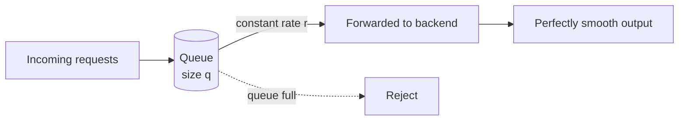

Requests queue and drain at a fixed rate, producing a smooth outflow regardless
of input shape. Ideal in front of something that genuinely cannot absorb bursts —
a legacy system, a hardware appliance, a third-party API with a hard per-second
cap.

The cost is **queueing latency**: a request may wait rather than fail, which
turns a fast rejection into a slow success and can be worse for a caller with its
own timeout. It also means the limiter now holds state for in-flight requests, so
a gateway restart drops them.

### 7.6 Comparison and decision

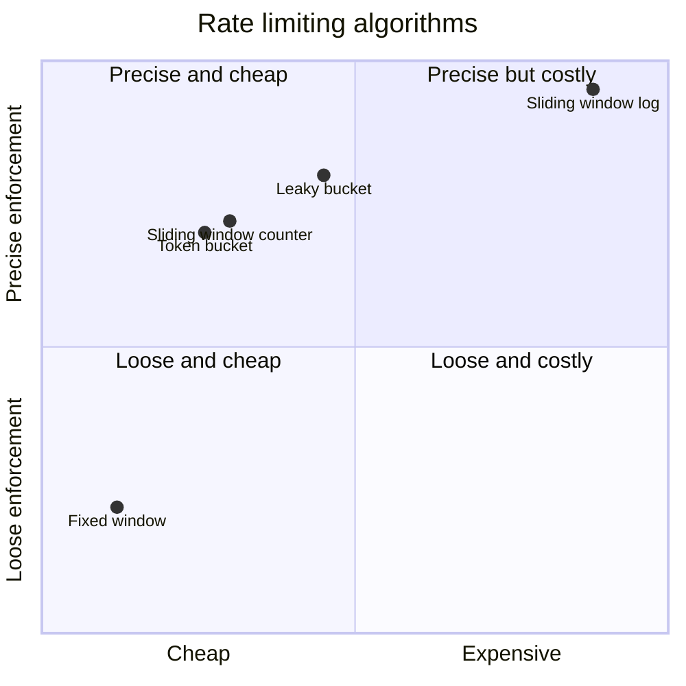

| Algorithm | Memory per client | Burst behaviour | Worst-case error | Best for |
|---|---|---|---|---|
| Fixed window | 1 counter | Uncontrolled at boundaries | **2× the limit** | Coarse internal quotas |
| Sliding log | O(requests) | Exact | None | Low-volume, high-value limits |
| Sliding counter | 2 counters | Smoothed | A few % under non-uniform traffic | General-purpose |
| **Token bucket** | 2 fields | **Explicitly bounded by capacity** | Small, tunable | **General API traffic (chosen)** |
| Leaky bucket | Queue of size q | Absorbed then smoothed | None, but adds latency | Protecting burst-intolerant backends |

**Token bucket**, because burst tolerance is a requirement rather than a defect
here (UC-3), it is O(1) in memory, and the two dials map directly onto how limits
are actually sold: "10 000 per minute, bursting to 500". Leaky bucket was
rejected because backends already buffer and turning a rejection into a queued
wait would push latency onto callers that have their own deadlines.

The sliding-window log still earns a place on a small number of routes —
login, password reset, payment — where volumes are low, precision matters, and
"approximately five attempts" is not a sentence anyone wants to defend.

---

## 8. Distributed State

The gateway is stateless and horizontally scaled, so a client's consecutive
requests hit different nodes. The counters cannot live in process memory alone.

### 8.1 Three options

| Approach | Added latency | Accuracy | Failure behaviour |
|---|---|---|---|
| **Local only, per node** | ~0 | Overshoots by up to **N×** (N = node count) | Perfect — no shared dependency |
| **Centralised (Redis)** | 1–2 ms | Accurate to the algorithm | Redis is now on every request path |
| **Two-tier hybrid** | ~0 hot, 1–2 ms cold | Bounded overshoot | Degrades to local on Redis loss |

Local-only is not as absurd as it sounds — with 20 nodes and a 100/min limit, a
per-node limit of 5/min is exactly correct if the load balancer distributes
evenly, and it does not for a client with keepalive connections. That is the
catch: local-only is accurate only under an assumption the load balancer does
not guarantee.

**Centralised Redis is the choice**, with the hybrid available for the small
number of very hot keys (Section 12.2).

### 8.2 The race that makes atomicity non-negotiable

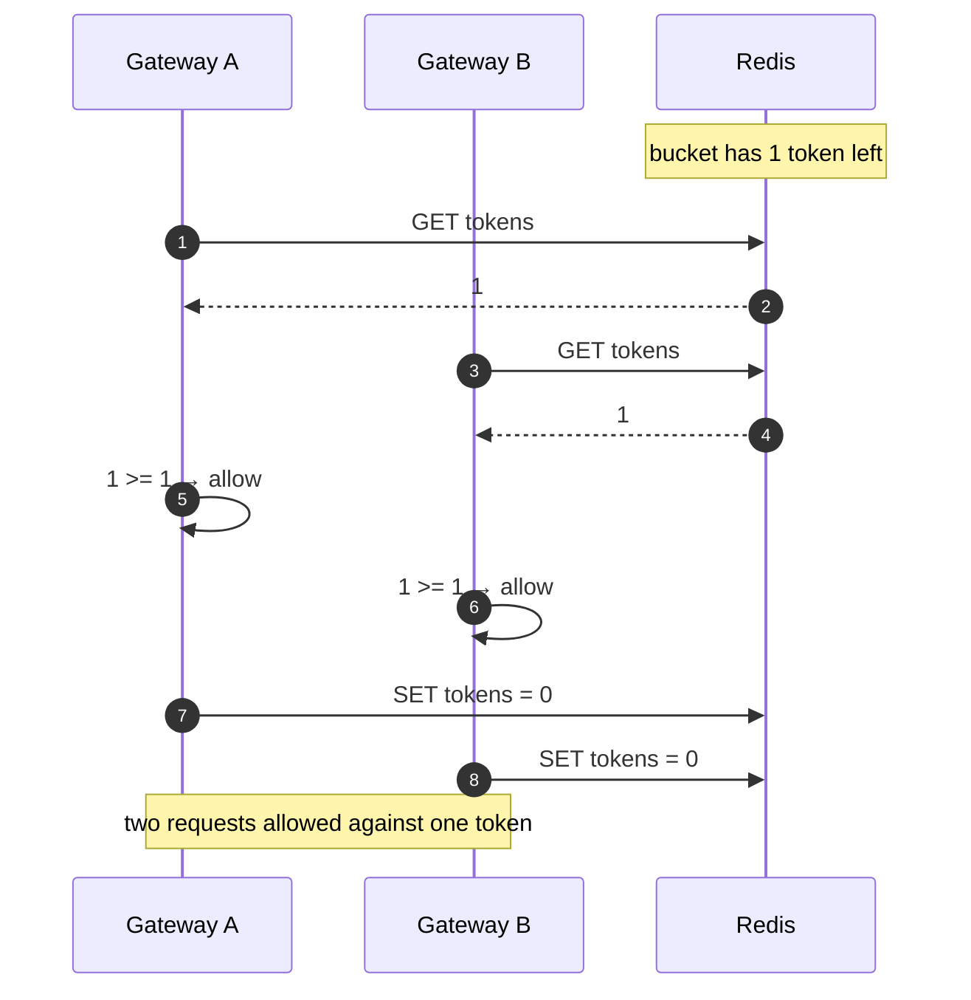

Check-then-set across a network is a race, and at 250 000 checks per second per
region it is a race you lose constantly. The fix is to move the whole
read-modify-write into the store as **one atomic operation** — a Lua script under
`EVALSHA`, which Redis executes single-threaded with no interleaving:

```lua
-- KEYS[1] = bucket key
-- ARGV = now_ms, rate_per_sec, capacity, requested
local state    = redis.call('HMGET', KEYS[1], 'tokens', 'ts')
local tokens   = tonumber(state[1]) or tonumber(ARGV[3])   -- new bucket starts full
local ts       = tonumber(state[2]) or tonumber(ARGV[1])
local elapsed  = math.max(0, tonumber(ARGV[1]) - ts) / 1000

tokens = math.min(tonumber(ARGV[3]), tokens + elapsed * tonumber(ARGV[2]))

local allowed = 0
if tokens >= tonumber(ARGV[4]) then
  tokens  = tokens - tonumber(ARGV[4])
  allowed = 1
end

redis.call('HMSET', KEYS[1], 'tokens', tokens, 'ts', ARGV[1])
redis.call('EXPIRE', KEYS[1], 600)          -- idle buckets evaporate; memory stays bounded
return { allowed, tokens }
```

Four properties in twenty lines: **atomic** refill-and-consume, **lazy** refill so
idle clients cost nothing, **self-expiring** keys so memory is bounded, and a
returned remaining count that feeds the response headers with no second call.

### 8.3 Keys, slots, and multiple limits

A request often has several limits: per API key, per IP, per endpoint. Evaluating
them as three separate round trips triples the latency budget.

- Put all of a request's limit keys in **one script invocation** where they share
  a hash slot, using a hash tag: `{acct:1234}:key`, `{acct:1234}:ip`,
  `{acct:1234}:ep:search`. Redis Cluster routes by the tagged substring, so all
  three land on one shard and one script evaluates them together.
- **The strictest limit wins**, and the response reports which one was hit —
  otherwise a client sees `429` with no idea which of its three limits it
  exceeded, and cannot fix anything.
- Evaluate **cheapest and most likely to reject first** and short-circuit; a
  blocked IP should not cost three bucket updates.

---

## 9. Dynamic Workflows

### 9.1 The allow path

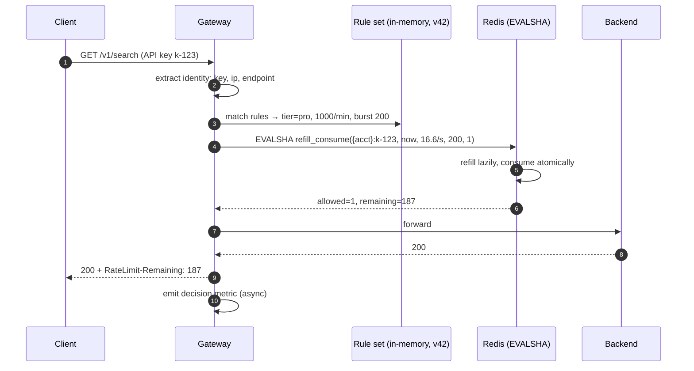

One round trip, ~1 ms, on the allowed path. The rule match is in-process against
a snapshot already in memory, so configuration never costs a network call.

### 9.2 The reject path

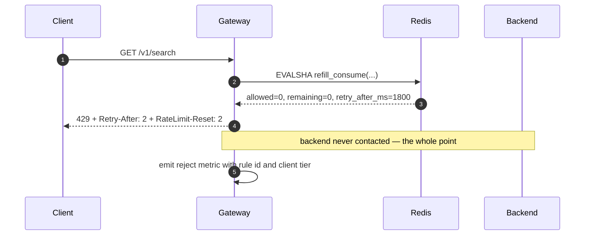

`Retry-After` is computed from the bucket, not guessed: the script knows the
refill rate and the current token count, so it can say exactly when one token
will exist. A constant like "retry in 60 seconds" is either wrong or wasteful,
and it synchronises every throttled client onto the same second.

### 9.3 Redis is unavailable

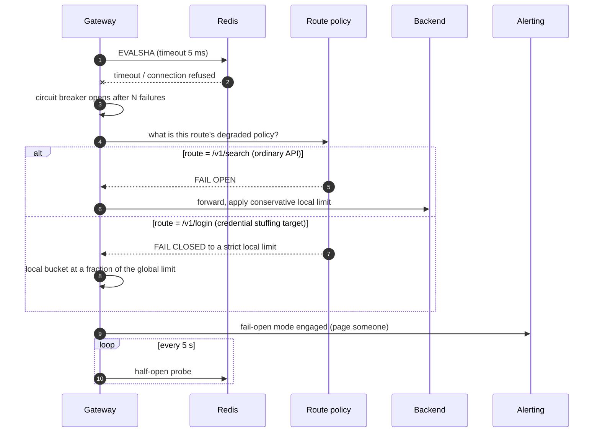

**Fail open is the default and it is not a global policy.** For ordinary API
traffic, letting requests through unlimited beats rejecting all of them: the
limiter exists to protect against overload, not to be the outage. But on a login
endpoint, failing open during a Redis outage hands an attacker unlimited
credential-stuffing attempts at exactly the moment nobody is watching that graph.

So the policy is **per route**, declared with the rule, and the degraded mode is
not "no limiting" but "a conservative local limit" — each node enforces
`global_limit / expected_node_count`, which overshoots but bounds the damage.
This mirrors the fail-open/fail-closed split by dependency in
[Notification Service](005-notification-service.md): decide it in advance, per
dependency, rather than defaulting the whole system to one answer.

### 9.4 A limit change propagates

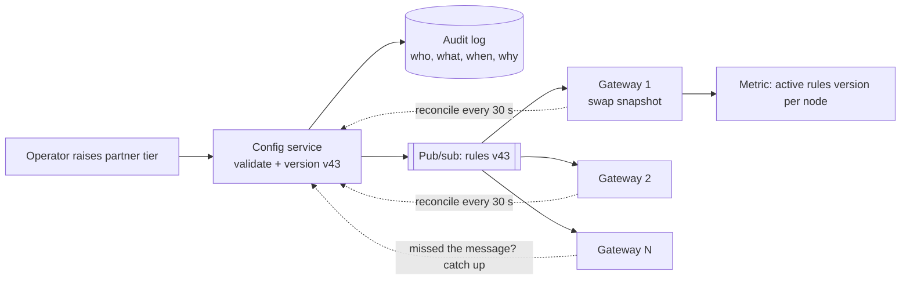

Three things make this safe: rules are **versioned and validated** before
publication (a malformed rule set that reaches the fleet is an instant global
outage); a **periodic reconciliation poll** repairs nodes that missed a message
so pub/sub does not have to be reliable; and **every node exports its active
rules version** as a metric, so "are all nodes on v43?" is a dashboard rather
than an investigation.

Note that changing a limit does **not** reset buckets. Raising the cap makes new
tokens available at the next refill; lowering it takes effect as the bucket
drains. Resetting state on every config change would let a client get a free full
bucket by triggering a rule edit.

### 9.5 Multi-region

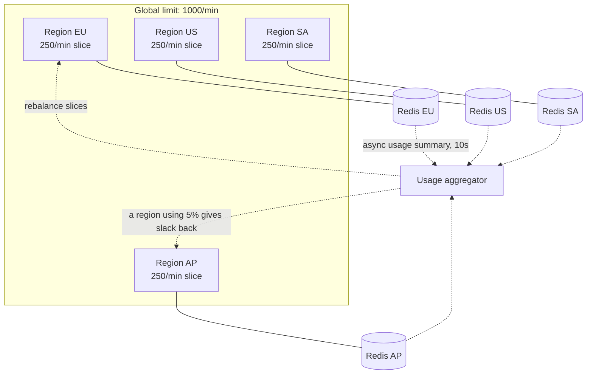

A single global Redis would add a cross-region round trip — 100 ms or more — to
every request, which fails the latency requirement by two orders of magnitude
before it fails anything else. So each region enforces a **slice** of the global
limit locally.

The trade-off is honest and worth stating: a client that spreads traffic across
all four regions can consume up to the full limit in each and get **4× its
aggregate cap**. Static equal slices also waste capacity when traffic is
geographically skewed — a client sending 90% of its traffic to EU is throttled at
250/min while 750/min sits unused elsewhere.

The mitigation is an **asynchronous usage aggregator** that reallocates slices
every few seconds based on observed distribution. It is eventually consistent by
construction, and that is acceptable: this is a guard rail, not a ledger. If you
truly need exact global limits, you need a global consensus round on every
request, and you should first check whether the requirement is real — it usually
comes from billing, which is metering and belongs elsewhere.

### 9.6 Where a request meets its limits

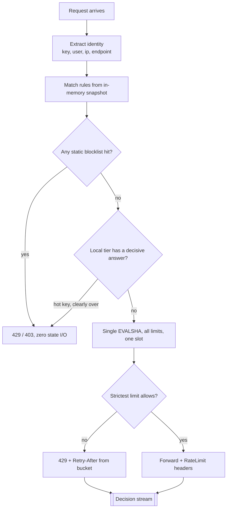

---

## 10. Bucket Lifecycle

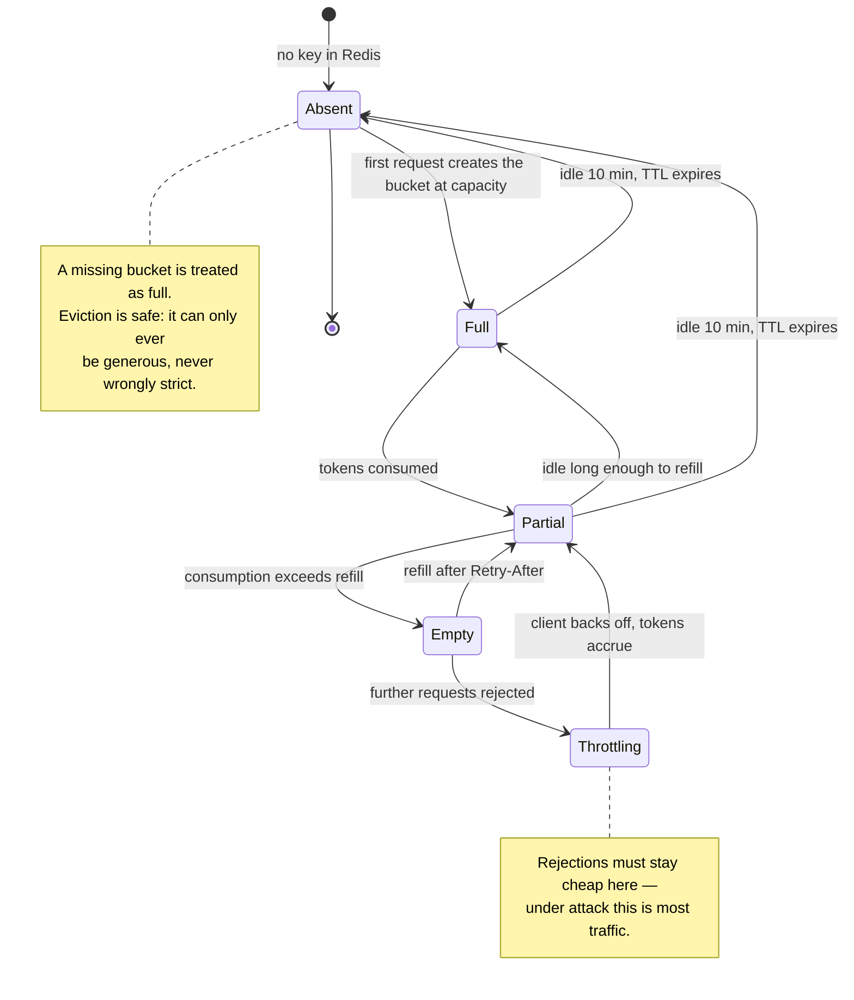

The note on `Absent` is the property that makes TTL-based eviction safe. If a
missing bucket defaulted to *empty*, evicting an idle key would silently throttle
a returning client, and memory pressure would turn into false rejections. Failing
generous on absence keeps eviction a pure memory optimisation.

---

## 11. Low-Level Design

### 11.1 Objects

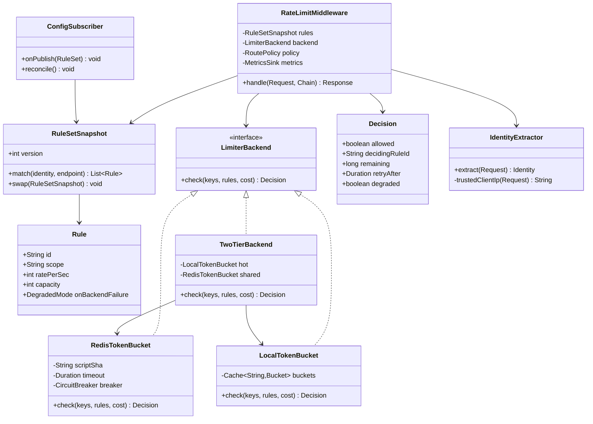

`LimiterBackend` is an interface for a reason that pays off in production, not
just in tests: the local, Redis, and two-tier implementations are swapped **per
route and at runtime** — that is exactly what the degraded mode in Section 9.3
does.

### 11.2 The middleware, in code shape

```
function handle(request, chain):
    identity = extractor.extract(request)          # key > user > trusted ip, in that order
    matched  = rules.match(identity, request.path) # in-memory, no I/O

    if matched.isEmpty(): return chain.proceed(request)   # unlimited routes exist; say so explicitly
    if blocklist.contains(identity): return Reject(403)   # cheapest possible rejection

    keys = matched.map(rule -> key(rule, identity))       # shared hash tag → one slot
    try:
        decision = backend.check(keys, matched, cost(request))
    catch (BackendUnavailable):
        decision = policy.degraded(request.route)         # FAIL_OPEN | LOCAL_STRICT | FAIL_CLOSED
        metrics.degradedMode(request.route)

    response = decision.allowed ? chain.proceed(request) : Reject(429, decision.retryAfter)
    response.headers += rateLimitHeaders(decision)        # on every response, not just 429s
    metrics.recordAsync(decision)                          # never blocks
    return response
```

Two details worth defending: **the rule match happens before any I/O**, so an
unlimited or blocklisted route never touches Redis; and **the headers are added to
the allowed path too**, which is what lets well-behaved clients avoid the limit
entirely.

### 11.3 Cost is not always one

Not every request is equally expensive. A bulk endpoint that fans out to fifty
downstream calls should consume fifty tokens, not one. Passing a `cost` into the
same token bucket handles this without a second mechanism — which is another
advantage of buckets over counters, where "one request" is the only unit that
exists.

Where cost is only known *after* execution (a search that turned out to scan a
large index), charge an estimate up front and **reconcile afterwards** by
deducting the difference from the bucket. The client pays for expensive calls on
its *next* request rather than the current one, which is late but correct, and
far simpler than holding a request open.

### 11.4 Concurrency inventory

| Race | Mechanism |
|---|---|
| Two gateways consuming the last token | Single Lua script; Redis executes it atomically |
| Refill computed from a skewed clock | `now` is passed from Redis (`TIME`) or a single trusted source, never each gateway's clock |
| Rule swap mid-request | Snapshot is immutable; a request reads one version for its whole lifetime |
| Bucket evicted between check and use | Absent = full; the decision is generous, never wrongly strict |
| Circuit breaker flapping | Half-open probes at a fixed interval, with hysteresis before closing |
| Multiple limits, partial application | All limits for a request evaluated in one script; either all consume or none do |
| Hot key on one shard | Bucket sharded into sub-buckets (Section 12.2) |

The **all-or-nothing** row is subtle and matters: if the per-key limit allows but
the per-IP limit rejects, the token already taken from the key bucket must be
returned, or a throttled client silently burns its other quota. One script that
evaluates every limit before committing any of them makes this free.

---

## 12. Optimization

### 12.1 The two-tier hybrid

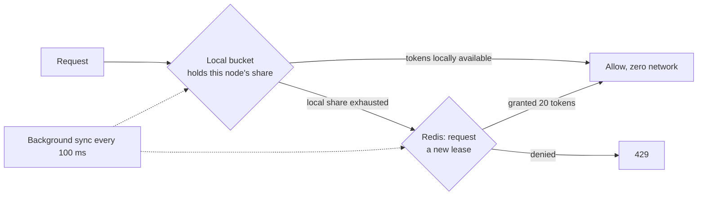

Rather than one Redis call per request, each node **leases a block of tokens** and
spends them locally — the same block-allocation idea as the ID generator in
[URL Shortener](001-url-shortener.md), applied to permission instead of
identifiers.

The gain is large and the cost is real: most requests skip the network entirely,
but a node that dies with 20 unspent tokens has silently under-served the client,
and a client's effective burst is now up to `nodes × lease_size` above the
configured capacity. Use it for **high-volume keys where the overshoot is a small
fraction of the limit**, and keep the direct path for everything else. For a
100/min limit, leasing 20 tokens per node is unacceptable; for a 100 000/min
limit it is noise.

### 12.2 Hot keys are the failure nobody plans for

One enterprise client at 10 000 req/s is 10 000 ops/s against **one Redis key on
one shard**. Adding shards does not help — hash slotting sends every request for
that key to the same place, and that shard's other tenants suffer for it.

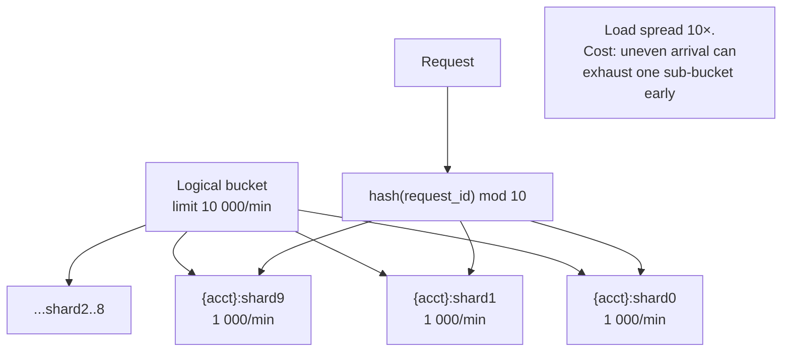

Split a hot bucket into *k* sub-buckets each holding `limit/k`, and hash each
request onto one. Load spreads by a factor of *k*; the cost is that random
assignment can exhaust one sub-bucket while others still have tokens, so a client
may be throttled slightly below its nominal limit. Mitigate by retrying once
against a second sub-bucket — two cheap lookups still beat one hot shard.

### 12.3 Redis interaction

- **`EVALSHA`, never `EVAL`.** Sending the script body on every request wastes
  bandwidth and parsing; ship the SHA and fall back to `EVAL` only on
  `NOSCRIPT`.
- **Pipeline independent checks**, but keep one request's limits in a single
  script — pipelining is for concurrency across requests, not for splitting a
  decision that must be atomic.
- **Aggressive timeouts (5 ms) and a circuit breaker.** A slow Redis is worse
  than an absent one: it consumes the latency budget on every request and then
  fails anyway. Time out fast and degrade.
- **Connection pooling per node**, sized to concurrency rather than to request
  rate.
- **Read from replicas: never.** Bucket state is written on every check; a
  replica read is stale by definition and lets the limit be exceeded silently.

### 12.4 Keeping rejections cheap

Under attack, `429`s become the majority of traffic. The rejection path must not
allocate a template, hit a database, or write a per-request log line. Log
**sampled** rejections and aggregate the rest into counters. A rejection path
that costs more than the allow path converts a rate limiter into an amplifier.

### 12.5 What deliberately is not optimized

- **Global exactness.** Regional slices overshoot by design (Section 9.5), and
  buying exactness costs a cross-region round trip per request.
- **The decision event stream.** Asynchronous, sampled at high volume, and never
  on the critical path.
- **Analytics on throttled clients.** Aggregated per minute; nobody needs
  per-request granularity to notice a client is being throttled.

---

## 13. Scaling and Failure Modes

### 13.1 Scaling levers, in order

1. **Add gateway nodes** — the limiter is middleware, so it scales with the
   gateway.
2. **Add Redis shards** — hash slotting spreads keys evenly, provided no single
   key is hot.
3. **Shard hot buckets** (Section 12.2) — the fix for the case adding shards does
   not solve.
4. **Enable the two-tier hybrid on high-volume keys** — trades a bounded
   overshoot for near-zero network cost.
5. **Regionalise further** — more regions, smaller slices, more approximation.

### 13.2 Failure matrix

| Failure | Blast radius | Behavior |
|---|---|---|
| Redis shard down | Keys on that shard | Circuit breaker opens for those keys; per-route degraded policy applies; other shards unaffected |
| Redis cluster down | All limiting | Fail open on ordinary routes, local strict limits on sensitive ones; page immediately |
| Redis slow (not down) | **Every request** | The dangerous one — a 200 ms Redis makes the limiter the latency problem. Hard timeout at 5 ms and treat slow as down |
| Config service down | No rule changes | Nodes keep the last good snapshot indefinitely; enforcement is unaffected |
| Bad rule set published | **Global, instant** | Validate before publish, canary to one node group, and keep one-command rollback to the previous version |
| Gateway node dies | Its in-flight requests | Stateless; leased tokens in the two-tier mode are lost (client is under-served briefly) |
| Clock skew across nodes | Refill miscalculated | Take `now` from Redis inside the script; never trust the caller's clock |
| Hot key saturates a shard | That shard's tenants | Sub-bucket sharding; detect via per-key op-rate metrics |
| Legitimate traffic spike | Clients throttled correctly | Working as designed — the alert should distinguish this from a limiter fault |

The last row is a real operational hazard: **a spike in `429`s is ambiguous.** It
means either "the limiter is protecting you" or "the limiter is broken and
rejecting valid traffic", and those need opposite responses. Splitting the metric
by deciding rule and by client tier is what makes the graph interpretable at 3
a.m.

---

## 14. Security

A rate limiter is a security control, and it has an attack surface of its own.

- **Client identity is the whole game.** Limits keyed on `X-Forwarded-For` are
  keyed on an attacker-controlled string unless the gateway takes the IP from the
  *trusted* position in the chain — the hop your own load balancer appended.
  Getting this wrong makes the limiter trivially bypassable and, worse, lets an
  attacker forge someone else's identity to throttle *them*.
- **IPv6 needs prefix grouping.** A single host routinely has a /64, which is 1.8
  × 10¹⁹ addresses. Limiting per IPv6 address is limiting per attacker whim;
  group by /64 (and consider /48 for known-hostile ranges).
- **Distributed attacks defeat per-IP limits by construction.** A botnet with
  100 000 IPs each sending under the limit sends 100 000 × the limit. Per-IP
  limits handle the lazy attacker; per-*account* and per-*endpoint* limits, plus
  a global backstop, handle the rest.
- **Enumeration through limit responses.** `RateLimit-Remaining` on an
  unauthenticated endpoint can leak whether an account exists, if limits are
  keyed on the account. Key pre-auth limits on the IP, not the claimed identity.
- **Do not let a `429` be expensive.** Section 12.4 is a security control, not
  only an optimisation.
- **Sensitive endpoints fail closed.** Login, password reset, payment, and token
  issuance get a strict local limit when Redis is unavailable (Section 9.3).
- **Audit every limit change.** Who raised a partner's cap, when, and why. An
  override with no expiry and no author is a permanent hole.
- **Limits are also a fairness mechanism**, and the tiers are visible to
  customers. Silently throttling a paying tier below its published limit is a
  contractual problem, which is why the deciding rule ID belongs in the response
  and the logs.

---

## 15. Monitoring

| Signal | Why it matters | Alert on |
|---|---|---|
| Limiter added latency p50/p99 | It is on every request | p99 > 2 ms |
| Redis op latency p99 | Leading indicator for the above | p99 > 1 ms |
| Reject rate by deciding rule and tier | Distinguishes protection from malfunction | Sudden change either direction |
| Reject rate by client | Finds the noisy tenant and the broken integration | One client > 50% of rejects |
| Degraded-mode gauge | Fail-open means unprotected | Any node in degraded mode |
| Circuit breaker state per shard | Partial Redis failure | Any breaker open > 60 s |
| Ops/s per Redis key (top-N) | Hot keys before they saturate a shard | Any key > 5 000 ops/s |
| Bucket key count and memory | Unbounded growth means TTLs are wrong | Growth without traffic growth |
| Active rules version per node | Config propagation health | Any node behind for > 60 s |
| Overrides expiring / expired | Prevents permanent exemptions | Any override older than 30 days |
| Backend load vs. limiter rejects | Whether limits are set at the right level | Backend saturating with near-zero rejects |

The last row is the one that tells you the limits are **wrong rather than
broken**: if backends are saturating while the limiter rejects almost nothing,
the limits are set too high and the system is providing no protection. That
failure is invisible in every other metric on this list, because everything is
technically working.

---

## 16. Trade-offs Summary

| Decision | Benefit | Cost |
|---|---|---|
| Token bucket | Bursts allowed and bounded; two independent dials | Slightly looser than a sliding log |
| Middleware, not a service | No extra network hop; failure degrades to policy | Limiter logic ships with every gateway |
| Centralised Redis state | Accurate across a stateless fleet | Redis on every request path; 1–2 ms |
| Single Lua script | Atomic, one round trip, returns header data | Logic lives in Lua; harder to test and debug |
| TTL on buckets | Memory bounded regardless of identity cardinality | Absent must mean full, so eviction is always generous |
| Fail open by default | The limiter cannot become the outage | No protection during the outage |
| Fail closed on sensitive routes | Attacks cannot exploit the degraded window | Real users blocked during a Redis outage |
| Regional limit slices | No cross-region latency | Global limit exceeded by up to the region count |
| Two-tier local leases | Near-zero network cost on hot keys | Overshoot; tokens lost when a node dies |
| Sub-bucket sharding | Hot keys stop saturating one shard | Client may be throttled slightly under its limit |
| Push-based config with reconcile poll | Seconds to propagate; self-healing | A bad rule set reaches everything quickly — hence canary and rollback |
| Headers on every response | Clients self-throttle, reducing load | Leaks limit state; keep it off unauthenticated endpoints |

---

## 17. Interview Deep Dives

Where this conversation usually goes next:

- **"Why token bucket and not sliding window?"** Burst tolerance as a
  requirement, capacity and rate as separate dials, and the memory argument
  against the log.
- **"How do you make it atomic across a fleet?"** The check-then-set race in
  Section 8.2, and why the whole read-modify-write must run inside the store.
- **"What happens when Redis goes down?"** Fail open versus fail closed, and the
  answer that gets you the offer: **it depends on the route**, declared in
  advance.
- **"One client sends 10 000 req/s."** Hot keys, why more shards do not help, and
  sub-bucket splitting with its throttle-slightly-early cost.
- **"Make the global limit exact across regions."** The cross-region round trip,
  why the requirement is usually really about metering, and what approximation
  actually costs.
- **"Different endpoints cost different amounts."** Variable token cost, and
  post-hoc reconciliation when the cost is only known afterwards.
- **"How do you stop the limiter being bypassed?"** Trusted-hop IP extraction,
  IPv6 prefix grouping, and why per-IP alone never survives a botnet.
- **"Rate limit by user *and* by IP *and* by endpoint."** Hash tags, one script,
  strictest-wins, and the all-or-nothing consumption rule from Section 11.4.

---

## 18. Key Takeaways

- **A rate limiter is a control that must never become the failure.** Fail open
  by default, fail closed where an attacker would benefit from the open door, and
  decide which is which per route before the incident rather than during it.
- **Match the algorithm to the traffic shape.** Token bucket for bursty API
  clients, leaky bucket when the backend genuinely cannot take bursts, sliding
  log only for low-volume high-value limits, and fixed window essentially never
  at a boundary that clients synchronise on.
- **Atomicity is not optional.** Check-then-set across a network is a race you
  lose thousands of times a second; the read-modify-write belongs inside the
  store, in one operation.
- **Approximation is the design, not a defect.** Regional slices, leased blocks,
  and sub-buckets all trade exactness for latency and availability — and every
  one of those trades is better than a cross-region round trip on the hot path.
- **Bound your memory with TTLs, and make absence generous.** Identity
  cardinality is attacker-controlled; a bucket that defaults to full on eviction
  makes memory pressure harmless.
- **Publish the limit state.** Headers on every response let good clients stay
  under the limit on their own, which is cheaper than any enforcement you can
  build.
- **The most dangerous failure is a slow limiter, not a dead one.** Time out in
  single-digit milliseconds and treat slow as down.
- **Limits that are never hit are not protection.** If backends saturate while
  rejections stay near zero, the system is working perfectly and defending
  nothing.
