## 1. Problem Statement

Build a messaging system: 1:1 and group conversations, messages delivered in
under a second while both people are online, and nothing lost when one of them
is on a train with no signal for four hours.

The first three case studies were all **request/response**. A client asked, a
server answered, and the connection ended. Chat breaks that shape in two ways
that change everything downstream:

1. **The server initiates.** A message arrives for you when *someone else* acts.
   There is no request of yours to attach the response to, so the system must
   already know where you are and hold a path open to you.
2. **State is per-recipient, not per-object.** A paste is read or not read by
   nobody in particular. A message has a delivery state *for each member of the
   conversation, on each of their devices*, and the product surfaces that state
   as ticks in the UI.

Everything hard about chat follows from those two sentences: connection
management, session routing, ordering, offline queues, read receipts, and
multi-device sync are all consequences.

The deceptively hard requirement is not throughput. It is that **the same
message must appear exactly once, in the same order, on every device that
should see it**, across reconnects, retries, and app reinstalls.

---

## 2. Use Cases

### 2.1 Actors and what they want

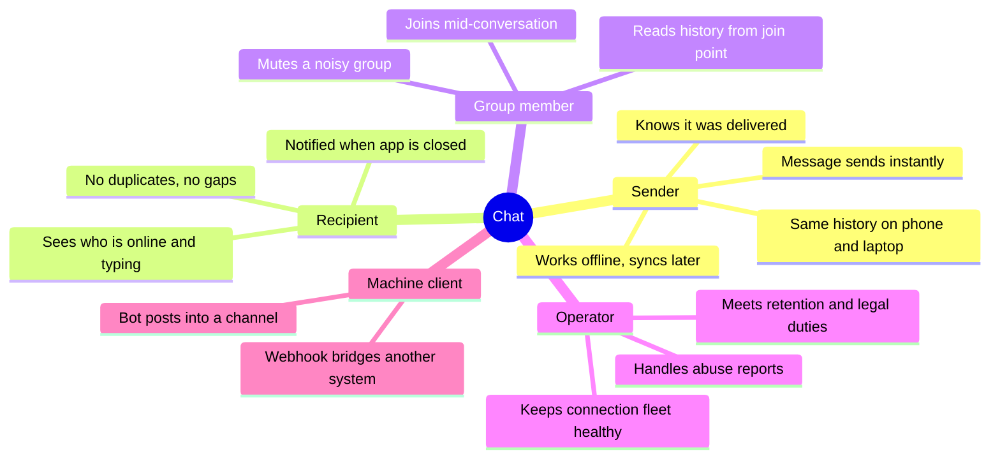

### 2.2 Primary use cases

| # | Use case | Actor | Trigger | Success outcome |
|---|---|---|---|---|
| UC-1 | Send a 1:1 message | Sender | Types and hits send | Persisted, delivered, sender sees ✓✓ |
| UC-2 | Send to a group | Sender | Sends into a 50-member group | Fanned out to all online members and devices |
| UC-3 | Receive while online | Recipient | Someone messages them | Push over the open socket in < 1 s |
| UC-4 | Receive while offline | Recipient | App backgrounded or killed | Mobile push; full message on next connect |
| UC-5 | Reconnect and catch up | Any client | Network returns | Every message missed, in order, no duplicates |
| UC-6 | Send while offline | Sender | Composes with no signal | Queued locally, sent on reconnect, not duplicated |
| UC-7 | Read receipts | Both | Recipient opens the chat | Sender sees read state advance |
| UC-8 | Typing indicator | Both | Recipient starts typing | Shown within ~1 s, expires on its own |
| UC-9 | Presence | Any | Contact connects/disconnects | Online/last-seen updates for people watching |
| UC-10 | Multi-device | Sender | Same account on phone + laptop | Both show sent and received messages |
| UC-11 | Media message | Sender | Attaches a photo | Uploaded out of band, message carries a reference |
| UC-12 | History scrollback | Any | Scrolls up | Paginated older messages |
| UC-13 | Group membership change | Admin | Adds/removes a member | Visibility boundaries change from that point |

### 2.3 The journey that defines the design

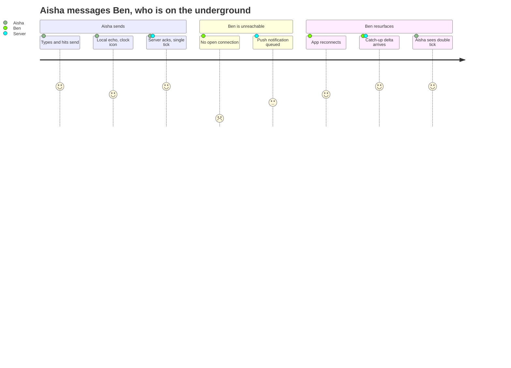

The three-minute gap in the middle is the system. A design that only handles
the first and last sections is a chat demo, not a chat system.

### 2.4 Out of scope

Voice and video calls (WebRTC signalling is a different system — the chat
transport carries the offers, but media never touches these servers), full-text
search over history (see [Search Engine](059-search-engine.md)), broadcast
channels with hundreds of thousands of readers (a pull-based feed problem, see
[Live Streaming Chat](036-live-streaming-chat.md)), and payment or bot
platforms layered on top.

---

## 3. Requirements

### Functional

- 1:1 and group conversations (groups capped at **1 000 members**; beyond that
  the fanout model changes — Section 12.5).
- Persist message history and serve paginated scrollback.
- Delivery states per recipient device: **sent → delivered → read**.
- Presence (online / last seen) and ephemeral typing indicators.
- Offline delivery via mobile push, with catch-up on reconnect.
- Multi-device per account, all devices converge on the same history.
- Attachments by reference; bytes go to an object store, not through the message path.
- Membership management with joins visible from the join point forward.

### Non-functional

- **End-to-end latency p99 < 500 ms** for a message between two online users in
  the same region.
- **No message loss after acknowledgement.** Once the sender sees a tick, that
  message survives any single node failure. This is the one hard durability line.
- **No duplicates and no gaps as observed by the client.** The wire protocol is
  at-least-once; the *user-visible* result must be exactly-once.
- **Ordering: total order within a conversation.** Global cross-conversation
  ordering is explicitly not required and buying it would be enormously
  expensive for zero user-visible benefit.
- Availability 99.99% for send/receive. A brief presence outage is cosmetic; a
  send outage is the outage.
- Support **15 M concurrent connections** at peak.

### Constraints and assumptions

- Mobile clients are the majority: flaky networks, aggressive OS-level socket
  kills, and background execution limits are normal conditions, not edge cases.
- Clients keep a **local database** and are the primary reader of their own
  history. The server is the source of truth and the sync origin, not the render
  path.
- Clock skew between clients is unbounded. **No ordering decision may depend on a
  client timestamp.**

---

## 4. Capacity Estimation

Assumptions: **50 M DAU**, **40 messages sent per active user per day**, average
**2.5 devices** per account, average **3 recipient devices' worth of fanout** per
message once 1:1 and group traffic are mixed, message payload ~300 bytes.

### Traffic

| Metric | Calculation | Result |
|---|---|---|
| Messages sent/day | 50 M × 40 | **2 B/day** |
| Sends, average | 2 B / 86 400 | **~23 K/s** |
| Sends, peak (3×) | | **~70 K/s** |
| Deliveries (fanout ×3, devices ×2.5) | 23 K × 7.5 | **~173 K/s** |
| Deliveries, peak | | **~520 K/s** |

The number that matters is the second-to-last one: **deliveries outnumber sends
by about an order of magnitude**, and that ratio is set by group size and device
count, both of which grow over time. Size the fanout path for deliveries, not
for sends.

### Connections

| Metric | Calculation | Result |
|---|---|---|
| Peak concurrent connections | 50 M DAU × ~30% × 2.5 devices ≈ | **~15 M** |
| Connections per node (tuned) | | **~100 K** |
| Connection nodes | 15 M / 100 K | **~150 nodes** (plus headroom → ~200) |
| Memory per connection (buffers + session) | ~20 KB | **~300 GB fleet-wide** |

### Storage

| Metric | Calculation | Result |
|---|---|---|
| Message bytes/day | 2 B × 300 B | **600 GB/day** |
| Per year | | **~219 TB/year** |
| With 3× replication | | **~657 TB/year** |
| Media (10% of messages × 200 KB) | 200 M × 200 KB | **~40 TB/day** |

> [!NOTE]
> Media is ~65× the text volume. This is why attachments must never travel
> through the message pipeline — they go to an object store via a pre-signed URL
> and the message carries a reference. See [File Storage](007-file-storage.md).
> Everything else in this document is about the 600 GB.

Text messages stored **once per conversation**, not once per recipient — a
choice defended in Section 7.2.

### Bandwidth, including the part people forget

- Message egress: 173 K deliveries/s × 300 B ≈ **52 MB/s** average.
- **Heartbeats**: 15 M connections × 1 ping per 30 s × ~50 B ≈ **25 MB/s**, plus
  15 M packets every 30 seconds of pure syscall and wakeup cost.

Keepalive traffic is roughly half the message traffic. On mobile it is worse
than the byte count suggests: every heartbeat wakes the radio and costs battery,
which is why the ping interval is a product decision, not a networking default.

---

## 5. API Design

Two surfaces: a **persistent bidirectional channel** for the real-time path, and
plain **HTTPS** for everything that is not latency-critical.

### 5.1 Real-time channel (WebSocket)

| Frame | Direction | Purpose |
|---|---|---|
| `CONNECT {token, device_id, sync_token}` | C → S | Authenticate and declare how far behind the client is |
| `CONNECT_ACK {session_id, server_time}` | S → C | Session established |
| `SEND {client_msg_id, conversation_id, body, attachments?}` | C → S | Send a message |
| `SEND_ACK {client_msg_id, message_id, seq, server_ts}` | S → C | Durable; this is the single tick |
| `MESSAGE {message_id, conversation_id, seq, sender, body, ts}` | S → C | Inbound message |
| `DELIVERY_ACK {conversation_id, seq}` | C → S | Client has it durably on disk |
| `READ {conversation_id, up_to_seq}` | C → S | Read cursor advanced |
| `STATE {conversation_id, seq, state, device_id}` | S → C | Delivery/read state of *your* sent message |
| `TYPING {conversation_id}` | C ↔ S | Ephemeral, never persisted |
| `PRESENCE {user_id, state, last_seen}` | S → C | Only for subscribed contacts |
| `PING` / `PONG` | C ↔ S | Liveness and NAT keepalive |

### 5.2 HTTP endpoints

| Endpoint | Method | Purpose |
|---|---|---|
| `/v1/conversations` | GET | Chat list, ordered by last activity, cursor-paginated |
| `/v1/conversations/{id}/messages?before={seq}&limit=50` | GET | Scrollback |
| `/v1/conversations` | POST | Create a conversation |
| `/v1/conversations/{id}/members` | POST / DELETE | Membership changes |
| `/v1/sync?since={sync_token}` | GET | Bulk catch-up after a long absence |
| `/v1/attachments/upload-url` | POST | Pre-signed upload target |
| `/v1/devices` | POST / DELETE | Register a device and its push token |

Points worth defending in review:

- **`client_msg_id` is generated by the client** (a UUID) and is the deduplication
  key. It is what makes a retried send idempotent, and it is the only reason the
  at-least-once transport produces an exactly-once experience.
- **`SEND_ACK` is only emitted after the message is durably committed**, never on
  receipt at the edge. The tick in the UI is a durability claim, so it must not
  be a lie.
- **`DELIVERY_ACK` comes from the client, not from the connection server.**
  "Written to the socket" is not "received"; TCP will happily buffer bytes into a
  connection that is already dead.
- **Sequence numbers are per conversation, not global** — the client uses them to
  detect gaps, so they must be gapless within a conversation.

---

## 6. High-Level Design

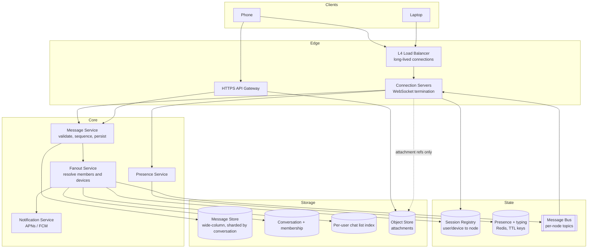

### Component responsibilities

| Component | Owns | Explicitly does not own |
|---|---|---|
| Load balancer | L4 pass-through, TLS termination optional | Any per-message logic |
| Connection server | Sockets, heartbeats, session registration, frame codec | Persistence, ordering, membership |
| Message service | Validation, dedupe, sequencing, durable write | Knowing who is connected where |
| Fanout service | Members → devices → routes; push handoff | Storing messages |
| Session registry | `user:device → node` mapping, TTL'd | Message state |
| Presence service | Heartbeat-derived online state, subscriptions | Delivery |
| Notification service | APNs/FCM, collapsing, retries ([005](005-notification-service.md)) | Message content policy |
| Message store | Durable, ordered, per-conversation history | Fast per-user queries |
| Chat list index | Per-user conversations sorted by activity | Message bodies |

**Why the connection servers hold no business logic.** They are the only
stateful tier in the request path — each one owns a slice of live sockets — and
stateful tiers are the hardest to deploy, drain, and scale. Keeping them dumb
means the interesting code lives on stateless services you can deploy fifty
times a day, while the socket tier changes rarely and drains slowly on purpose.

**Why an L4 balancer rather than L7.** These connections live for hours. L7
proxies are built around request-scoped resources, and an L7 hop in front of 15 M
sockets doubles the connection count and the memory bill for no routing benefit —
the routing decision happens once, at connect, and never again.

---

## 7. Data Model

### 7.1 Entities

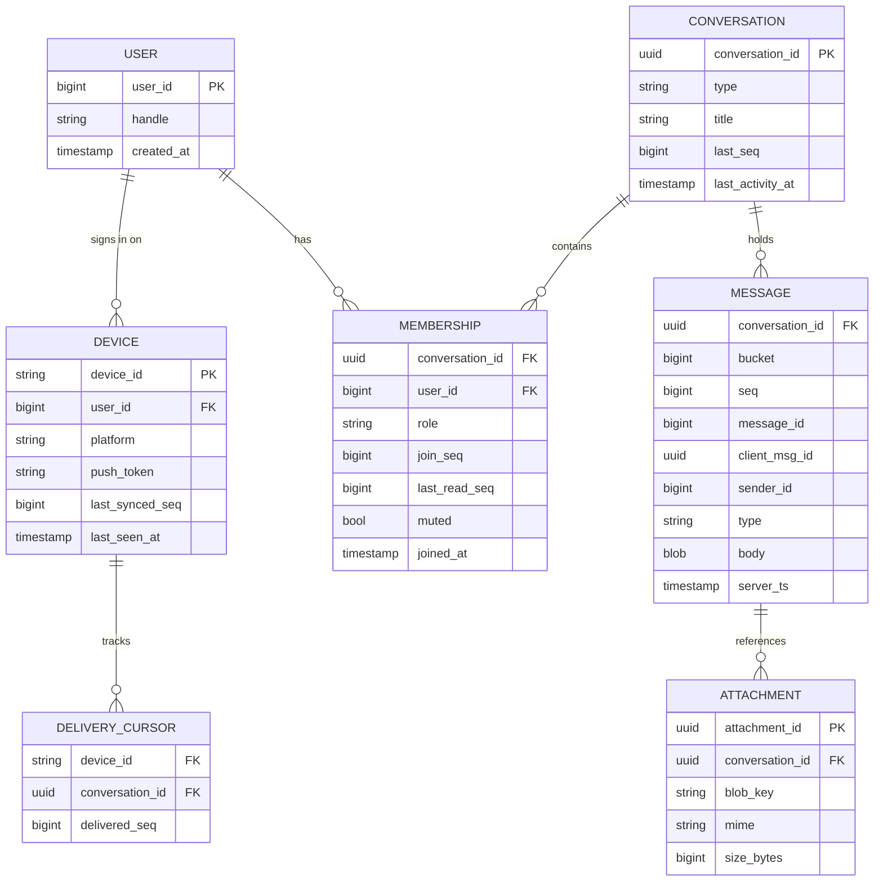

### 7.2 The central choice: one copy or one copy per recipient

This is the decision the whole storage design turns on, and it is the same
question [News Feed](006-news-feed.md) answers the opposite way.

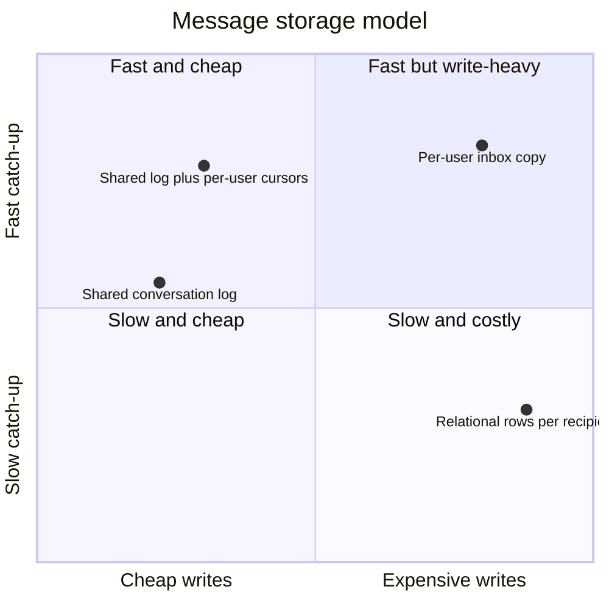

- **Per-user inbox (fanout on write)**: every recipient gets their own row.
  Catch-up is one range scan over a single partition — beautiful. But a message
  to a 1 000-member group becomes 1 000 writes, storage multiplies by average
  group size, and *edits, deletions and retention now have to be applied N
  times*. At 23 K sends/s that is 170 K+ storage writes/s of pure duplication.
- **Shared conversation log (chosen)**: one row per message, partitioned by
  conversation. Writes are O(1) in group size. Deletion and retention touch one
  row. The cost: a client's catch-up is per-conversation rather than a single
  scan.
- **Shared log + per-user cursors (what we actually build)**: the log holds
  bodies; a small per-user index holds *which conversations changed and when*,
  and each membership row holds `last_read_seq`. The heavy object is written
  once; the cheap pointer is written per member.

The per-user index still fans out, but it writes a ~50-byte upsert instead of a
300-byte row, and it is idempotent — a retry overwrites rather than duplicating.
That asymmetry is the whole argument.

> [!TIP]
> The general rule this is an instance of: **fan out pointers, not payloads.**
> It shows up again in feeds, notifications, and audit pipelines.

### 7.3 Partitioning

**Messages** are partitioned by `(conversation_id, bucket)` and clustered by
`seq DESC`:

- All reads are "the last N messages in this conversation" or "N before seq X" —
  both are single-partition range scans, the access pattern wide-column stores
  are built for.
- `bucket` (a monotonically increasing counter incremented every ~50 K messages,
  or per month, whichever comes first) **bounds partition size**. Without it, a
  five-year-old group chat becomes a multi-gigabyte partition that no compaction
  strategy handles gracefully. This is the single most common modelling mistake
  in chat systems and it does not show up until year two.
- Clustering `DESC` puts the newest messages first, so the common read hits the
  head of the partition.

**Memberships** are stored twice — by `conversation_id` (for fanout: who is in
this conversation) and by `user_id` (for the chat list: what am I in). Two
denormalized copies of the same small fact, because both directions are hot and
neither can afford a scan.

**Chat list index**: `(user_id) → (last_activity_ts DESC, conversation_id)`,
upserted on every message. This is the per-user write from Section 7.2 and it is
sized to stay small: one row per conversation a user is in, not per message.

### 7.4 Sequence numbers and message IDs

Two identifiers, two jobs, and conflating them is a classic error:

| Field | Scope | Property | Used for |
|---|---|---|---|
| `message_id` | Global | Unique, roughly time-sortable (Snowflake-style, see [058](058-unique-id-generator.md)) | References, dedupe across conversations, logs |
| `seq` | Per conversation | **Gapless**, monotonic | Ordering, gap detection, cursors, read receipts |
| `client_msg_id` | Per sender | Client-generated UUID | Send idempotency, local echo reconciliation |

`seq` must be gapless because it is how a client knows it is missing something:
it holds up to 41, receives 43, and knows to ask for 42. A sparse ID gives you
ordering but not completeness, and completeness is what the reconnect path needs.

Gapless implies a **single sequencer per conversation** — an increment that
cannot be done concurrently by two writers. That constraint drives Section 8.

---

## 8. Ordering and the Sequencer

### 8.1 Why timestamps do not work

Two members send at the same moment from devices whose clocks differ by 90
seconds. Order by client timestamp and one message lands *above* a message that
visibly replies to it. Order by server receive time and you are at the mercy of
which connection server was less loaded that millisecond, so two recipients can
order the same pair differently — and disagreement across devices is worse than
being wrong consistently.

Ordering must come from **one place per conversation**, and it must be
persisted, not recomputed.

### 8.2 Routing writes to the owner

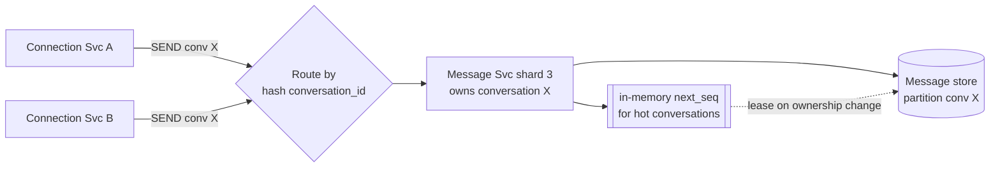

Every write for a conversation is routed to the shard that owns it, so `seq`
allocation is a local increment rather than a distributed transaction. The
owning shard keeps `next_seq` in memory for active conversations and persists
the high-water mark, leasing a block on ownership change (the same block-lease
trick as the key pool in [Pastebin](003-pastebin.md)).

Ownership changes — rebalancing, a node death — are handled by making the
increment **conditional at the store level** (`UPDATE conversations SET last_seq
= last_seq + 1 ... IF last_seq = ?`, or the equivalent lightweight transaction).
In steady state the in-memory counter makes it free; during a handover the
conditional write makes it correct. Optimize the common path, but never let the
common path be the *only* path that is correct.

### 8.3 What the client does with it

The client stores messages keyed by `seq` and renders in `seq` order. A message
arriving out of order slots into place. A gap triggers a targeted fetch. The
sender's own message shows a local echo immediately, keyed by `client_msg_id`,
and is reconciled to its real `seq` when `SEND_ACK` arrives — which is why the
ack must carry both identifiers.

---

## 9. Dynamic Workflows

### 9.1 Send a 1:1 message, both online

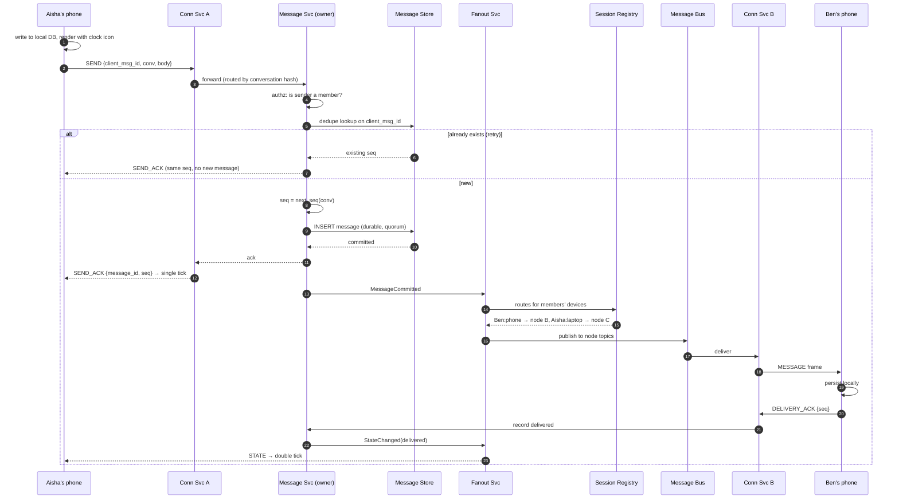

**The ack boundary is the design.** The sender is told "sent" the instant the
message is durable, *before* any fanout work. Delivery is a separate, later,
retryable event. Collapsing the two — acking only once Ben has it — would make
Aisha's send latency depend on Ben's network, which is both slow and wrong: the
message is safely stored either way.

### 9.2 Recipient is offline

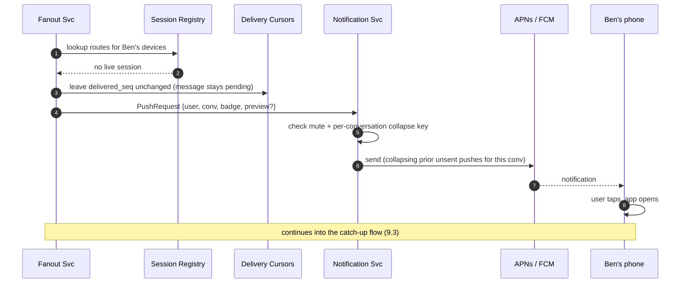

There is **no server-side per-user message queue**. The message is already in
the conversation log; "undelivered" is just `delivered_seq < last_seq`. A
separate queue would be a second copy of the data with its own retention,
ordering and failure semantics — all of it redundant with the log that already
exists.

Push is a **wake-up signal, not a delivery channel**. It is best-effort, it is
rate-limited by Apple and Google, and under end-to-end encryption it cannot
carry content anyway. Treating it as delivery is how systems end up showing
notifications for messages the app never receives.

### 9.3 Reconnect and catch-up

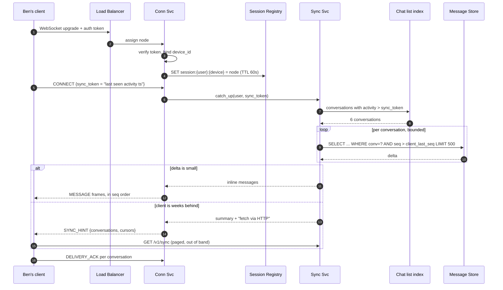

Three things this flow gets right:

- **The client declares its position; the server does not track it.** The server
  keeps `delivered_seq` for receipts, but catch-up is driven by what the client
  says it has. A reinstalled app asks for everything and gets it, with no
  server-side state to reset.
- **The chat list index answers "what changed" without scanning conversations.**
  Without it, catch-up means touching every conversation the user is in, most of
  which are idle.
- **A far-behind client is pushed off the socket path.** Dumping 40 000 messages
  down a WebSocket blocks that connection server's event loop and its other
  99 999 sockets. Bulk sync belongs on HTTP where it is paged, cancellable, and
  isolated.

### 9.4 Group fanout

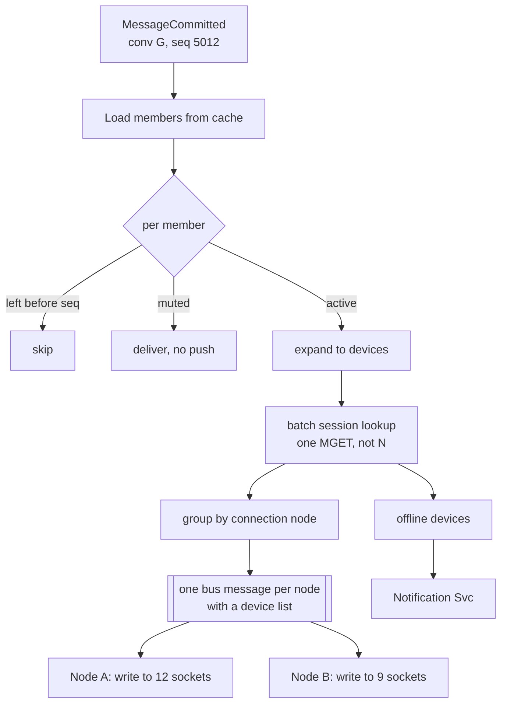

Two batching decisions carry the whole thing: **one session-registry lookup for
all members** rather than N round trips, and **one bus message per connection
node** carrying a device list rather than one per recipient. For a 1 000-member
group across 200 nodes, that is 200 bus messages instead of 2 500 — and the
difference grows with group size, which is exactly where the pressure is.

Membership is cached aggressively (it changes rarely) with the `join_seq` check
applied at fanout time, so a member who left at seq 4000 never receives seq 5012
even if a stale cache still lists them.

### 9.5 Read receipts

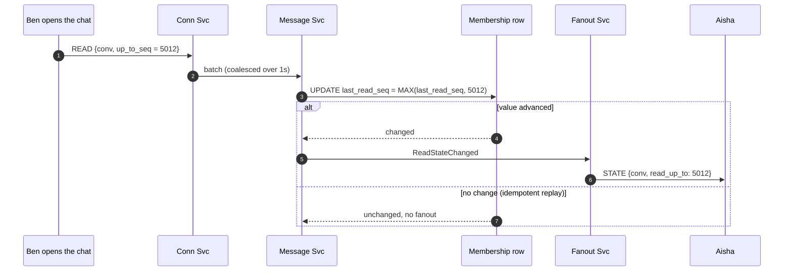

Receipts are stored as **one cursor per member**, not one row per (message,
member). For a 1 000-member group with 50 K messages, cursors cost 1 000 rows
and per-message receipts cost 50 million. The cursor also makes the update
naturally idempotent — `MAX` of a monotonic value — so replays are free.

The unread count is then `last_seq − last_read_seq`, computed on read, never
stored as a counter that can drift.

### 9.6 Presence and typing

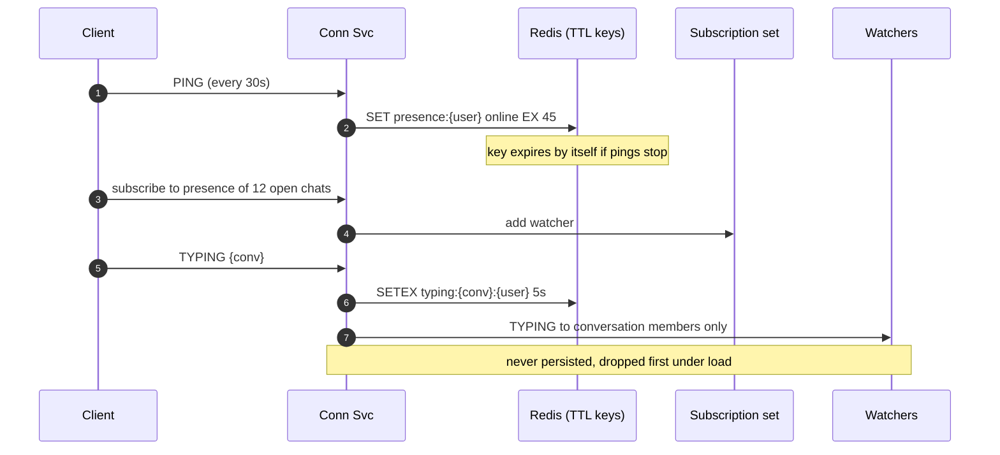

Presence is the trap in this design. Naively, every user's state change notifies
every contact — and with an average of a few hundred contacts each, presence
traffic scales as users × contacts and can dwarf messaging. Three constraints
keep it bounded:

1. **Subscribe only to what is on screen.** A client watches presence for the
   conversations currently visible, not its whole address book.
2. **TTL keys instead of explicit offline events.** A key that expires on its own
   handles the crashed client, the killed app, and the dead network identically —
   no reliable disconnect detection required, because there is no reliable
   disconnect detection.
3. **Coarse granularity.** "Online", "last seen recently", "last seen a while
   ago". Second-precision presence is a privacy liability and a traffic
   multiplier for no product value.

Typing indicators are the most expendable traffic class in the system. They are
never persisted, never retried, and are the first thing shed under load — see
Section 12.3.

### 9.7 Multi-device

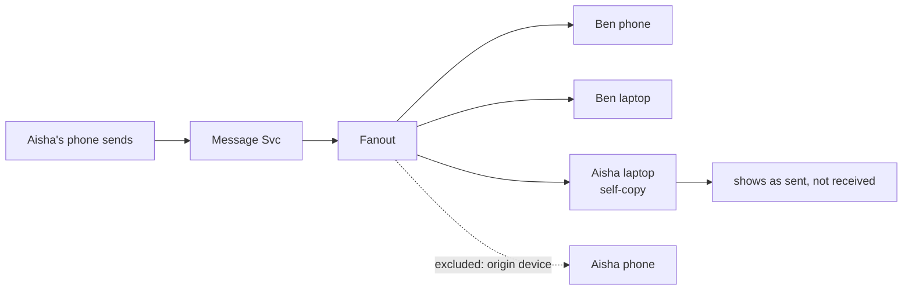

Every device is an independent delivery target with its own cursor, including
**the sender's other devices** — without the self-copy, Aisha's laptop never
learns what she sent from her phone. The originating device is excluded because
it already rendered a local echo.

Per-device cursors are also what make "delivered" honest: the double tick means
*at least one* of the recipient's devices has it durably, and the system knows
precisely which ones do.

### 9.8 A connection server dies

```mermaid
sequenceDiagram
  autonumber
  participant N as Conn Svc B (dies)
  participant SR as Session Registry
  participant FO as Fanout Svc
  participant C as 100k clients
  participant LB as Load Balancer

  N--xSR: heartbeat stops
  Note over SR: session keys expire (TTL 60s)
  FO->>SR: route lookup for Ben
  alt session key already expired
    SR-->>FO: none → push path
  else stale entry still present
    SR-->>FO: node B
    FO->>N: publish (no consumer)
    Note over FO: undelivered; delivered_seq unchanged
  end
  C->>C: socket closed, backoff with jitter (1s..60s)
  C->>LB: reconnect
  LB->>SR: new node, new session
  C->>C: catch-up (9.3) fills anything missed
  Note over C,SR: nothing is lost — the log is the truth
```

The window where the registry is stale produces **undelivered messages, never
lost ones**, because delivery is derived from `delivered_seq` against a durable
log rather than from a queue that was drained into a dead socket.

The real operational hazard is the reconnect storm: 100 000 clients reconnecting
simultaneously, each triggering auth plus catch-up. **Jittered exponential
backoff is mandatory on the client**, and the fleet needs enough headroom to
absorb one node's worth of clients landing on its neighbours. Without jitter, one
node failure becomes a synchronized thundering herd that takes down the node that
inherits the traffic — and then its neighbour, in turn.

---

## 10. Message Lifecycle

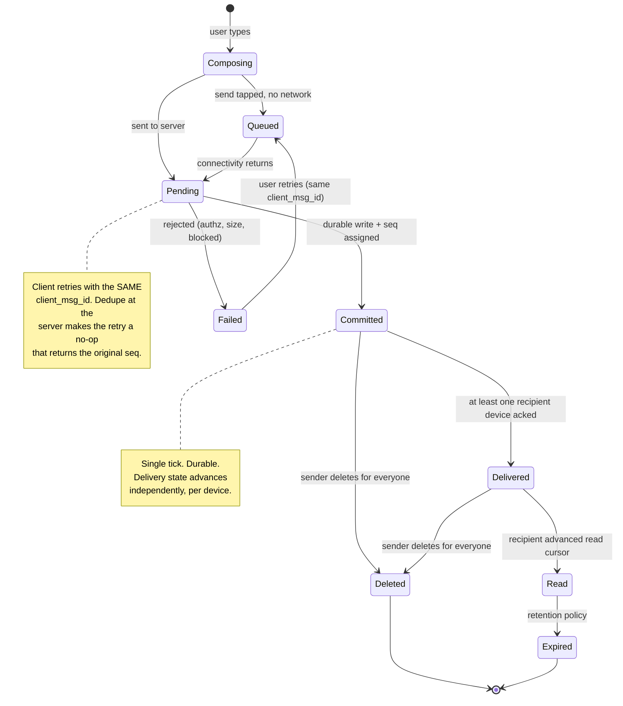

`Failed → Queued` on the same `client_msg_id` is the edge that makes retries
safe, and it is why that identifier has to be generated once at compose time and
persisted locally — regenerating it on retry reintroduces duplicates through the
front door.

---

## 11. Low-Level Design

### 11.1 Service objects

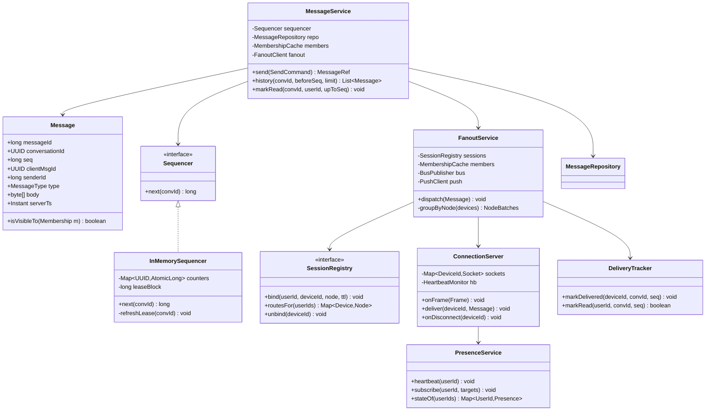

`Sequencer` and `SessionRegistry` are interfaces for the same practical reason as
the blob store in Pastebin: they are the seams where a single-process test needs
a trivial substitute (a `HashMap` counter, an in-process route table) for
infrastructure that is expensive to stand up.

### 11.2 Send, in code shape

```
function send(cmd, auth):
    conv = members.conversation(cmd.conversationId)
    require(members.isMember(conv, auth.userId), FORBIDDEN)
    require(cmd.body.length <= MAX_BODY, TOO_LARGE)         # 64 KB; media by reference

    existing = repo.findByClientMsgId(auth.userId, cmd.clientMsgId)
    if existing:
        return MessageRef(existing.messageId, existing.seq)  # retry: identical answer

    seq = sequencer.next(conv.id)                            # in-memory increment
    msg = Message(snowflake(), conv.id, seq, cmd.clientMsgId,
                  auth.userId, cmd.type, cmd.body, now())

    repo.append(msg)                     # QUORUM write — the commit point, the tick
    ack(cmd.clientMsgId, msg.messageId, seq)                 # sender is done here

    fanout.dispatchAsync(msg)                                # everything else is async
    return MessageRef(msg.messageId, seq)
```

The dedupe lookup before the sequencer call is deliberate: **allocating a seq for
a duplicate would burn a number and leave a gap**, and gaps are precisely what
`seq` exists to rule out.

### 11.3 Fanout, in code shape

```
function dispatch(msg):
    roster = members.of(msg.conversationId)                  # cached, ~ms
    targets = []
    for m in roster:
        if m.userId == msg.senderId and m.deviceId == msg.originDevice: continue
        if m.joinSeq > msg.seq: continue                     # joined after this message
        if m.leftSeq != null and m.leftSeq <= msg.seq: continue
        targets += devicesOf(m.userId)

    routes = sessions.routesFor(targets)                     # ONE batched lookup
    online, offline = partition(targets, routes)

    for (node, devices) in groupByNode(online):              # one bus msg per node
        bus.publish(node.topic, Delivery(msg, devices))

    for device in offline:
        if not members.isMuted(device.userId, msg.conversationId):
            push.enqueue(device, collapseKey = msg.conversationId)

    # no per-recipient rows written: "undelivered" is delivered_seq < msg.seq
```

### 11.4 Connection server loop

```
on frame(socket, frame):
    switch frame.type:
      CONNECT:      auth(frame.token); bind(socket, deviceId)
                    sessions.bind(userId, deviceId, thisNode, TTL_60S)
                    syncSvc.catchUpAsync(userId, deviceId, frame.syncToken)
      SEND:         messageSvc.sendAsync(frame)              # never block the loop
      DELIVERY_ACK: tracker.markDelivered(deviceId, frame.conv, frame.seq)
      READ:         readBuffer.add(frame)                    # coalesced, flushed each 1s
      TYPING:       presence.typing(frame)                   # fire and forget, sheddable
      PONG:         sessions.refresh(deviceId, TTL_60S); presence.heartbeat(userId)

every 30s:
    for socket in sockets:
        if now - socket.lastPong > 90s: close(socket)        # 3 missed pings
        else: send(socket, PING)

on shutdown:                                                  # graceful drain
    stop accepting new connections
    send(socket, RECONNECT_HINT {backoff: random(0..30s)})    # stagger the herd
    wait for drain, then exit
```

The drain path deserves the attention it rarely gets: deploying the connection
tier means deliberately disconnecting hundreds of thousands of clients. Telling
them *when* to come back — with a server-chosen random delay — turns a
synchronized stampede into a smooth ramp, and it is three lines of code.

### 11.5 Concurrency inventory

| Race | Mechanism |
|---|---|
| Two sends racing for a seq in one conversation | Single owning shard; in-memory counter, conditional store write on ownership change |
| Client retries a send | Unique index on `(sender_id, client_msg_id)`; loser returns the winner's row |
| Duplicate delivery to a device | Client dedupes on `message_id`; local DB insert is idempotent |
| Two devices advancing the read cursor | `last_read_seq = MAX(current, incoming)`; monotonic, order-independent |
| Reconnect while old socket is still registered | Session key is `(user, device)`; a new bind overwrites, old socket is closed by the node |
| Message committed while a member is being removed | `join_seq` / `left_seq` compared against `msg.seq` at fanout time — membership is versioned by seq, not by wall clock |
| Fanout retried after partial delivery | Delivery is idempotent per device; `delivered_seq` uses MAX |
| Presence flapping on a bad network | TTL keys plus a short debounce before publishing "offline" |

The pattern running through that table: **every state advance is a monotonic
maximum or a conditional transition.** Both are naturally idempotent, which is
what makes an at-least-once transport survivable without distributed locks.

---

## 12. Optimization

### 12.1 Connection tier

- **One epoll-style event loop per core**, non-blocking sockets, no thread per
  connection. 100 K threads is not a fleet, it is a scheduler benchmark.
- **Adaptive heartbeats**: 30 s on mobile radio, longer on stable Wi-Fi. Every
  ping costs battery; the interval trades reconnect detection latency against
  handset lifetime, and the right answer differs by platform.
- **Binary framing** (protobuf/flatbuffers) over JSON: roughly a third of the
  bytes and a fraction of the parse cost at 520 K deliveries/s.
- **Batch small frames** within a ~20 ms window per socket. Group chat delivers
  bursts; one write of five messages beats five writes of one.

### 12.2 Read path

Clients read their **local database**, not the server. The server's read path
exists for catch-up and scrollback only, which is why this system tolerates a
storage tier that would be unacceptable for a web app: p99 of a few hundred
milliseconds on scrollback is invisible when the visible messages are already on
disk.

- Cache the last ~100 messages per active conversation in Redis, absorbing the
  scrollback that immediately follows every catch-up.
- Cache membership rosters aggressively — read on every fanout, written rarely.
- Cache the chat list index per user; it is read on every app foreground.

### 12.3 Load shedding tiers

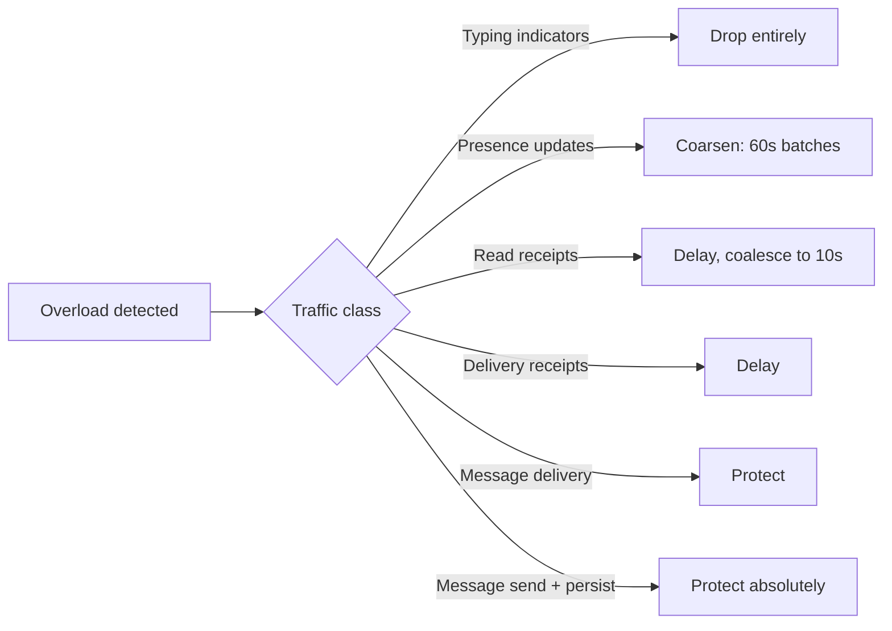

Deciding the shed order *before* an incident is the point. Chat carries four
distinct traffic classes with wildly different value, and typing indicators —
which can be 30–40% of frames in a busy group — are worth exactly nothing
compared to a message send. A system that treats all frames equally degrades by
dropping some of everything, which is the worst possible outcome.

### 12.4 Fanout

- **Batch session lookups** (Section 9.4): one `MGET` per message, not one per
  recipient.
- **Group by connection node**: bus messages scale with node count, not member
  count.
- **Coalesce push notifications** per conversation with a collapse key — twenty
  messages in a group produce one notification, not twenty.
- **Precompute device lists** for hot conversations; the roster changes far more
  slowly than messages arrive.

### 12.5 Large groups change the model

Above roughly 1 000 members, push-based fanout stops making sense: a single
message becomes thousands of socket writes, and the marginal member is usually
not watching. Beyond that threshold the model inverts to **pull** — members poll
or subscribe to a shared stream, presence is aggregated ("3 400 online") rather
than enumerated, and receipts are dropped entirely. That is a different system,
covered in [Live Streaming Chat](036-live-streaming-chat.md) and
[Group Messaging](034-group-messaging.md).

Knowing where your model breaks, and saying so with a number, is more convincing
than claiming it scales forever.

### 12.6 Storage

- **Tier by age**: hot months on SSD, older buckets to cheaper storage. The
  `bucket` key from Section 7.3 makes this a partition-level operation rather
  than a row-by-row migration.
- **Compress message bodies** at the block level — chat text compresses well and
  the store does it for free.
- **Retention policy per conversation**, applied at bucket granularity, so
  expiry is a partition drop rather than 600 GB/day of tombstones. Tombstone
  accumulation is the classic wide-column self-inflicted wound.

### 12.7 What deliberately is not optimized

- **Presence is eventually consistent and coarse.** Someone showing as online for
  30 seconds after closing the app is not a defect worth engineering away.
- **Read receipts are coalesced over a second.** Nobody perceives the difference,
  and it converts a per-scroll write storm into one write.
- **Scrollback is not globally cached.** It is a rare, human-paced operation
  against a store already optimized for that exact range scan.

---

## 13. Scaling and Failure Modes

### 13.1 Scaling levers, in the order you would pull them

1. **Add connection servers** — stateless apart from their sockets, and clients
   reconnect naturally. The cheapest lever.
2. **Shard the message service by conversation** — the sequencer is per
   conversation, so adding shards adds parallelism with no coordination.
3. **Grow the session registry** — it is a hash-partitioned key-value store with
   short TTLs; partition by user.
4. **Add message store nodes** — conversation-hash partitioning spreads evenly;
   plan token ranges with headroom.
5. **Regionalize** — pin conversations to a home region, route connections to the
   nearest edge, and forward cross-region traffic. Last, because cross-region
   ordering and membership are the hardest parts of this whole document.

### 13.2 Failure matrix

| Failure | Blast radius | Behavior |
|---|---|---|
| One connection node dies | ~100 K clients | Reconnect with jittered backoff; catch-up fills the gap; nothing lost |
| Session registry down | Routing blind | Fall back to broadcasting deliveries to all nodes (expensive, correct) or degrade to push-only; sends still commit |
| Message store shard down | 1/N of conversations | Sends fail fast with a retryable error; client keeps the message in its outbox and shows "sending". **Never ack what is not durable** |
| Fanout service lagging | Delivery delayed | Sends still ack; recipients catch up on reconnect. Alert on fanout lag, not on error rate |
| Push provider (APNs/FCM) down | Offline users not notified | Messages still arrive on next foreground; degraded, not broken |
| Presence Redis down | No online/typing state | Messaging unaffected — presence is a separate failure domain on purpose |
| Region loss | Users in that region | Reconnect to another region; conversations owned there need ownership transfer, which is the slow part |
| Reconnect storm after a deploy | Whole fleet | Staggered drain, server-issued backoff hints, connection-rate limits at the LB |

The theme: **degrade delivery latency, never durability.** Every row above either
delays a message or fails a send loudly. None of them silently lose one, and none
of them ack a message that is not committed.

---

## 14. Security and Privacy

- **Authenticate on connect and bind the session to a device.** A long-lived
  socket outlives short-lived tokens, so the connection must carry an expiry and
  re-authenticate rather than trusting the original handshake for six hours.
- **Authorize every send against membership**, server-side, on the owning shard.
  Conversation IDs are guessable enough that "knows the ID" can never be
  authorization.
- **Rate limit per user and per device** at the connection server — messages,
  typing frames, and connection attempts separately. See
  [Rate Limiter](002-rate-limiter.md).
- **Attachments via pre-signed, short-lived, scoped URLs.** The upload never
  transits the chat path and the URL cannot be replayed against another
  conversation.
- **Retention and deletion**: "delete for everyone" is a tombstone that fans out
  like a message, and clients honour it. Be honest that a recipient who has
  already read the message may still have the bytes — the guarantee is best-effort
  by construction, and the UI should not imply otherwise.

### 14.1 End-to-end encryption, and what it costs

E2EE (Signal-protocol style: X3DH for key agreement, double ratchet for forward
secrecy, sender keys for groups) is a product decision with sweeping
architectural consequences:

| Capability | Without E2EE | With E2EE |
|---|---|---|
| Server-side search | Straightforward | Impossible; client-side index only |
| New device gets history | Server replays the log | Nothing to replay — history transfers device-to-device or not at all |
| Group fanout | One ciphertext for everyone | Sender key per group, re-keyed on every membership change |
| Push notification content | Preview in the payload | Wake-up only; the client decrypts locally |
| Abuse and spam detection | Content-based | Metadata and behaviour only, plus user reports |
| Server-side media transcoding | Normal | Not possible; the client does it before encrypting |

The honest summary: **E2EE moves work to the client and removes options from the
server permanently.** Retrofitting it is a rewrite of the delivery, sync, and
moderation paths, not a feature. Decide before building, and if the answer is
yes, note that the ordering and fanout design in this document is unchanged —
the server routes opaque blobs — while multi-device sync (Section 9.7) becomes
substantially harder, because each device is a separate cryptographic identity
that must be encrypted to individually.

---

## 15. Monitoring

| Signal | Why it matters | Alert on |
|---|---|---|
| Send-to-ack latency p50/p99 | The user-perceived "did it send" | p99 > 500 ms |
| Send-to-delivered p99 (online recipients) | End-to-end health | p99 > 2 s |
| Concurrent connections per node | Balance and headroom | Skew > 20% across nodes |
| Connection churn rate | Leading indicator of a flapping node or bad deploy | 2× baseline |
| Fanout lag (commit → dispatch) | The silent failure — sends still ack | p99 > 1 s |
| Undelivered ratio (`delivered_seq` behind `last_seq`) | Real delivery health, independent of error rates | Sustained rise |
| Sequence gap reports from clients | Correctness canary; should be ~zero | Any sustained non-zero |
| Duplicate `client_msg_id` rate | Client retry storms or a broken network path | Spike |
| Push send/failure rate by platform | Offline delivery health | Failure rate > 2% |
| Catch-up size distribution | Clients falling behind; sync cost | p99 > 1 000 messages |
| Session registry hit rate | Stale routing → unnecessary pushes | < 95% |

**Sequence gaps are the correctness alarm.** They should be zero. Any non-zero
sustained rate means the sequencer, the fanout, or the catch-up path is losing
something, and it is the one metric on this list where the target is not "low"
but "none".

---

## 16. Trade-offs Summary

| Decision | Benefit | Cost |
|---|---|---|
| Persistent WebSocket over polling | Sub-second push, no polling overhead | A stateful tier to route, drain, and scale |
| Shared conversation log, not per-user copies | O(1) writes in group size; simple deletion and retention | Catch-up is per-conversation, needs a change index |
| Fan out pointers (chat list index), not payloads | Fast "what changed"; small idempotent writes | One more index to keep consistent |
| Per-conversation gapless `seq` | Total order and gap detection for free | Single writer per conversation; ownership handover to handle |
| Ack on durable commit, before fanout | Send latency independent of recipients | Sender's tick says "stored", not "delivered" — the UI must say so too |
| At-least-once + `client_msg_id` dedupe | Simple, retryable transport | Clients must dedupe; the ID must survive restarts |
| Read cursors, not per-message receipts | O(members) instead of O(members × messages) | Cannot answer "who read message 4711" precisely |
| Push as wake-up, not delivery | Works under E2EE; no duplicate delivery path | An extra round trip before the user sees content |
| Presence via TTL keys + subscriptions | No reliable disconnect detection required; bounded traffic | Up to ~45 s of staleness |
| Typing indicators sheddable | Protects messaging under load | They vanish exactly when the app feels busiest |
| 1 000-member group cap | Push fanout stays viable | Large communities need a different system |
| Conversation-hash partitioning | Even spread, single-partition reads | No cross-conversation queries; resharding is painful |

---

## 17. Interview Deep Dives

Where this conversation usually goes next:

- **"How do you guarantee ordering?"** The full path: no client clocks, one
  sequencer per conversation, gapless `seq`, ownership handover via conditional
  writes, and client-side gap detection. Sections 8 and 9.3.
- **"What if the same message is delivered twice?"** At-least-once transport plus
  `client_msg_id` and `message_id` dedupe, and why every state advance is a
  monotonic max.
- **"How does a user with three devices stay in sync?"** Per-device cursors, the
  self-copy to the sender's other devices, and how E2EE makes this the hardest
  part of the system.
- **"Now make groups 100 000 members."** The push-to-pull inversion, aggregated
  presence, dropped receipts — Section 12.5.
- **"Add end-to-end encryption."** Section 14.1, and specifically what the server
  loses: search, history for new devices, content-based moderation, and push
  previews.
- **"A connection server just died with 100 K clients on it."** Reconnect storms,
  jitter, session TTLs, catch-up, and why nothing is lost. Section 9.8.
- **"Run it in five regions."** Conversation home regions, cross-region fanout,
  and where ordering guarantees stop — the genuinely hard extension.
- **"Add message search."** Client-side index under E2EE; otherwise see
  [Search Engine](059-search-engine.md).

---

## 18. Key Takeaways

- **Server-initiated delivery is the whole difference.** Once the server has to
  reach *you*, it needs a session registry, a routing tier, and a story for every
  way a connection can vanish — none of which a request/response system needs.
- **Fan out pointers, not payloads.** One durable copy per conversation plus tiny
  per-user index writes beats N copies of every message, and it keeps deletion,
  editing, and retention to a single row.
- **Ordering must come from one place per conversation.** Gapless sequence
  numbers give total order, gap detection, cursors, and receipts from a single
  mechanism — and they are cheap precisely because the ordering scope is a
  conversation, not the system.
- **Ack durability, not delivery.** The sender's tick means "committed"; delivery
  is a separate, retryable, per-device event. Conflating them couples one user's
  latency to another user's network.
- **Make every state advance idempotent** — monotonic maxima and conditional
  transitions — and an at-least-once transport becomes exactly-once as the user
  experiences it, with no distributed locks anywhere.
- **Undelivered is a cursor comparison, not a queue.** Deriving delivery state
  from a durable log removes an entire class of storage, retention and ordering
  problems that a per-user message queue would have created.
- **Rank your traffic before you are overloaded.** Typing indicators, presence,
  receipts, and messages have wildly different value; a system that cannot shed
  the cheap ones will drop some of the expensive ones instead.
