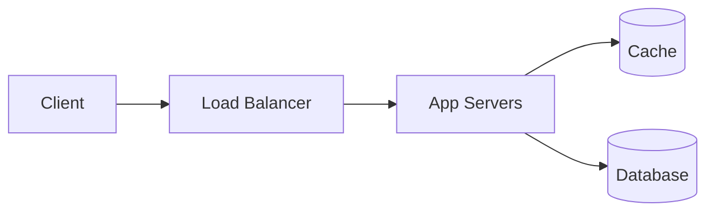

Every feature the renderer supports, with the markdown that produced it. This
page is also the visual test: if something here looks wrong after a change to
the generator, the change broke it.

## Frontmatter

Every field is optional. A bare `.md` file with no frontmatter still renders —
the title falls back to the first heading, then to the filename.

```yaml
---
title: Rate Limiter
description: One line used in cards, search results, and social previews.
tags: [redis, token-bucket]          # becomes links to /tags/<tag>/
difficulty: easy | medium | hard     # renders as a badge
status: published                    # or draft → renders as "not written yet"
author: Your Name
created: 2026-07-28
updated: 2026-08-01
---
```

## Admonitions

The GitHub blockquote syntax, extended with custom titles and collapsible
variants.

```markdown
> [!NOTE]
> Body text goes here.
```

> [!NOTE]
> Body text goes here.

### All kinds

> [!NOTE]
> Neutral aside. Also `[!INFO]`.

> [!TIP]
> A better way to do it. Also `[!HINT]`.

> [!IMPORTANT]
> Do not skip this part.

> [!SUCCESS]
> It worked. Also `[!CHECK]`, `[!DONE]`.

> [!QUESTION]
> Something still open. Also `[!FAQ]`, `[!HELP]`.

> [!WARNING]
> Careful here. Also `[!CAUTION]`, `[!ATTENTION]`.

> [!DANGER]
> This will break things. Also `[!ERROR]`, `[!FAILURE]`.

> [!BUG]
> A known defect worth flagging.

> [!EXAMPLE]
> A worked example.

> [!QUOTE]
> Someone else's words. Also `[!CITE]`.

> [!ABSTRACT]
> The short version. Also `[!SUMMARY]`, `[!TLDR]`.

### Custom titles

Anything after the marker on the same line replaces the default title.

```markdown
> [!TIP] Prefer distributed ID generation
> It scales horizontally and guarantees uniqueness.
```

> [!TIP] Prefer distributed ID generation
> It scales horizontally and guarantees uniqueness.

### Collapsible

Add `-` to start collapsed, `+` to start open. Both render as a native
`<details>`, so they work without JavaScript and are searchable by the browser's
find-in-page.

```markdown
> [!EXAMPLE]- Full capacity calculation
> Hidden until clicked.

> [!ABSTRACT]+ Open by default
> Visible, but the reader can fold it away.
```

> [!EXAMPLE]- Full capacity calculation
> 10 M pastes/day × 10 KB = 100 GB/day → ~36 TB/year.
>
> With 3× replication and zstd at roughly 3:1, that lands back near 36 TB/year
> of physical storage.

> [!ABSTRACT]+ Open by default
> Visible, but the reader can fold it away.

An unrecognised marker is left alone deliberately — `> [!WHATEVER]` renders as
an ordinary blockquote rather than an unstyled mystery box, so a typo is
visible instead of silent.

## Emoji

Type `:name:` and get the emoji. Shortcodes inside code spans and fenced blocks
are never touched, and an unknown name is left as literal text so typos show up
rather than vanishing.

| Source | Renders |
|---|---|
| `Ship it :rocket:` | Ship it :rocket: |
| `:white_check_mark: done, :x: failed` | :white_check_mark: done, :x: failed |
| `:warning: careful` | :warning: careful |
| `Latency :chart_with_upwards_trend:` | Latency :chart_with_upwards_trend: |
| `` `:rocket:` `` (in code) | `:rocket:` |
| `:notarealname:` | :notarealname: |

Shortcodes also work in the `title` and `description` frontmatter fields, since
those never pass through the markdown parser.

> [!NOTE] Emoji are for prose, not chrome
> The navigation, buttons, and admonition headers use the inline SVG icon set
> in `generator/lib/icons.mjs` — they stay crisp, inherit the text colour, and
> render identically on every platform. Emoji in body copy are a different
> thing and perfectly fine.

## Tags

`tags: [redis, sharding]` in frontmatter does three things: renders chips under
the page title, files the page under `/tags/redis/` and `/tags/sharding/`, and
feeds the tag filters in search. Tags are matched case-insensitively, so
`Redis` and `redis` are one tag.

Browse everything at [Tags](../../tags/), or start with
[Getting Started](../guides/001-getting-started.md).

## Diagrams

Fenced `mermaid` blocks render client-side and are click-to-zoom. Mermaid only
loads on pages that actually contain a diagram.

````markdown

````


Sequence, class, state, ER, gantt, pie, journey, mindmap, and quadrant diagrams
all work — anything Mermaid 10.9 supports.

## Code

Fenced blocks get a language label, a copy button, and syntax highlighting.
Like Mermaid, the highlighter only loads on pages that need it.

```js
export function slugify(text) {
  return String(text).toLowerCase().replace(/[^a-z0-9\s-]/g, "").trim().replace(/\s+/g, "-");
}
```

## Tables

Standard GitHub tables. Wide ones scroll horizontally inside their own
container rather than pushing the page sideways.

| Approach | Uniqueness | Unguessable | Cost per write |
|---|---|---|---|
| Hash of content | Collisions | No | 1 hash + check |
| Counter + Base62 | Guaranteed | No | Cheap |
| Pre-generated pool | Guaranteed | Yes | One pool pop |

## Headings and the table of contents

`##` and `###` headings get anchor links and populate the "On this page" panel
automatically. `####` and deeper render normally but stay out of the TOC, which
keeps it usable on long pages.
