## 1. Problem Statement

Pastebin is deceptively simple: a user pastes a block of text, gets back a short
URL, and anyone with that URL can read the text. That is the whole product.

It is a good interview system precisely because the naive version fits in a
single file of code, so the conversation moves quickly to the parts that
actually matter — where the bytes live, how the key is minted, what happens when
a paste expires, and why a service whose payload is 10 KB instead of 100 bytes
cannot reuse a URL shortener's architecture unchanged.

The one-line difference from [URL Shortener](001-url-shortener.md): a shortener
stores a *pointer*, Pastebin stores the *payload*. That single change moves the
bottleneck from ID generation to storage and bandwidth, and it is the thread
running through every decision below.

---

## 2. Use Cases

### 2.1 Actors and what they want

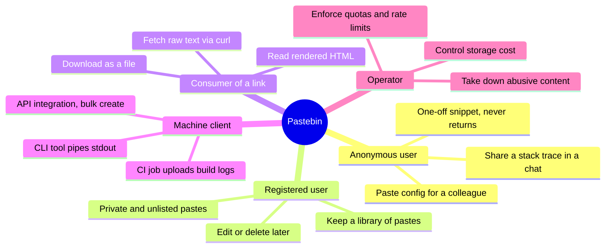

### 2.2 Primary use cases

| # | Use case | Actor | Trigger | Success outcome |
|---|---|---|---|---|
| UC-1 | Create a public paste | Anonymous user | Submits text via web form | Short URL returned, content readable |
| UC-2 | Read a paste | Any reader | Opens the short URL | Content rendered, view counted |
| UC-3 | Fetch raw content | Machine client | `GET /raw/{key}` | `text/plain` body, no HTML |
| UC-4 | Create with expiry | Any creator | Sets TTL (10 min … never) | Paste becomes unreachable after TTL |
| UC-5 | Burn after read | Privacy-conscious user | Sets `burn_after_read` | First read succeeds, second returns 410 |
| UC-6 | Password-protect | Any creator | Supplies a password | Reader must supply password to decrypt |
| UC-7 | Delete a paste | Owner | `DELETE /v1/pastes/{key}` | Paste gone from cache, CDN, and store |
| UC-8 | List my pastes | Registered user | Opens dashboard | Paginated list of owned pastes |
| UC-9 | Report / take down | Reader, Operator | Abuse report or scanner hit | Paste quarantined, serves 451 |
| UC-10 | Bulk upload from CI | Machine client | API key + POST | Paste created, idempotent on retry |

### 2.3 The reader's journey

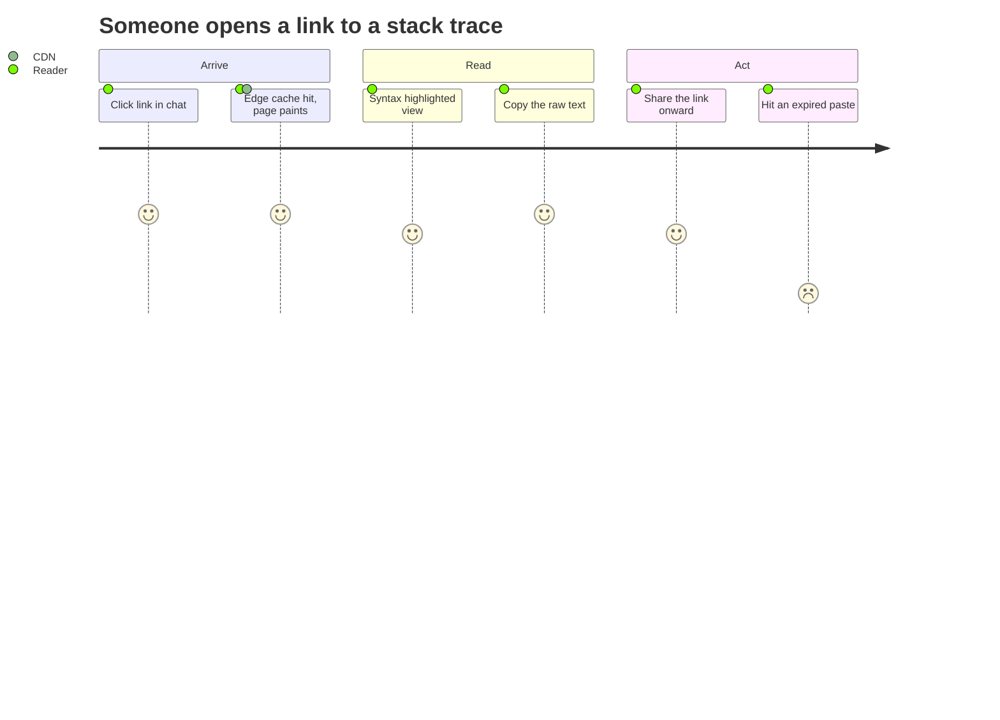

That last row is the design constraint hiding in plain sight: an expired or
deleted paste must fail *fast and clearly*, not with a slow 500 from a
half-purged cache.

### 2.4 Out of scope

Collaborative editing (see Collaborative Editor),
version history, comments, and a full-text search over paste bodies. Search is
worth explicitly declining — indexing user-submitted text turns an abuse problem
into a discovery problem.

---

## 3. Requirements

### Functional

- Create a paste from a text body of up to **10 MB**, returning a short key.
- Retrieve a paste by key, as rendered HTML or as raw text.
- Optional per-paste settings: expiry TTL, visibility (public / unlisted / private),
  password protection, burn-after-read, syntax language hint, title.
- Delete a paste (owner or operator).
- List and paginate pastes owned by an authenticated user.
- Enforce rate limits and quotas per client.

### Non-functional

- **Read-heavy**: assume ~10:1 reads to writes; the read path is what we optimize.
- **Low read latency**: p99 under 100 ms globally for cached pastes.
- **Durability over availability for writes**: a paste that was acknowledged must
  never be lost. A failed *write* is acceptable (the user still has their text in
  the textarea); a lost *stored* paste is not.
- **High availability for reads**: 99.99%. Reads should survive a metadata store
  degradation via cache and CDN.
- **Immutability**: once created, a paste body never changes. This is a huge
  simplification — it makes every cache layer safe by construction.
- **Cost-sensitive**: storage grows monotonically and most pastes are read a
  handful of times in the first hour and then never again.

### Constraints and assumptions

- Keys are unguessable enough that an unlisted paste is not trivially enumerable.
- No strong consistency requirement across regions: a paste being readable a few
  hundred milliseconds after creation in a far region is fine, *except* for the
  creator's own immediate redirect (read-your-writes for the author).

---

## 4. Capacity Estimation

Assumptions: **10 M new pastes/day**, **10:1 read/write**, **average body 10 KB**
(median far lower, ~1 KB; the mean is dragged up by log dumps), 5-year retention
for non-expiring pastes.

### Traffic

| Metric | Calculation | Result |
|---|---|---|
| Writes | 10 M / 86 400 | **~115 writes/s** |
| Writes (peak 3×) | | **~350 writes/s** |
| Reads | 100 M / 86 400 | **~1 160 reads/s** |
| Reads (peak 3×) | | **~3 500 reads/s** |

### Storage

| Metric | Calculation | Result |
|---|---|---|
| Body bytes/day | 10 M × 10 KB | **100 GB/day** |
| Body bytes/year | 100 GB × 365 | **~36 TB/year** |
| 5 years, raw | 36 TB × 5 | **~180 TB** |
| With 3× replication | | **~540 TB** |
| With zstd (~3:1 on text) | 180 TB / 3, then ×3 replicas | **~180 TB** |
| Metadata/day | 10 M × ~300 B | **~3 GB/day → ~1 TB/year** |

The interesting split: **bodies are hundreds of terabytes, metadata is about a
terabyte.** They want completely different stores. That observation drives
Section 7.

### Bandwidth

- Ingress: 100 GB/day ≈ **1.2 MB/s** average. Trivial.
- Egress: 100 M reads × 10 KB ≈ **1 TB/day ≈ 12 MB/s** average, ~35 MB/s peak.

Egress is 10× ingress, and egress is the line item you pay for. This is the
economic argument for the CDN in Section 9.2.

### Cache working set

Reads follow a steep recency curve — most reads target pastes created in the
last hour.

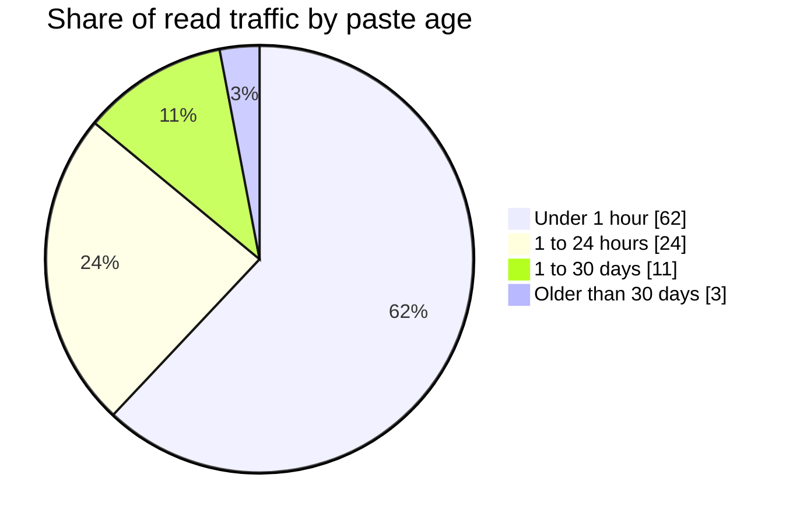

Caching one day of pastes (10 M × 10 KB = 100 GB) would serve ~86% of reads. In
practice we cache **small bodies inline** and only the hot tail: budget **~50 GB
of Redis** across the fleet and expect a 90%+ hit rate.

---

## 5. API Design

| Endpoint | Method | Purpose |
|---|---|---|
| `/v1/pastes` | POST | Create a paste. Body: `{content, language?, title?, expires_in?, visibility?, password?, burn_after_read?}` |
| `/v1/pastes/{key}` | GET | Metadata + content as JSON |
| `/v1/pastes/{key}` | DELETE | Delete (owner or operator) |
| `/v1/pastes/{key}/unlock` | POST | Exchange password for a short-lived read token |
| `/v1/users/me/pastes` | GET | Cursor-paginated list of owned pastes |
| `/{key}` | GET | Human-facing HTML view |
| `/raw/{key}` | GET | `text/plain` body — the endpoint `curl` users actually want |
| `/dl/{key}` | GET | Same bytes with `Content-Disposition: attachment` |

Notes that matter in review:

- **Create is idempotent** via a client-supplied `Idempotency-Key` header. CI
  systems retry; retries must not produce three copies of the same build log.
- **Create returns `201` with a `Location` header**, not a redirect — machine
  clients should not have to follow a 302 to learn the key.
- **Reads of an expired paste return `410 Gone`, not `404`** when we still know
  the key existed; a bare unknown key returns `404`. Taken-down content returns
  `451`. Distinguishing these costs nothing and makes debugging humane.
- Rate limiting sits at the gateway — the design in
  [Rate Limiter](002-rate-limiter.md) applies directly.

---

## 6. High-Level Design

```mermaid
flowchart TB
  subgraph Client
    B[Browser]
    C[CLI / CI job]
  end

  subgraph Edge
    CDN[CDN<br/>caches raw + rendered reads]
    GW[API Gateway<br/>TLS, auth, rate limit]
  end

  subgraph Services
    W[Write Service<br/>stateless]
    R[Read Service<br/>stateless]
    KGS[Key Generation Service<br/>pre-minted key pool]
  end

  subgraph Data
    RC[("Redis<br/>hot pastes + negative cache")]
    MD[("Metadata Store<br/>sharded by key hash")]
    OS[("Object Store<br/>paste bodies, immutable")]
  end

  subgraph Async
    Q[[Event Queue]]
    GC[Expiry / GC Worker]
    AB[Abuse Scanner]
    AN[Analytics Rollup]
  end

  B --> CDN
  C --> GW
  CDN -->|miss| GW
  GW --> W
  GW --> R
  W --> KGS
  W --> OS
  W --> MD
  W --> Q
  R --> RC
  R --> MD
  R --> OS
  Q --> GC
  Q --> AB
  Q --> AN
  GC --> MD
  GC --> OS
  AB --> MD
```

### Component responsibilities

| Component | Owns | Explicitly does not own |
|---|---|---|
| API Gateway | TLS, authn, rate limits, request size cap | Business rules |
| Write Service | Validation, key allocation, blob-then-metadata ordering | Rendering, counting |
| Read Service | Cache lookup, authz on private pastes, rendering | Mutation of any kind |
| KGS | Unique, unguessable keys; never hands out a key twice | Knowing what a paste is |
| Metadata store | Small, indexed, queryable facts about pastes | Paste bytes |
| Object store | Durable, cheap, immutable bytes | Queries |
| Workers | Expiry, abuse, counters — everything off the hot path | Anything a user waits on |

**Why split read and write services** when both are thin? They scale on
different axes (reads 10×), fail differently (a write outage is survivable, a
read outage is the outage), and deploy at different rates. Keeping them separate
lets you shed writes to protect reads under load — a lever you want during an
incident.

---

## 7. Data Model

### 7.1 Entities

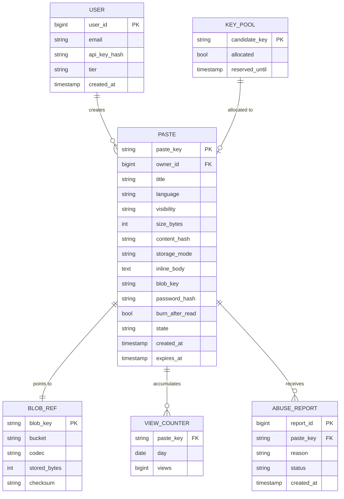

### 7.2 The storage split — and the hybrid that beats it

Three options, and the interview usually stops at the first two:


- **All in the relational store**: simple and transactional, but 180 TB of TEXT
  columns destroys your buffer-pool hit rate, backups, and replication lag. Every
  metadata query drags blob pages through memory.
- **All in an object store**: cheap and infinitely durable, but every read costs
  an extra network round trip — painful for a 400-byte snippet.
- **Hybrid (chosen)**: bodies **≤ 4 KB live inline** in the metadata row;
  anything larger goes to the object store with only a `blob_key` in the row.

The hybrid is the right answer because the size distribution is bimodal: the
median paste is a few hundred bytes, and the mean is dragged up by a minority of
log dumps. Inline storage serves the majority of *reads* with zero extra hops
while holding a small share of total *bytes*.

> [!TIP]
> `storage_mode` (`inline` | `blob`) as an explicit column, rather than
> "blob_key is null means inline", makes the migration to a third tier — say, a
> cold archive — a value change instead of a schema change.

### 7.3 Indexes and partitioning

- Primary access is `paste_key` → **hash-shard on `paste_key`**. Reads are exact
  point lookups, so hash sharding gives a uniform spread with no hot shard.
- `(owner_id, created_at DESC)` secondary index for the user dashboard, local to
  each shard, fanned out and merged at the service (bounded — a user's pastes are
  few).
- `(expires_at)` index **on a partial predicate** `WHERE expires_at IS NOT NULL`
  so the GC scan touches only expiring rows, not the majority that never expire.
- `content_hash` index enables optional dedupe (Section 12.6).

Do not shard by `owner_id`: anonymous pastes dominate and would all land on a
null-owner hotspot.

---

## 8. Key Generation

The key is user-visible, must be unique, and for unlisted pastes must be
**unguessable**. Those are different properties and the design has to satisfy
both.

### 8.1 Sizing

Base62 over 8 characters gives 62⁸ ≈ **2.18 × 10¹⁴** keys. At 10 M/day we consume
3.65 × 10⁹ per year — about 0.002% of the space in a year. Eight characters is
comfortable; six (5.7 × 10¹⁰) would be ~6% consumed per year and, worse, cheap
enough to enumerate.

### 8.2 Three approaches

| Approach | Uniqueness | Unguessable | Cost per write |
|---|---|---|---|
| Hash of content, first 8 chars | Collisions certain; needs retry loop | No — identical content yields identical key, leaking existence | 1 hash + collision check |
| Counter + Base62 (Snowflake-style) | Guaranteed | **No** — sequential keys are enumerable | Cheap |
| **Pre-generated random pool (KGS)** | Guaranteed by the pool | Yes — CSPRNG-derived | One pool pop |

Sequential IDs are the trap here. They are perfect for a URL shortener where
links are public by definition, and disqualifying for Pastebin where "unlisted"
is a product feature. If you take a counter approach anyway, you must encrypt
the counter (format-preserving encryption over the ID space) to recover
unguessability.

### 8.3 The Key Generation Service

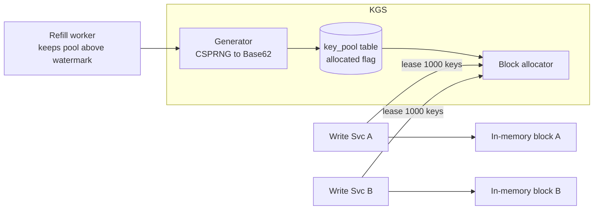

Each write server leases a **block of 1 000 keys** and serves them from memory,
so the steady-state cost of a key is a pointer increment — no coordination on
the hot path. Trade-off: a server crash loses its unused block, up to 1 000 keys
out of 2.18 × 10¹⁴. Nobody cares. Trying to avoid that loss by taking keys one at
a time reintroduces a per-write round trip, which is the thing the design exists
to prevent.

The refill worker keeps the pool above a low watermark; the generator checks a
Bloom filter of issued keys before inserting, keeping the pool free of duplicates
without a unique-index conflict storm.

---

## 9. Dynamic Workflows

This is where the design becomes concrete: the same components, seven different
runtime paths.

### 9.1 Create a paste

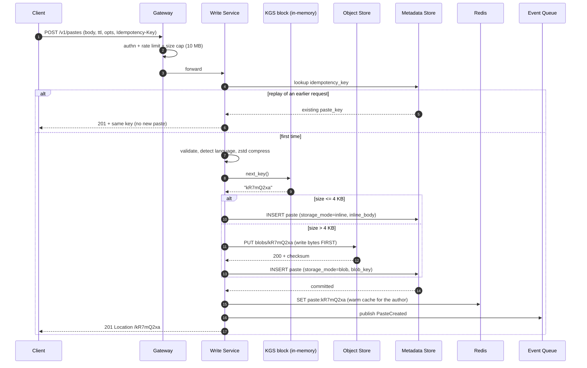

**Ordering is the whole trick.** Bytes go to the object store *before* the
metadata row is committed, so the metadata insert is the single commit point. The
two failure modes are asymmetric on purpose:

- Blob written, metadata insert fails → an **orphan blob**. Invisible to users,
  reclaimed by a reconciliation job. Costs a little money.
- Metadata written, blob missing → a **dangling paste** that 500s on read. Costs
  correctness.

We accept the cheap failure and design out the expensive one.

### 9.2 Read a paste (the hot path)

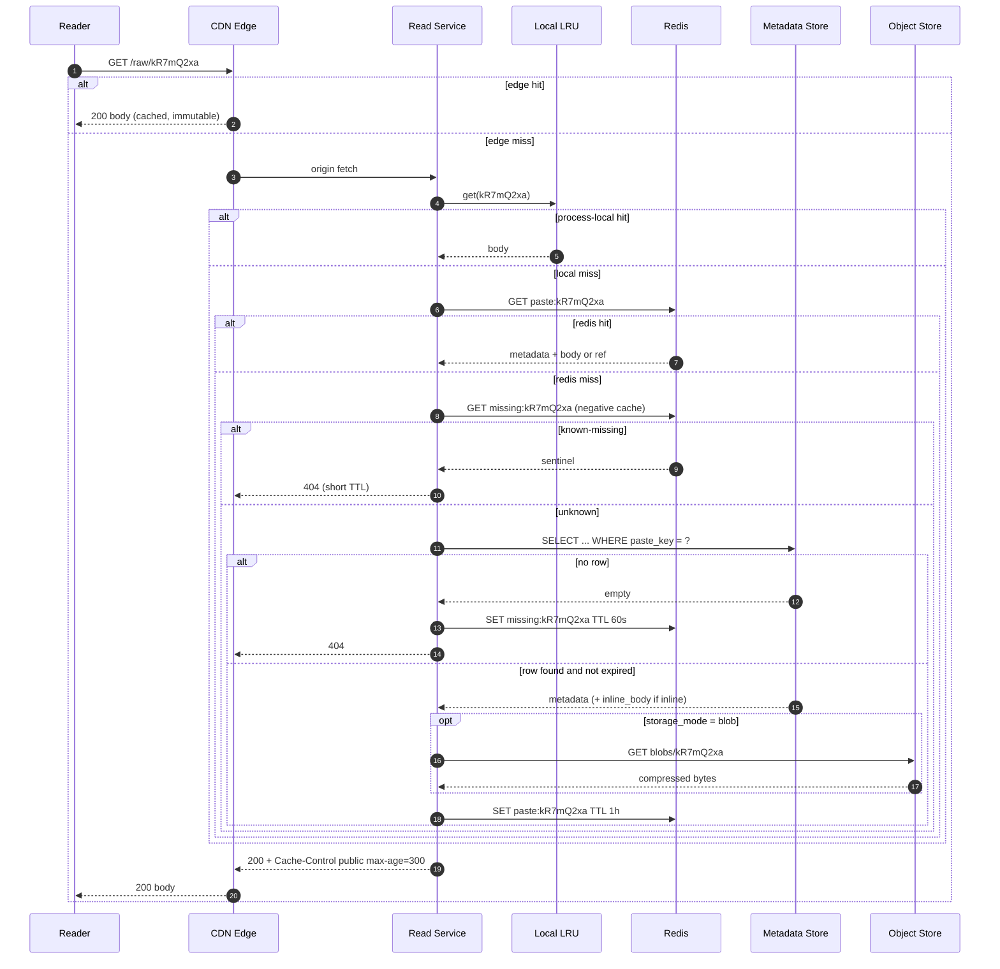

Four cache tiers — CDN, process-local LRU, Redis, then the stores. Each exists
for a different reason: the CDN removes egress cost and geography, the local LRU
absorbs a viral paste without hammering Redis, Redis is the shared warm tier, and
the stores are the truth.

> [!WARNING]
> `max-age` is deliberately 300 seconds, not a year, even though bodies are
> immutable. Deletion and takedown must actually take effect. Long TTLs plus an
> explicit CDN purge API is the alternative — faster reads, but now correctness
> depends on a purge call succeeding. Five minutes of exposure after a takedown
> is usually the honest trade; regulated content changes that answer.

### 9.3 Thundering herd on a viral paste

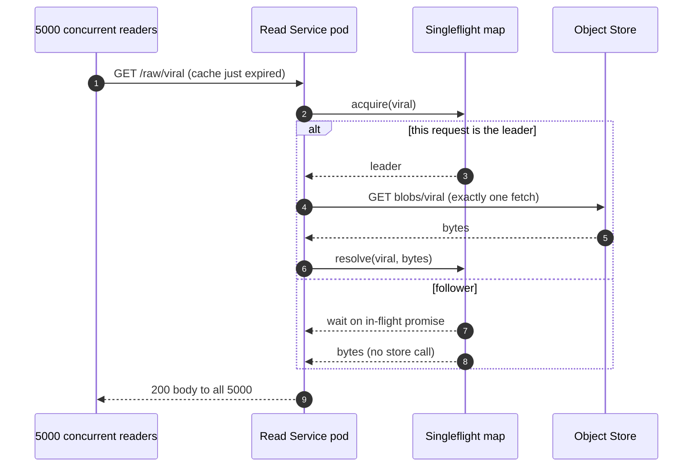

Request coalescing turns N simultaneous misses into one origin fetch. Without
it, a paste that hits the front page of an aggregator sends thousands of
identical GETs to the object store the moment its cache entry expires.

### 9.4 Burn after read

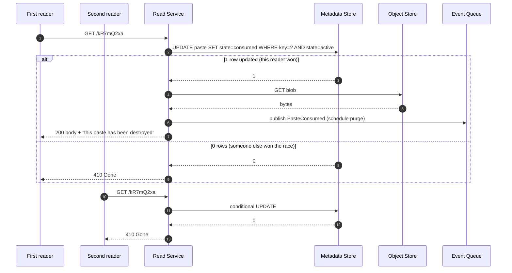

The **conditional update is the lock**. Two concurrent readers both attempt the
same state transition and the store arbitrates — no distributed lock service, no
read-then-write race. Note that burn-after-read pastes must be excluded from CDN
and Redis caching entirely (`Cache-Control: no-store`), or the second reader gets
the body from an edge that never learned about the consume.

### 9.5 Password-protected paste

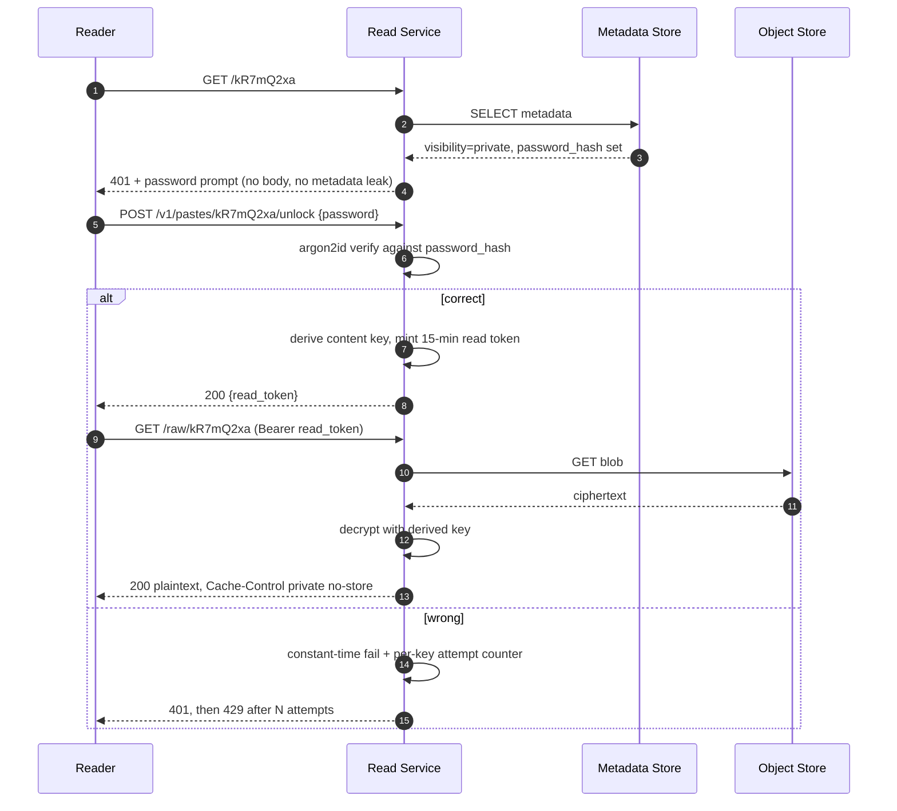

If the password is meant to protect against an operator, the body must be
**encrypted client-side** with the key kept in the URL fragment (`#`), which
browsers never send to the server. Server-side password checks protect against
link-guessers, not against you. Say which threat model you are addressing — that
distinction is what separates a senior answer here.

### 9.6 Expiry and garbage collection

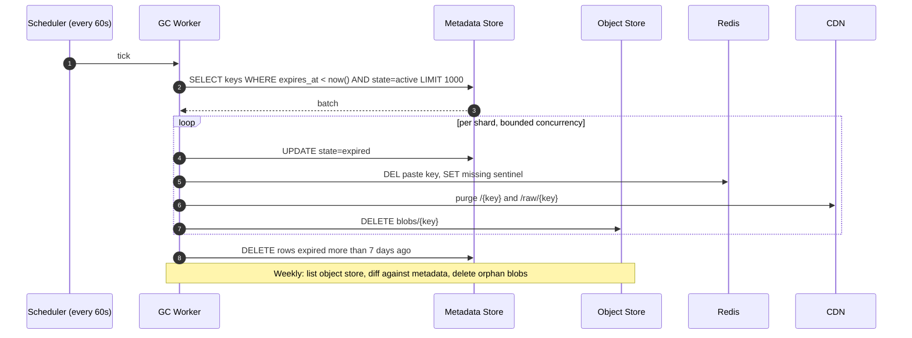

Two-phase deletion — mark expired, purge later — matters because it makes the
whole job idempotent and gives you a seven-day window to recover from a bad
expiry bug. Deleting immediately makes an off-by-one in a TTL calculation an
unrecoverable data-loss incident.

Expiry is also enforced **lazily on read** (`expires_at < now()` is checked in
the read path), so correctness never depends on the GC worker being current. The
worker exists to reclaim *space*, not to enforce *semantics*.

### 9.7 Abuse handling and view counting

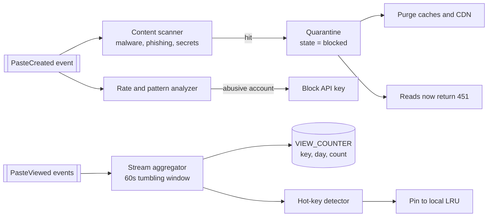

View counting is **never** a synchronous write on the read path. A counter
increment per read would add a store write to 3 500 reads/s to make a number on
a page slightly fresher. Events go to the queue, a stream job aggregates in
60-second windows, and the page shows a count that is a minute stale. The same
event stream feeds the hot-key detector that pins viral pastes into local caches.

---

## 10. Paste Lifecycle

```mermaid
stateDiagram-v2
  [*] --> Validating: POST /v1/pastes
  Validating --> Rejected: too large / malformed / quota
  Validating --> Stored: blob written
  Stored --> Active: metadata committed
  Active --> Consumed: burn-after-read served
  Active --> Expired: expires_at passed
  Active --> Deleted: owner DELETE
  Active --> Blocked: abuse scanner or takedown
  Consumed --> Purged: purge job
  Expired --> Purged: GC after grace period
  Deleted --> Purged: GC after grace period
  Blocked --> Purged: operator confirms
  Blocked --> Active: appeal upheld
  Purged --> [*]
  Rejected --> [*]

  note right of Active
    Only state that serves 200.
    Expired / Deleted give 410
    Blocked gives 451
    Unknown key gives 404
  end note
```

The `Blocked → Active` edge is easy to forget and matters: takedowns get appealed
and reversed, so blocking must be a reversible state change, not a delete.

---

## 11. Low-Level Design

### 11.1 Service objects

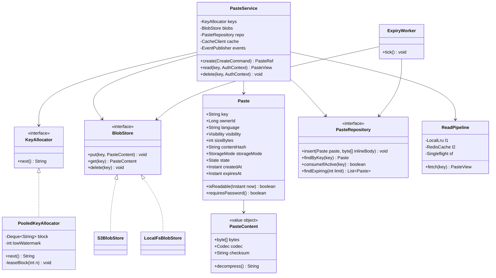

`BlobStore` and `KeyAllocator` are interfaces for a practical reason, not
ceremony: they are the two seams where local development and tests need cheap
substitutes — a filesystem, a deterministic counter — for expensive
infrastructure.

### 11.2 Create, in code shape

```
function create(cmd, auth):
    assert cmd.content.length <= MAX_BYTES                # 10 MB, checked at gateway too
    if cmd.idempotencyKey:
        existing = repo.findByIdempotencyKey(auth.clientId, cmd.idempotencyKey)
        if existing: return existing                      # exactly-once for retrying clients

    body     = compress(cmd.content, ZSTD)
    hash     = sha256(cmd.content)
    key      = keys.next()                                # in-memory pop, no I/O
    expires  = cmd.expiresIn ? now() + cmd.expiresIn : null

    if body.length <= INLINE_THRESHOLD:                   # 4 KB
        mode, blobKey, inline = INLINE, null, body
    else:
        blobs.put(key, body)                              # durable BEFORE commit
        mode, blobKey, inline = BLOB, key, null

    paste = Paste(key, auth.userId, mode, blobKey, hash, expires, ACTIVE)
    repo.insert(paste, inline)                            # commit point
    cache.set("paste:" + key, paste, inline ?? body, TTL_1H)
    events.publish(PasteCreated(key, auth.clientId, hash))
    return PasteRef(key, url("/" + key))
```

### 11.3 Read, in code shape

```
function read(key, auth):
    if not isValidKeyFormat(key): return NotFound         # reject before any I/O
    if bloom.mightExist(key) == false: return NotFound    # 8-char garbage never hits the DB

    view = l1.get(key) ?? l2.get(key)
    if view == null:
        if l2.get("missing:" + key): return NotFound      # negative cache
        view = singleflight.do(key, () => {
            p = repo.findByKey(key)
            if p == null:
                l2.set("missing:" + key, SENTINEL, TTL_60S)
                return null
            body = (p.storageMode == INLINE) ? p.inlineBody : blobs.get(p.blobKey)
            return PasteView(p, body)
        })
        if view == null: return NotFound
        l2.set(key, view, TTL_1H)
    l1.set(key, view)

    if not view.paste.isReadable(now()):  return Gone          # lazy expiry, authoritative
    if view.paste.state == BLOCKED:       return Unavailable   # 451
    if view.paste.requiresPassword() and not auth.hasReadToken(key):
        return Unauthorized
    if view.paste.burnAfterRead:
        if not repo.consumeIfActive(key): return Gone          # conditional update = the lock
        schedulePurge(key)

    events.publishAsync(PasteViewed(key))                      # never blocks the response
    return view
```

Two details worth defending in review: the **key-format check and Bloom filter
run before any I/O**, so a scanner spraying random 8-character keys costs
microseconds instead of a database round trip each; and **lazy expiry is checked
after the cache read**, because a cached entry can outlive its own `expires_at`.

### 11.4 Concurrency inventory

| Race | Mechanism |
|---|---|
| Two readers on a burn-after-read paste | Conditional `UPDATE … WHERE state='active'`; row count arbitrates |
| Two writers, same idempotency key | Unique index on `(client_id, idempotency_key)`; loser reads the winner's row |
| KGS handing the same key twice | Keys leased in disjoint blocks; a block lease is a single atomic claim |
| Cache stampede on expiry | Singleflight + jittered TTLs |
| GC deleting a blob mid-read | Two-phase delete: state flips to expired, blob removal is 7 days behind |
| Concurrent delete + read | Read re-validates `state` after the cache fetch; worst case, one stale 5-minute CDN hit |

---

## 12. Optimization

Everything up to here is a working system. This section is what makes it fast
and cheap — which, for a read-heavy service with a monotonically growing corpus,
is the same problem.

### 12.1 Read path

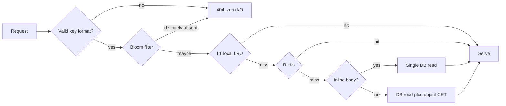

Cumulative effect: the CDN absorbs the majority of reads before they reach us at
all; of what remains, the great majority is served without touching the object
store. The object store — the slowest and per-request most expensive tier — sees
a small single-digit percentage of original read volume.

### 12.2 Compression

Text compresses roughly 3:1 with zstd, better on logs and JSON. Compress **once
at write**, store compressed, and serve compressed to any client sending
`Accept-Encoding: zstd, gzip` — the bytes pass through untouched. Only decompress
for clients that cannot handle it, or when the server must render syntax
highlighting. This cuts storage, cache footprint, *and* egress simultaneously,
which is rare enough to be worth calling out.

### 12.3 Storage tiering

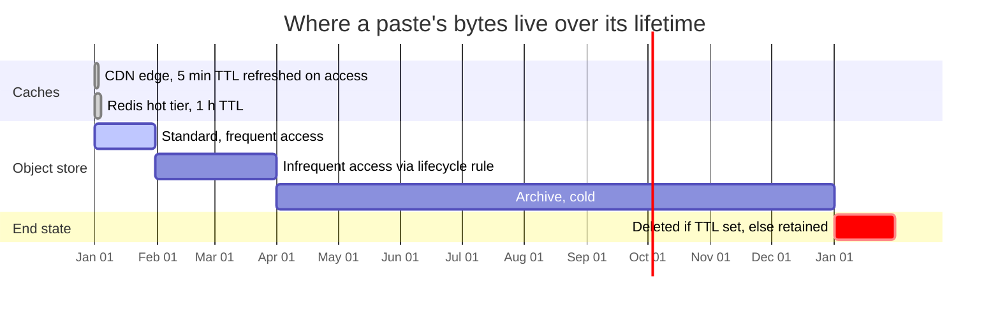

Lifecycle rules on the bucket do this automatically. The saving is real:
transitioning objects untouched for 30 days to infrequent-access and then to
archive can cut body storage cost substantially at 180 TB, and the pastes that
get demoted are, by construction, the ones nobody reads.

### 12.4 Write path

- **Compression and language detection off the request thread** where latency
  matters; both are CPU-bound and neither needs to block the 201.
- **Batch the metadata insert** only if write volume justifies it — at 350
  writes/s peak it does not. Say so explicitly rather than adding machinery.
- **Multipart upload** for bodies over ~5 MB, so a flaky connection retries a
  part instead of the whole 10 MB.

### 12.5 Hot-key handling

The hot-key detector in the event pipeline pins viral pastes into every pod's L1
cache with an extended TTL. Combined with singleflight, a paste doing 50 000
req/s does approximately zero store reads. This is the same class of problem as
the hot-key section in Distributed Cache.

### 12.6 Deduplication (conditional)

`content_hash` lets identical bodies share one blob with a reference count.
Attractive in theory — CI systems paste the same failing log repeatedly.

Do not build it first. It adds a reference count to every delete path, turns
"delete the blob" into a distributed refcount problem, and creates a
**cross-user information leak**: if creating a paste returns suspiciously fast or
visibly reuses storage, you have learned that someone else pasted that exact
content. Worth it only once storage cost is a top-three line item, and only with
per-user namespacing of the hash.

### 12.7 What deliberately is not optimized

- View counts are a minute stale. Nobody is making decisions on them.
- Cross-region replication is asynchronous. A paste readable in Frankfurt 300 ms
  before Singapore is not a defect.
- The user dashboard fans out across shards. It is a low-traffic authenticated
  path; spending a denormalized index on it would be optimizing the wrong 0.1%.

---

## 13. Scaling and Failure Modes

### 13.1 Scaling levers, in the order you would pull them

1. **Add CDN coverage / raise edge TTL** — removes load and egress cost with no code change.
2. **Scale read pods horizontally** — stateless, trivially horizontal.
3. **Grow the Redis tier** — more hot working set, fewer store reads.
4. **Add metadata shards** — hash sharding makes resharding the expensive one; plan the shard count with headroom, or use consistent hashing with virtual nodes from day one.
5. **Regional object-store replicas** — last, because it is the costliest.

### 13.2 Failure matrix

| Failure | Blast radius | Behavior |
|---|---|---|
| Redis cluster down | Higher latency, more store load | Degrade to metadata + object store; shed writes to protect reads |
| Object store degraded | Large pastes unreadable | Inline pastes still serve; return 503 with `Retry-After` for blobs |
| Metadata shard down | 1/N of keys unreadable | Cached keys still serve; other shards unaffected — the argument for hash sharding |
| KGS pool exhausted | Writes fail | Emergency generator inline in the write path; alert at 30% pool remaining |
| GC worker stalled | Storage grows; expired pastes still 410 | Lazy expiry keeps *correctness* intact, only cost drifts. Alert on oldest-unpurged age |
| CDN outage | Full read volume hits origin | Origin sized for ~3× normal to absorb it; degrade to raw text, skip rendering |

The theme: **every failure degrades to something readable.** The read path has
four tiers and lazy expiry precisely so that no single dependency can make
correct behavior impossible.

---

## 14. Security and Abuse

- **Never render user content into HTML unescaped.** Syntax highlighting means
  parsing untrusted text; serve rendered views from a **separate origin** with a
  strict CSP so a highlighter escaping bug is not a session-stealing XSS on the
  main domain. Serve `/raw/` with `Content-Type: text/plain; charset=utf-8` and
  `X-Content-Type-Options: nosniff` — without nosniff, a paste of HTML served as
  plain text can still be sniffed and executed by some browsers.
- **Pastebin is a natural malware and exfiltration host.** The scanner pipeline
  is not optional: hash matching against known-bad, phishing-kit heuristics, and
  credential/secret-pattern detection. Secret detection is also a *feature* —
  warning a user that they just pasted a cloud access key is a genuine service.
- **Enumeration**: 8-char CSPRNG keys plus per-IP rate limiting on 404s. A
  sustained high 404 rate from one source is an enumeration attempt and should
  trigger a block, not just a metric.
- **Quotas** per tier on paste count, total bytes, and body size.
- **Encryption**: TLS in transit, at-rest encryption on the object store, and
  optional client-side encryption for genuine zero-knowledge (Section 9.5).
- **Legal**: a takedown workflow with an audit trail, and `451` as the honest
  status code for legally removed content.

---

## 15. Monitoring

| Signal | Why it matters | Alert on |
|---|---|---|
| Read p50/p99 by tier (edge / L1 / Redis / store) | Locates a slowdown to a layer | p99 > 200 ms |
| Cache hit rate per tier | Leading indicator of store load | Redis hit rate < 85% |
| KGS pool depth | Silent, then catastrophic | < 30% remaining |
| Orphan blob count and bytes | Shows reconciliation is working | Growth over a week |
| Oldest unpurged expired paste | GC health, and cost | > 24 h |
| 404 rate by source IP | Enumeration attempts | Sustained spike |
| Storage bytes by tier | Lifecycle rules working | Standard-tier growth outpacing writes |
| Write-to-readable lag | Read-your-writes for authors | p99 > 1 s |

---

## 16. Trade-offs Summary

| Decision | Benefit | Cost |
|---|---|---|
| Hybrid inline + object storage | Most reads need no second hop; bodies stay out of the DB | Two code paths, a threshold to tune |
| Pre-generated random keys (KGS) | Unguessable and collision-free, no hot-path coordination | Extra service; leased blocks lost on crash |
| Blob before metadata | Never serves a dangling paste | Orphan blobs need reconciliation |
| Lazy expiry + background GC | Correctness independent of worker health | Expired rows and bytes linger briefly |
| Two-phase delete, 7-day grace | Recoverable from a bad expiry bug; idempotent | Storage held past logical deletion |
| CDN with 5-minute TTL | Cheap egress, global latency | Takedowns take up to 5 min unless purged |
| Async view counts | Read path stays free of writes | Counts ~1 min stale |
| Hash sharding on `paste_key` | No hot shard; failures are 1/N | Resharding is painful; no range scans |
| Separate read and write services | Independent scaling; shed writes to save reads | Two deployables, shared model code |
| Skipping dedupe initially | Simpler deletes, no cross-user leak | Pays for duplicate storage |

---

## 17. Interview Deep Dives

Where a conversation about this system usually goes next:

- **"Make unlisted pastes actually private."** Leads to client-side encryption,
  URL-fragment key handling, and the realization that server-side password checks
  address a different threat model entirely.
- **"The object store is now 40% of your bill."** Leads to tiering, compression
  ratios, and the dedupe conversation with its leak caveat.
- **"One paste is doing 100 k req/s."** Leads to hot-key detection, singleflight,
  edge TTL policy, and whether to serve a static snapshot.
- **"Support editing."** Breaks the immutability assumption that every cache tier
  depends on — the honest answer is versioned keys (`key@v2`), so bodies stay
  immutable and only a pointer moves.
- **"Add full-text search over pastes."** See
  Search Engine, and note that it converts an abuse
  problem into a discovery problem.
- **"Run it in five regions."** Leads to regional object stores, metadata
  replication topology, and read-your-writes for the creating region.

---

## 18. Key Takeaways

- Pastebin looks like a URL shortener and is not one. The payload moves the
  bottleneck from ID generation to storage and egress, and every major decision
  follows from that.
- **Immutability is the enabling property.** Because a body never changes, four
  cache tiers can be stacked without a single invalidation protocol — deletion,
  not mutation, is the only thing that needs propagating.
- **Order writes so the cheap failure is the one that happens.** Blob first,
  metadata as the commit point: orphan bytes cost money, dangling metadata costs
  correctness.
- **Enforce semantics on the read path, reclaim resources in the background.**
  Lazy expiry means a stalled GC worker is a cost problem, never a correctness one.
- **Sequential keys are a security decision, not a performance one.** Fine for
  public short links, disqualifying the moment "unlisted" is a feature.
- Keep every write off the read path — counters, scanning, and analytics all
  belong behind the event queue.
