## 1. Problem Statement

Build the service every other service calls when it needs to reach a human:
"your order shipped", "someone replied to you", "your password was reset",
"here is your one-time code". Push, email, SMS, in-app, webhook — one API in,
the right message out on the right channel.

It sounds like plumbing. It is not, for two reasons that shape every decision
below.

**First, delivery happens through systems you do not own and cannot fix.** APNs,
FCM, SES, Twilio — each with its own quotas, its own error taxonomy, its own
outages, and its own opinion of your reputation. In [Chat](004-chat-system.md)
the delivery target was a socket we held ourselves; here it is a third party
whose acknowledgement means *accepted for delivery*, not *delivered*. Most of
the engineering is managing other people's failure modes.

**Second, notifications are unwanted by default.** Every other system in this
series gets better as it does more. This one gets worse. Send too many and users
disable notifications permanently, mark you as spam, and take your sending domain
down with them — an irreversible loss inflicted by a system working exactly as
built. The scarce resource is not throughput, it is the recipient's tolerance.

So the thread running through this design: **the hard part is not sending, it is
deciding whether to send, and surviving the providers you send through.**

---

## 2. Use Cases

### 2.1 Actors and what they want

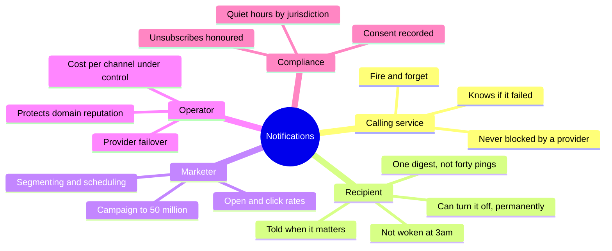

### 2.2 Primary use cases

| # | Use case | Actor | Trigger | Success outcome |
|---|---|---|---|---|
| UC-1 | Transactional notification | Order service | Order ships | Push within seconds, email fallback |
| UC-2 | One-time code | Auth service | Login attempt | SMS/push in < 10 s, never duplicated |
| UC-3 | Social notification | Social service | Someone replies | Push, or folded into a digest if noisy |
| UC-4 | Marketing campaign | Marketer | Scheduled blast | 50 M recipients, rate-shaped, opt-outs honoured |
| UC-5 | Scheduled reminder | Calendar service | `send_at` in the future | Fires at the right local time |
| UC-6 | Digest | System | Many events, one user, short window | One notification summarising N events |
| UC-7 | Preference change | Recipient | Toggles a category off | Takes effect immediately, everywhere |
| UC-8 | Unsubscribe | Recipient | Clicks the footer link | One click, no login, permanent |
| UC-9 | Bounce handling | Provider | Hard bounce webhook | Address suppressed, never retried |
| UC-10 | Provider failover | Operator | Primary SMS provider degrades | Traffic shifts, no message lost |
| UC-11 | Delivery status | Calling service | Queries a notification | Current state and per-channel attempts |
| UC-12 | Quiet hours | Recipient | Non-urgent send at 02:00 local | Deferred to morning, not dropped |

### 2.3 The journey that defines the design

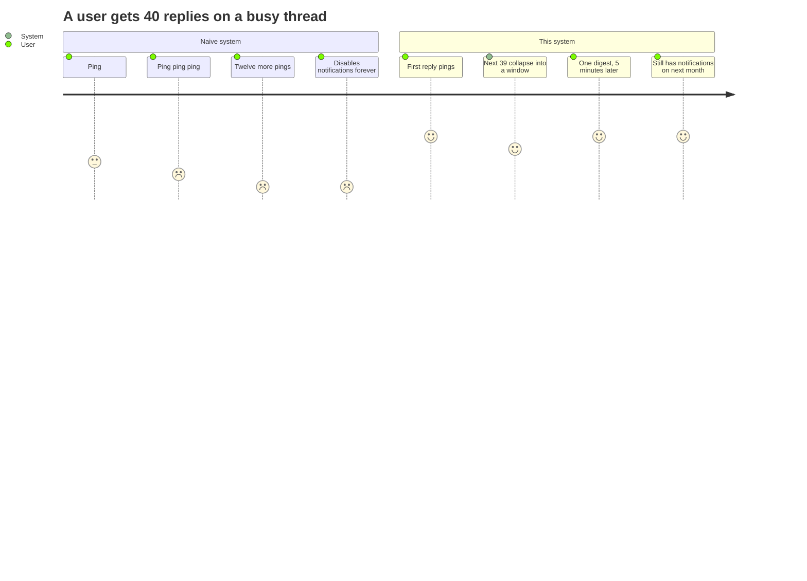

The bottom row is the actual success metric, and it is not a latency number.
A system that optimises only for delivery speed produces the top row.

### 2.4 Out of scope

The internals of each channel — deliverability engineering and MTA design
(Email Service), APNs/FCM connection management
(Push Notification Platform), carrier
routing (SMS Gateway) — and outbound webhooks to customer
endpoints (Webhook Delivery). Here those are adapters
behind an interface. Also out of scope: the segmentation engine that decides
*who* is in a campaign; it hands us a recipient list.

---

## 3. Requirements

### Functional

- Accept a notification request naming a **recipient, template, and data**, not a
  rendered message.
- Deliver across **push, email, SMS, in-app, and webhook**, with a fallback
  ladder when a channel is unavailable.
- Render templates with **versioning and localisation**.
- Evaluate **per-user, per-category, per-channel preferences**, including quiet
  hours and frequency caps.
- **Deduplicate and digest** related notifications within a window.
- **Schedule** future sends, including "9am in the recipient's timezone".
- Track delivery status per channel and expose it.
- Ingest provider callbacks: delivered, bounced, complained, unsubscribed.
- Maintain a **suppression list** that no send can bypass.

### Non-functional

- **Accept path p99 < 50 ms.** Callers must never wait on a provider. Accepting
  is a durable enqueue and nothing more.
- **Transactional end-to-end p99 < 10 s** from accept to provider acceptance.
- **At-least-once delivery, at-most-once *notification*.** The transport retries;
  the user must not see "your payment failed" three times. This is the cardinal
  sin of the domain.
- **Durability of accepted requests.** A 202 means we own it. Losing it silently
  is worse than rejecting it loudly.
- **Isolation between traffic classes.** A 50 M campaign must not delay a
  one-time password by even a second.
- Availability 99.99% on the accept path; the delivery path may lag without
  being down.
- **Compliance is a correctness requirement**, not a feature: consent, opt-outs,
  and quiet hours are enforced in the pipeline, not in the caller.

### Constraints and assumptions

- **Providers are quota-limited and will fail.** Their rate limits, not our CPU,
  are the binding constraint.
- **"Sent" is the strongest thing we can usually know.** Push tells us a device
  received it, never that a human saw it. Email tells us hours later, by webhook,
  and sometimes lies. SMS delivery receipts are carrier-dependent and optional.
- Callers are internal services that will retry on timeout, so **idempotency is
  mandatory at the API boundary**.
- Channel costs differ by orders of magnitude (Section 4.4), so routing is an
  economic decision as well as a product one.

---

## 4. Capacity Estimation

Assumptions: **100 M registered users, 25 M DAU**, 20 M transactional
notifications/day, plus marketing campaigns up to **50 M recipients**.

### 4.1 Traffic

| Metric | Calculation | Result |
|---|---|---|
| Transactional/day | | **20 M** |
| Transactional average | 20 M / 86 400 | **~230/s** |
| Transactional peak (3×) | | **~700/s** |
| Campaign, requested "within 30 min" | 50 M / 1 800 | **~28 000/s** |
| Total notifications/day | 20 M + 50 M | **~70 M** |

The campaign peak is **40× the transactional peak**. That single ratio is the
argument for everything in Section 6 about separate lanes: two workloads this
different cannot share a queue, a worker pool, or a provider quota.

### 4.2 Channel mix

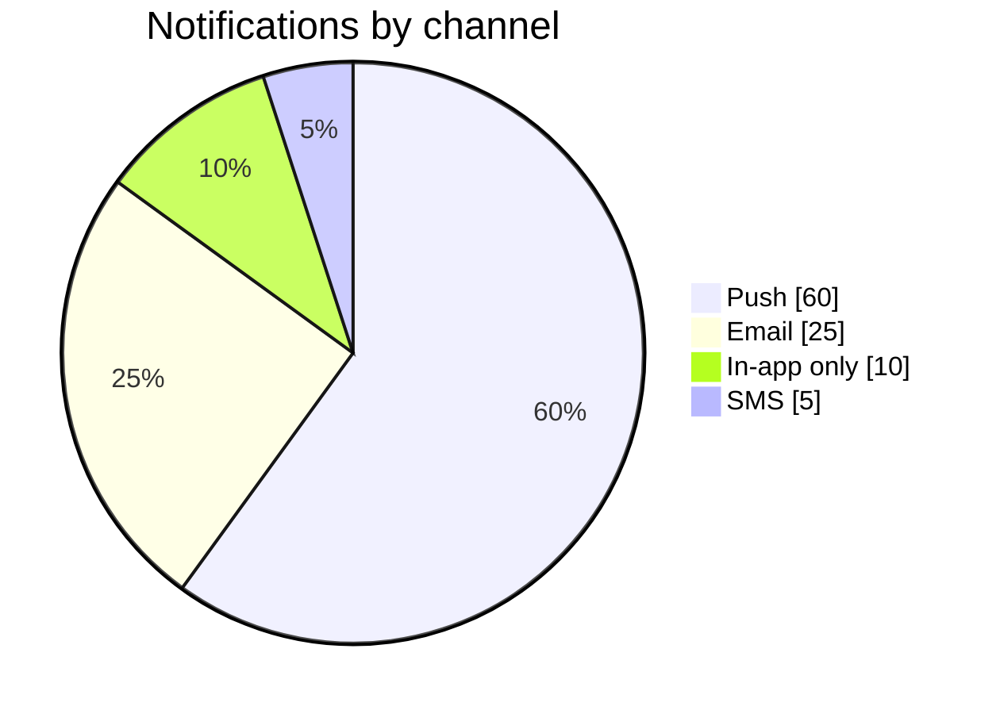

Push 42 M/day, email 17.5 M/day, SMS 3.5 M/day.

### 4.3 The constraint that is actually binding

Nothing above is compute-bound. The binding limits are provider quotas:

| Channel | Typical account limit | 50 M campaign takes |
|---|---|---|
| Push (FCM multicast, 500 tokens/request) | Effectively unbounded for us | ~100 K requests, minutes |
| Email (SES, 500 messages/s) | 500/s | **~27.8 hours** |
| Email (raised quota, 5 000/s) | 5 000/s | **~2.8 hours** |
| SMS (per long code) | ~1/s per number | Requires a large number pool or short code |

> [!IMPORTANT]
> "Send 50 M emails in 30 minutes" is not achievable at 500/s — the arithmetic
> says 27.8 hours. The requirement has to be renegotiated into **"start within
> 5 minutes, complete within 4 hours, in a deterministic order"**, and the quota
> raised to match. Discovering this in the capacity section rather than in
> production is the entire point of doing the arithmetic.

This is the general shape of the system: **you are quota-bound, not CPU-bound.**
Scaling workers past the provider limit converts a throughput problem into a
rate-limit-error problem.

### 4.4 Cost, which is a design input

| Channel | Approx. unit cost | 3.5 M/day of it |
|---|---|---|
| Push | ~free (egress only) | negligible |
| Email | ~$0.0001 | ~$350/day at 3.5 M |
| SMS | ~$0.0075 | **~$26 000/day** |

SMS is roughly **75× email and effectively infinitely more than push**. At our
volume the SMS line item alone is ~$9.6 M/year. That is why the fallback ladder
in Section 8.5 is push → email → SMS and never the reverse, and why SMS requires
both urgency and explicit opt-in.

### 4.5 Storage

| Metric | Calculation | Result |
|---|---|---|
| Delivery records/day | 70 M × ~400 B | **~28 GB/day** |
| With retries and per-channel attempts (~1.3×) | | **~36 GB/day** |
| 90-day hot retention | | **~3.2 TB** (×3 replicas ≈ 10 TB) |
| Aggregated metrics | rolled up, kept indefinitely | small |

Detail rows expire at 90 days; the aggregates that answer "what is our bounce
rate" are rolled up hourly and kept forever. Nobody queries an individual
delivery record from two years ago, and keeping 70 M/day forever to pretend
otherwise is expensive theatre.

---

## 5. API Design

| Endpoint | Method | Purpose |
|---|---|---|
| `/v1/notifications` | POST | Send one. Body: `{recipient, template_id, data, category, priority, channels?, dedupe_key?, send_at?}` |
| `/v1/notifications/batch` | POST | Up to 1 000 requests in one call |
| `/v1/notifications/{id}` | GET | Status and per-channel attempts |
| `/v1/campaigns` | POST | Register a bulk send against a recipient list |
| `/v1/campaigns/{id}` | GET / DELETE | Progress; cancel a campaign mid-flight |
| `/v1/users/{id}/preferences` | GET / PATCH | Category × channel preferences, quiet hours, timezone |
| `/v1/users/{id}/channels` | POST / DELETE | Register a device token, email, or phone number |
| `/v1/unsubscribe` | POST | One-click, token-authenticated, no login |
| `/v1/suppressions` | GET / POST | Operator view of the suppression list |
| `/v1/callbacks/{provider}` | POST | Provider webhooks: delivered, bounced, complained |
| `/v1/templates/{id}/versions` | POST / GET | Template management |

Points worth defending in review:

- **`202 Accepted`, never `200 OK`.** The response means "durably queued and we
  now own it", which is a materially different promise from "delivered". The
  response body carries a `notification_id` for tracking and nothing that implies
  success.
- **`Idempotency-Key` is required for transactional sends.** The caller retries on
  timeout — that is correct client behaviour — and it must not produce a second
  message. Key scope is `(caller, idempotency_key)`, retained 24 hours.
- **`dedupe_key` is a different thing and both are needed.** `Idempotency-Key`
  collapses *retries of one request*; `dedupe_key` collapses *distinct requests
  that mean the same thing to the user* ("3 people liked your post" arriving as
  three separate events). One is transport safety, the other is product
  restraint.
- **Callers send `template_id` + `data`, never rendered content.** Accepting
  caller-supplied HTML means arbitrary markup in your emails, injection through
  your sending domain, and no ability to fix a broken message centrally. The
  template is the contract; the caller supplies variables.
- **`category` is mandatory** because it drives preferences, quiet hours,
  suppression semantics, and the legal treatment of the message. A send without a
  category cannot be evaluated, so it is rejected at the door.
- **`priority` is a small closed enum** (`urgent`, `transactional`, `bulk`) that
  selects a lane. Callers do not get a numeric priority to inflate; every team
  believes its notifications are urgent.

---

## 6. High-Level Design

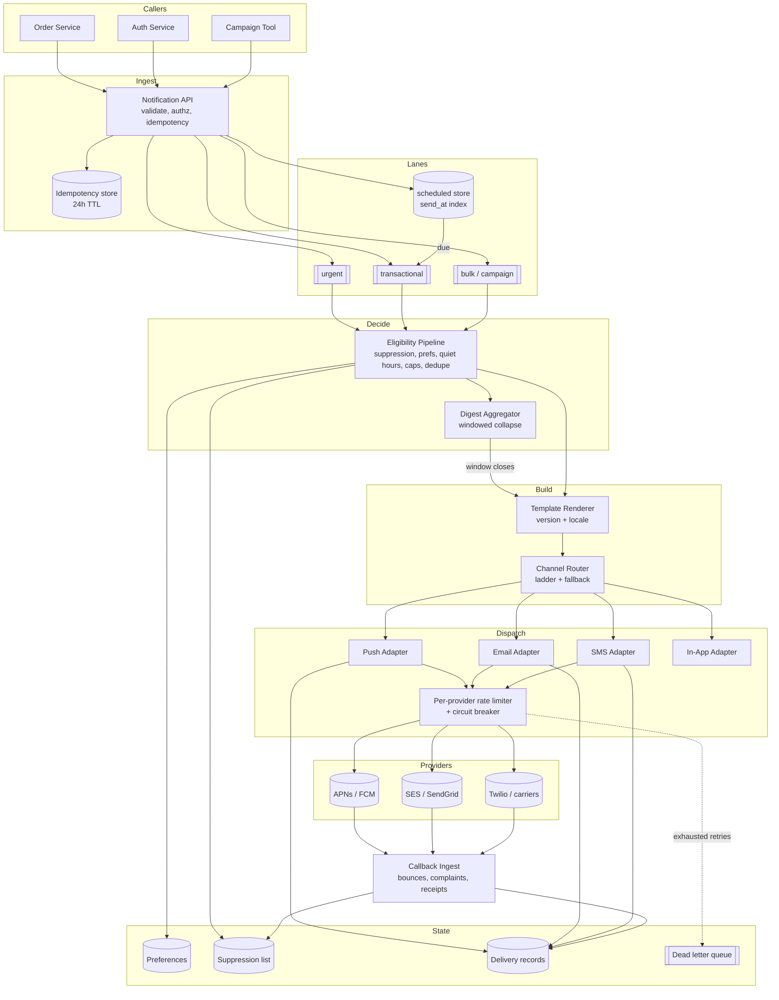

### Component responsibilities

| Component | Owns | Explicitly does not own |
|---|---|---|
| Notification API | Validation, authz, idempotency, lane selection, durable enqueue | Any provider contact |
| Scheduler | `send_at` materialisation, timezone maths | Eligibility |
| Eligibility pipeline | Whether to send, on which channels, now or later | How to render or transmit |
| Digest aggregator | Windowed collapse of related events | Delivery |
| Template renderer | Versioned, localised content; per-channel variants | Recipient policy |
| Channel router | Ladder, fallback, per-channel identity lookup | Provider protocols |
| Channel adapters | Provider protocol, batching, error mapping | Business rules |
| Rate limiter / breaker | Provider quota shaping, failover | Message content |
| Callback ingest | Provider webhooks → delivery state and suppressions | Sending |
| Suppression store | The list nothing may bypass | Preferences (a different thing) |

**Why the accept path does nothing but enqueue.** The caller is a service in
someone's request path. If accepting a notification means talking to a provider,
then every provider's p99 becomes the caller's p99 and every provider outage
becomes a caller outage. The queue is not there for throughput — at 700/s we do
not need one — it is there as **a failure boundary**. That is the single most
important structural decision in this document.

**Why lanes rather than one queue with priorities.** In-queue priority still
shares consumer capacity, connection pools and provider quota, so a campaign can
still starve a one-time password by holding every worker. Physically separate
queues with separately-sized worker pools and separate provider credentials make
isolation a property of the topology rather than of a scheduling policy that is
correct only until someone tunes it.

---

## 7. Data Model

### 7.1 Entities

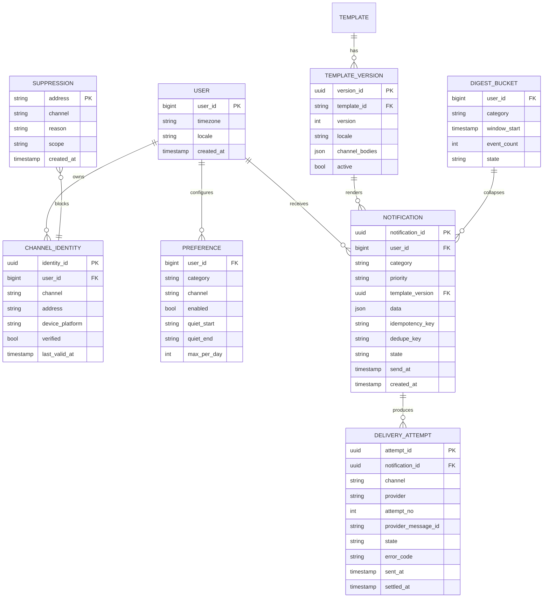

### 7.2 Partitioning and access patterns

| Table | Partition key | Why |
|---|---|---|
| `NOTIFICATION` | `notification_id` hash | Point lookups by ID; no range queries needed |
| `DELIVERY_ATTEMPT` | `notification_id` | Attempts are always read with their notification |
| Per-user timeline | `(user_id, created_at DESC)` | The in-app inbox; a range scan per user |
| `PREFERENCE` | `user_id` | Read on every send; cached hard |
| `SUPPRESSION` | `(channel, address)` | Read on every send; must be O(1) |
| `DIGEST_BUCKET` | `(user_id, category, window)` | Read-modify-write within a window |
| Scheduled sends | `send_at` bucketed per minute | Range scan "everything due now" |

### 7.3 Suppression is not a preference

These two are constantly conflated and they behave differently in ways that
matter legally:

| | Preference | Suppression |
|---|---|---|
| Set by | User, per category and channel | Bounces, complaints, unsubscribes, legal holds |
| Granularity | Category × channel | Address, global for that address |
| Overridable by transactional sends? | **Yes**, for security-critical messages | **Never** for hard bounce or complaint |
| Failure mode if wrong | Annoyed user | Blocked domain, regulatory exposure |
| Storage | Row per (user, category, channel) | Flat key-value, plus a Bloom filter in front |

A hard bounce means the address does not exist — retrying is not merely
impolite, it degrades your sending reputation with every attempt. A spam
complaint means the recipient pressed the button; continuing to send is what
gets a sending domain blocklisted. Neither is a preference, and neither is
overridable by a caller marking a message "important".

Marketing opt-out is a third case: it blocks the marketing category but must not
block a password reset. That is why suppression carries a `scope`
(`marketing` | `all`) rather than being a boolean.

### 7.4 Templates are versioned and immutable

A rendered notification records the **template version** it used, not the
template. Someone will edit a template on a Tuesday and ask on Thursday what the
Monday email said; without version pinning the answer is unknowable. Immutable
versions also make rollback a pointer change and let a campaign that spans four
hours render consistently even if someone edits the template halfway through.

---

## 8. The Eligibility Pipeline

This is the chapter that makes the system a notification *service* rather than a
message relay. Every notification passes through an ordered sequence of gates,
and **order is a design decision**: cheapest and most binding first.

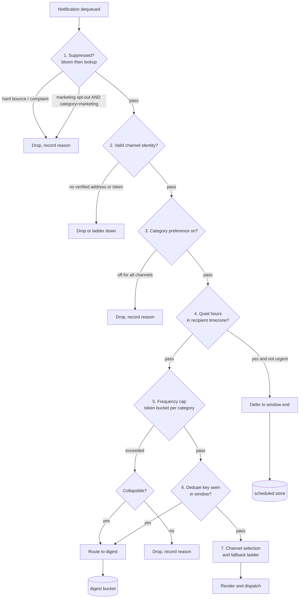

### 8.1 Why this order

- **Suppression first** because it is legally binding and the cheapest check —
  a Bloom filter rejects the common case with no I/O. Nothing downstream can
  overturn it, so evaluating anything before it is wasted work.
- **Identity before preferences**: no point consulting preferences for a channel
  the user has no address on.
- **Quiet hours before frequency caps** because a deferred notification should
  not consume a cap it may not need at all.
- **Dedupe last among the filters**, because it needs the surviving set to
  collapse against.

### 8.2 Urgency overrides, and their limits

| Gate | `urgent` (OTP, security) | `transactional` | `bulk` |
|---|---|---|---|
| Hard bounce / complaint suppression | **No override** | No override | No override |
| Marketing opt-out | Not applicable | Not applicable | Blocks |
| Category preference | Override allowed | Respected | Respected |
| Quiet hours | Override allowed | Deferred | Deferred |
| Frequency cap | Exempt | Counted | Counted and capped |
| Digesting | Never | Sometimes | Usually |

The one-time-password case is the reason overrides exist at all: a user who
turned off "account notifications" still needs their login code. Equally, the
override list is short and enumerated in code, not a boolean the caller sets —
otherwise every team marks its notifications urgent within a quarter.

### 8.3 Quiet hours are a timezone problem

Quiet hours are stored per user as local wall-clock times plus an IANA timezone,
never as UTC offsets. Offsets change twice a year in half the world, and a
notification deferred to "22:00 UTC+1" fires an hour wrong after a DST
transition. Deferral computes the next local window end at evaluation time.

"Send at 9am local to 50 M users" is therefore not one send — it is **24-plus
waves**, one per timezone, which is also a natural way to shape a campaign
against a provider quota. A constraint and a mitigation in the same mechanism.

### 8.4 Frequency caps

A token bucket per `(user, category)` — the same mechanism as
[Rate Limiter](002-rate-limiter.md), applied to human attention rather than API
quota. Typical shape: 1 notification per category per 5 minutes, 10 per day,
with a global ceiling across categories so that ten well-behaved categories
cannot combine into a bad day.

Crucially, **exceeding a cap routes to digest rather than dropping** where the
category allows it. Dropping loses information the user wanted; digesting
delivers it at a tolerable rate. Dropping is reserved for the genuinely
worthless.

### 8.5 Channel selection and the fallback ladder

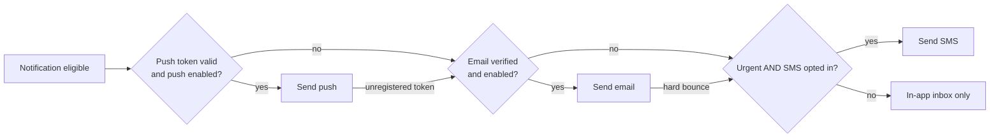

The ladder runs cheapest-first for a reason that is not only economic: push is
free, revocable, and low-friction; SMS costs real money, cannot be unsent, and
is regulated. Falling *up* the ladder — SMS because push failed — is how a
service accidentally spends $26 000 in an afternoon.

Note the `PUSH -->|unregistered token| E` edge. Provider feedback that a token is
dead arrives *after* the send attempt, so the ladder is partly reactive: the
attempt fails, the token is pruned (Section 9.7), and the notification descends
one rung.

---

## 9. Dynamic Workflows

### 9.1 Transactional send, end to end

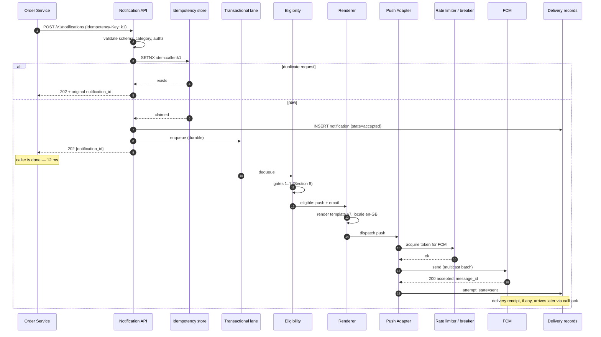

**The caller's involvement ends at step 8.** Everything after is asynchronous
and retryable, and none of it can hurt the order service. The 202 is returned
after the durable insert *and* the enqueue, in that order — acknowledging before
durability would make the tick a lie, exactly as in [Chat](004-chat-system.md).

### 9.2 Provider failure, retries, and failover

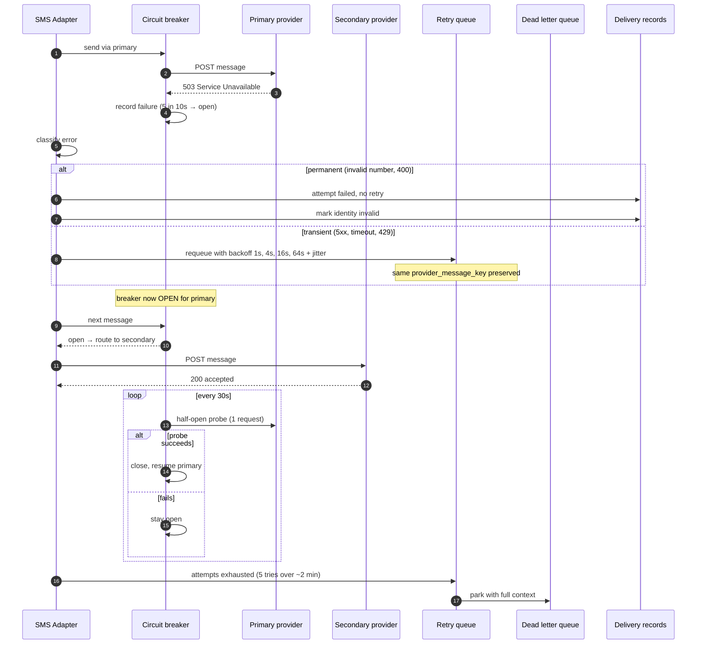

Three things this gets right:

- **Errors are classified before they are retried.** Retrying a 400 "invalid
  phone number" five times produces five identical failures, five provider
  charges in some pricing models, and zero chance of success. The error taxonomy
  per provider — permanent, transient, throttled, auth — is real work and it is
  where most naive implementations are wrong.
- **429 is not an error, it is instruction.** A throttle response should adjust
  the local rate limiter's fill rate, not merely schedule a retry; otherwise the
  system retries into the same wall at the same rate.
- **The DLQ is a queue with an owner, not a graveyard.** Messages land there with
  full context, an alert fires on depth, and there is a documented replay path.
  A DLQ nobody reads is a data loss mechanism with extra steps.

**Retry safety** depends on the provider's own idempotency support. Where a
provider accepts a client-supplied key (most do), pass a deterministic one
derived from `(notification_id, channel, attempt_group)` — so a retry after an
ambiguous timeout cannot produce a second SMS. Where it does not, the honest
answer is that an ambiguous timeout on the last attempt is a genuine
at-least-once risk, and the mitigation is to prefer *not sending* over *sending
twice* for anything marketing, and the reverse for OTPs.

### 9.3 Bounces, complaints, and suppression

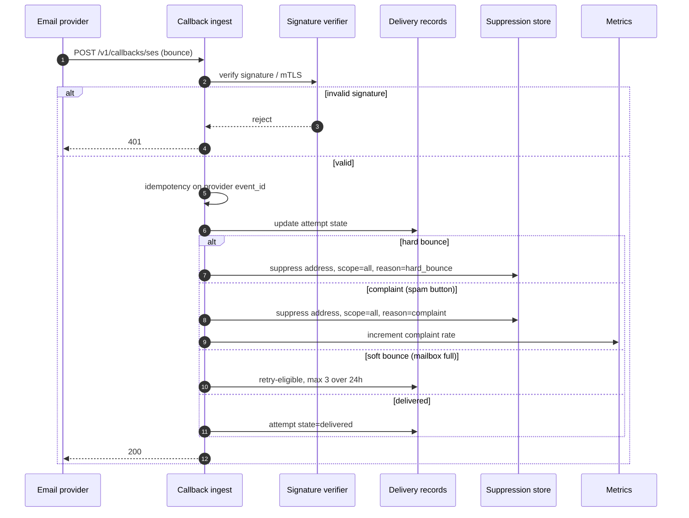

**Callback endpoints are public, unauthenticated-by-default surfaces that mutate
the suppression list.** Signature verification is not optional: without it,
anyone who learns the URL can suppress arbitrary addresses — a denial of service
against your own users that also looks exactly like normal operation.

Provider callbacks are also **at-least-once and out of order**. A "delivered"
can arrive after a "bounced" for the same message. Delivery state transitions
must therefore be idempotent and ordered by the provider's event timestamp, not
by arrival — the same monotonic-state discipline as the chat delivery cursors.

Complaint rate is the metric that matters most on this path: mailbox providers
begin throttling around **0.1%**, so it needs an alert well below the threshold
that triggers someone else's automated decision about your domain.

### 9.4 Campaign fanout

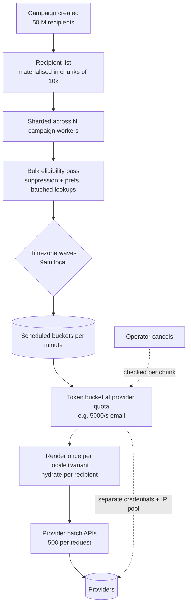

Four decisions worth stating explicitly:

- **The campaign lane has its own workers, its own provider credentials, and its
  own IP pool.** Reputation is per-IP; mixing a marketing blast with password
  resets on one IP pool means a bad campaign delays password resets at every
  mailbox provider. This is the deliverability equivalent of the noisy-neighbour
  problem.
- **Eligibility is evaluated in bulk with batched lookups**, not one round trip
  per recipient. 50 M individual suppression lookups is a different system from
  50 M/10 000 = 5 000 batched ones.
- **Render once per (locale, variant), hydrate per recipient.** The expensive
  part of rendering is template compilation, not variable substitution; doing it
  50 M times is the easiest 100× win in the system.
- **Cancellation is checked per chunk.** A campaign that cannot be stopped
  halfway is a liability — the most valuable button in a marketing tool is the
  one that stops a mistake at 3 M sent instead of 50 M.

### 9.5 Digesting

```mermaid
sequenceDiagram
  autonumber
  participant E1 as Event 1 (reply)
  participant EL as Eligibility
  participant B as Digest bucket (user, category)
  participant T as Window timer
  participant RN as Renderer
  participant U as User

  E1->>EL: notification
  EL->>EL: frequency cap not exceeded
  EL->>U: send immediately (first one is the valuable one)
  Note over B,T: window opens: 5 min, extendable to 30 min
  loop events 2..40 within window
    EL->>B: increment count, append summary data
    B->>B: no send
  end
  T->>B: window closes
  B->>RN: render digest ("39 more replies on ...")
  RN->>U: one notification
  B->>B: reset; next event starts a new window
```

The first notification goes out immediately and the rest collapse. That
asymmetry matters: a digest-everything policy makes the product feel dead, while
a send-everything policy makes it unusable. The first event is almost always the
informative one; events 2 through 40 are confirmation that something is busy,
which one summary conveys better than forty pings.

Windows are **per (user, category)** and extend on activity up to a ceiling, so a
thread that stays hot produces a digest every 30 minutes rather than a rolling
stream of 5-minute digests.

### 9.6 Scheduled sends

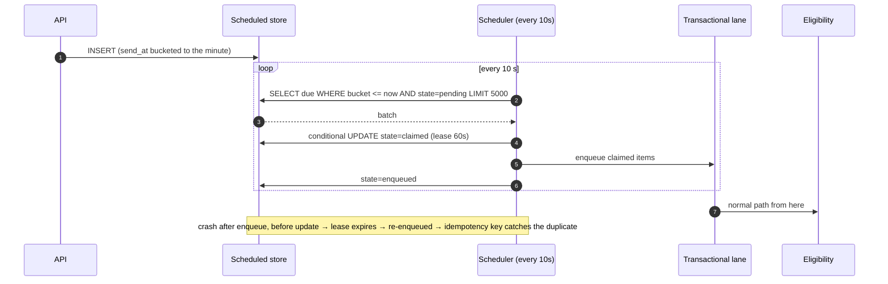

The scheduler is deliberately dumb: claim with a lease, enqueue, mark. It can
double-fire after a crash, and that is fine **because the idempotency key
downstream makes a double-fire a no-op**. Building an exactly-once scheduler is
significantly harder than building an at-least-once one behind an idempotent
consumer, and the second design is the one that survives contact with an
operator restarting a pod. See Job Scheduler for the
general case.

Eligibility is evaluated **at send time, not at schedule time**. A user who
unsubscribes at 14:00 must not receive the message they became eligible for at
09:00. This is easy to get wrong when scheduling is implemented as "render and
park".

### 9.7 Device token lifecycle

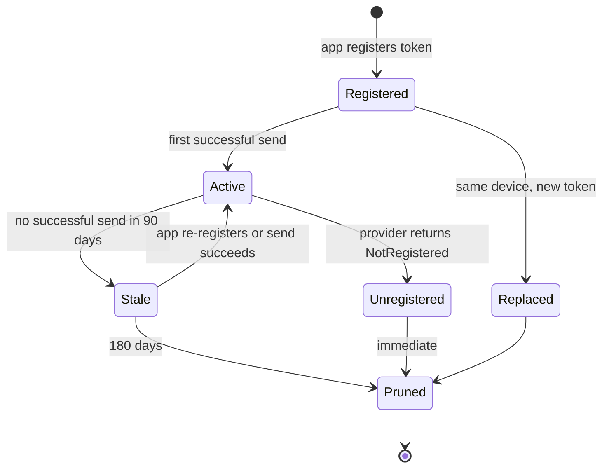

Tokens rot constantly — reinstalls, OS updates, app removals. An unpruned token
table means sending to addresses that cannot receive, which wastes quota and
pollutes the delivery metrics with permanent failures that look like an
incident. The provider tells you (`NotRegistered`, `InvalidRegistration`) and the
only correct response is to delete, immediately, on the first such response.

---

## 10. Notification Lifecycle

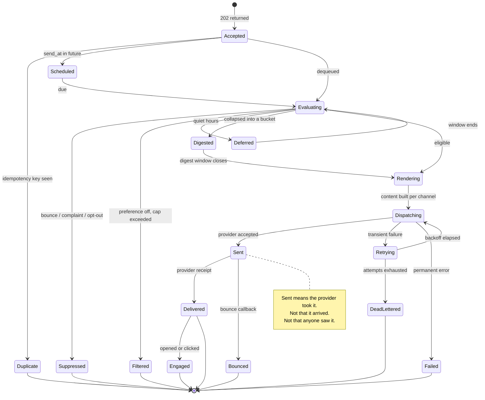

`Suppressed` and `Filtered` are terminal states that are **recorded, not
discarded**. "Why didn't my user get the email?" is the single most common
support question this system receives, and the answer must be a lookup — "capped
at 14:03 by the daily limit for category `social`" — rather than an
investigation. Notifications that were deliberately not sent are as
operationally interesting as ones that were.

---

## 11. Low-Level Design

### 11.1 Service objects

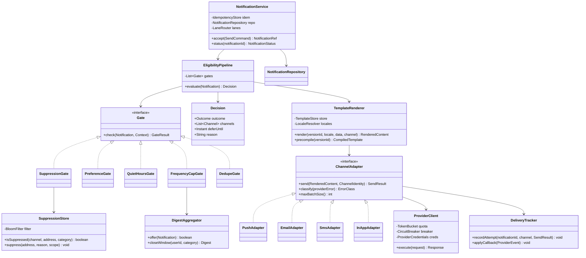

`Gate` as an interface is not ceremony: gates are added, reordered, and disabled
per environment far more often than anything else in this system, and each one
is independently testable against a `Context`. `ChannelAdapter` is the seam where
a second SMS provider — or a test double that asserts instead of sending —
substitutes without touching a line of business logic.

### 11.2 Accept, in code shape

```
function accept(cmd, caller):
    validate(cmd)                                        # schema, category exists, template exists
    require(caller.mayUseCategory(cmd.category), FORBIDDEN)

    if cmd.idempotencyKey:
        claimed = idem.claim(caller.id, cmd.idempotencyKey, TTL_24H)
        if not claimed:
            return idem.lookup(caller.id, cmd.idempotencyKey)   # same id, same answer

    n = Notification(uuid(), cmd.userId, cmd.category, cmd.priority,
                     templates.activeVersion(cmd.templateId), cmd.data,
                     cmd.dedupeKey, cmd.sendAt, state = ACCEPTED)

    repo.insert(n)                                       # durable BEFORE the enqueue
    if cmd.sendAt and cmd.sendAt > now():
        scheduled.insert(n.id, bucketOf(cmd.sendAt))
    else:
        lanes.of(cmd.priority).enqueue(n.id)             # urgent | transactional | bulk

    idem.bind(caller.id, cmd.idempotencyKey, n.id)
    return NotificationRef(n.id)                         # 202
```

The insert precedes the enqueue so that a crash between them leaves a row in
`accepted` state that a sweeper re-enqueues, rather than a queue entry pointing
at a row that does not exist. **Order writes so the recoverable failure is the
one that happens** — the same principle as blob-before-metadata in
[Pastebin](003-pastebin.md).

### 11.3 Deliver, in code shape

```
function deliver(notificationId):
    n = repo.load(notificationId)
    if n.state in (SENT, SUPPRESSED, FILTERED): return       # idempotent replay

    decision = eligibility.evaluate(n)                       # gates 1..7
    switch decision.outcome:
      SUPPRESS: repo.terminal(n, SUPPRESSED, decision.reason); return
      FILTER:   repo.terminal(n, FILTERED,   decision.reason); return
      DEFER:    scheduled.insert(n.id, bucketOf(decision.deferUntil)); return
      DIGEST:   digests.offer(n); return
      SEND:     pass

    for channel in decision.channels:                        # ladder order
        identity = identities.forChannel(n.userId, channel)
        content  = renderer.render(n.templateVersion, user.locale, n.data, channel)
        result   = adapters[channel].send(content, identity)

        tracker.recordAttempt(n.id, channel, result)
        switch adapters[channel].classify(result):
          OK:         repo.mark(n, SENT); return             # ladder stops at first success
          PERMANENT:  identities.invalidate(identity); continue   # descend the ladder
          THROTTLED:  quota.slowDown(channel); retry.schedule(n, backoff(n.attempt)); return
          TRANSIENT:  retry.schedule(n, backoff(n.attempt)); return

    repo.mark(n, FAILED)                                     # ladder exhausted
```

Two details worth defending: the **state check at the top makes redelivery from
the queue harmless**, which is what allows an at-least-once queue underneath;
and **eligibility is re-evaluated on every attempt**, so a retry three minutes
later respects an unsubscribe that happened two minutes ago.

### 11.4 Concurrency inventory

| Race | Mechanism |
|---|---|
| Caller retries the same request | `SETNX` on `(caller, idempotency_key)`; loser returns the winner's id |
| Queue redelivers after a worker crash | Terminal-state check at the top of `deliver`; all writes idempotent |
| Two workers claim the same scheduled item | Conditional `UPDATE ... WHERE state='pending'` with a lease |
| Digest window closing while an event arrives | Conditional close on `(user, category, window_start)`; a late event opens the next window |
| Preference change mid-flight | Eligibility evaluated at send time, on every attempt |
| Suppression added while a campaign runs | Bulk pass re-checks per chunk, not once at campaign start |
| Duplicate provider callbacks | Idempotency on the provider's `event_id`; state transitions ordered by event timestamp |
| Two adapters exhausting one provider quota | Shared distributed token bucket keyed per provider account, not per worker |
| Token registered on two devices | Identity keyed by `(user, channel, address)`; re-registration replaces |

The pattern, again: **conditional transitions and idempotent writes everywhere**,
so that an at-least-once substrate produces at-most-once user-visible behaviour
without a single distributed lock.

---

## 12. Optimization

### 12.1 The accept path

Validation, an idempotency `SETNX`, one insert, one enqueue. Everything
else — preference lookups, rendering, provider contact — happens after the 202.
The measured budget is ~12 ms, and the only way to keep it there is to keep
refusing to add work to it. Every proposal to "just check preferences at accept
time so we can tell the caller" should be declined: it doubles the latency,
couples the caller to the preference store, and the answer would be stale by the
time the notification is actually sent.

### 12.2 Rendering

- **Precompile templates**, cache by `(version_id, locale, channel)`. Compilation
  is the expensive step; substitution is not.
- **Render once per variant in campaigns**, hydrate per recipient (Section 9.4).
- **Do not render for notifications that will be filtered.** Eligibility runs
  before rendering in the pipeline for exactly this reason — at a 40% filter
  rate that is 40% of rendering cost removed for free.

### 12.3 Provider interaction

- **Batch**: FCM multicast up to 500 tokens per request, SES bulk templated
  sends. A 42 M/day push volume becomes ~84 K requests.
- **Reuse connections**: HTTP/2 to APNs, persistent pools everywhere. TLS
  handshakes at 28 K/s cost more than the sends.
- **Shape to quota locally** with a distributed token bucket per provider
  account, so we throttle ourselves before the provider throttles us. Being
  429'd is strictly worse than waiting: it costs a round trip, it counts against
  reputation with some providers, and it arrives as an error that looks like an
  incident.
- **Regional endpoints** where the provider offers them.

### 12.4 Suppression checks

A Bloom filter in front of the suppression store, rebuilt hourly and updated
incrementally. Roughly 99% of sends are to non-suppressed addresses, so the
filter answers "definitely not suppressed" without I/O for almost everything and
the store is consulted only on a possible hit. False positives cost one lookup;
false negatives do not exist, which is the property that makes this safe for a
legally binding check.

### 12.5 Load shedding

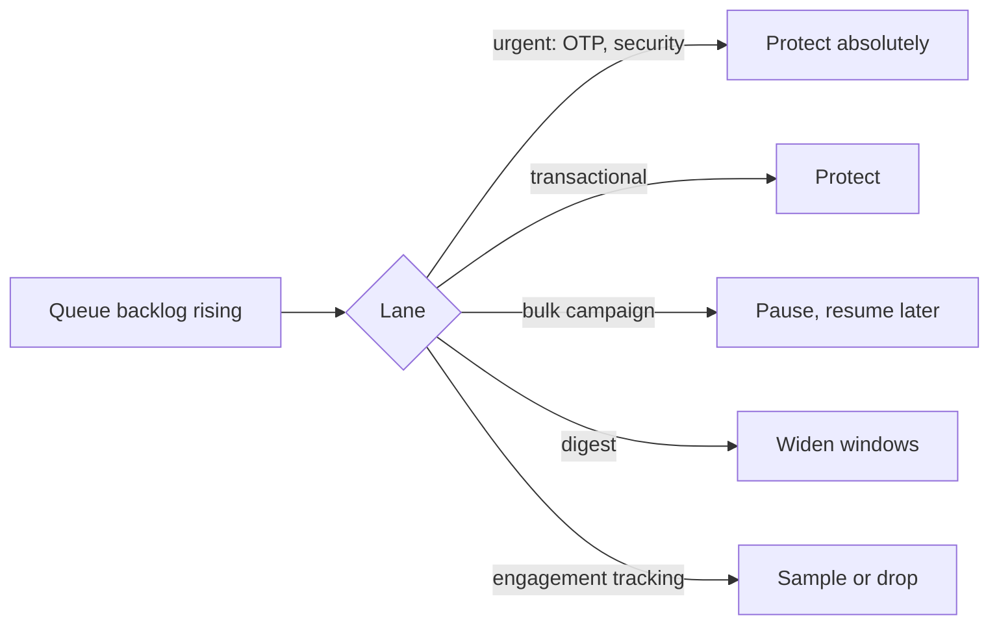

Campaigns are pausable by construction — they are already rate-shaped over
hours, so pausing one for ten minutes changes nothing a recipient would notice.
That makes bulk traffic the natural shock absorber for the whole system, and it
is only possible because the lanes are physically separate.

### 12.6 What deliberately is not optimized

- **Open and click tracking** is best-effort, sampled at high volume, and
  eventually consistent. It informs marketing decisions, not system behaviour.
- **Delivery record queries** are point lookups by ID; there is no general
  analytics query path over 70 M rows/day. Aggregates are precomputed hourly.
- **Digest content quality.** "39 more replies" beats a semantically clever
  summary that costs an LLM call per notification and fails at 2am.

---

## 13. Scaling and Failure Modes

### 13.1 Scaling levers, in the order you would pull them

1. **Add workers per lane** — stateless consumers, independently sized. Cheapest.
2. **Raise provider quotas** — usually a support ticket and a reputation
   history, and it is the actual ceiling (Section 4.3). Do this *before* adding
   workers that will only generate 429s.
3. **Add providers per channel** — a second SMS or email vendor buys both
   capacity and failover, at the cost of a second error taxonomy to maintain.
4. **Shard the preference and suppression stores by user/address hash** — both
   are pure key-value lookups.
5. **Regionalise** — providers, IP pools, and workers per region; recipients are
   naturally partitioned by geography, which makes this the rare easy
   regionalisation.

### 13.2 Failure matrix

| Failure | Blast radius | Behavior |
|---|---|---|
| One provider down | That channel | Circuit breaker opens, failover to secondary; ladder descends if none |
| All providers for a channel down | That channel | Queue backs up (retention sized for hours); other channels unaffected |
| Provider quota exhausted | That channel slows | Local token bucket paces; bulk lane pauses first, urgent unaffected |
| Queue backlog | Delivery latency | Shed per Section 12.5; alert on lane age, not depth |
| Preference store down | Cannot evaluate | **Fail closed for bulk, open for urgent.** Sending an OTP to someone who may have opted out beats failing a login; sending a campaign to someone who opted out is a compliance incident |
| Suppression store down | Cannot check | **Fail closed for everything.** No exceptions — this is the one dependency whose unavailability stops sending |
| Template service down | Cannot render | Serve last-known-good compiled templates from local cache |
| Callback endpoint down | Status goes stale | Providers retry for hours; state converges. Delivery itself is unaffected |
| Callback storm (post-campaign) | Ingest overwhelmed | Callbacks are buffered to a queue and processed asynchronously — never synchronously against the database |
| Poison message | One worker looping | Attempt counter on the message; DLQ after N; alert on DLQ depth |
| Scheduler double-fire | Duplicate sends | Idempotency key absorbs it (Section 9.6) |

The two `fail closed` rows are the interesting ones, and they point in different
directions on purpose. **Suppression failing open is a legal and reputational
event that cannot be undone**; a preference check failing open for an urgent
security message is a minor annoyance. Deciding this per-dependency, in advance,
rather than defaulting the whole system to one policy, is what the failure
matrix is for.

---

## 14. Security, Privacy, and Compliance

- **Verify provider callbacks.** Signature or mTLS on every callback endpoint;
  they mutate suppression state and are publicly reachable (Section 9.3).
- **Treat notification payloads as leaky.** Push previews render on a lock
  screen; email subject lines appear in previews on shared devices. For sensitive
  categories send a content-free notification and let the app fetch the detail
  after authentication — the same discipline E2EE forces in
  [Chat](004-chat-system.md).
- **Templates are code.** User-supplied data goes through the template engine's
  escaping, never string concatenation. A template engine with unsandboxed
  expression evaluation over caller-supplied data is server-side template
  injection with a friendly name.
- **Verify channel identities before use.** An unverified email or phone number
  is an unconfirmed claim about someone else's address, and sending to it is how
  a service becomes an abuse vector for harassment — attacker supplies victim's
  number, your platform sends the message.
- **One-click unsubscribe** that works without login and takes effect
  immediately, including `List-Unsubscribe` and `List-Unsubscribe-Post` headers.
  Mailbox providers increasingly require it, and a slow unsubscribe converts into
  a spam complaint, which is far more damaging.
- **Consent is recorded with provenance** — when, how, from what IP, under which
  terms version. "We believe they opted in" is not a defence.
- **Quiet hours and consent rules are jurisdictional.** SMS in particular is
  heavily regulated, and the rules follow the recipient, not the sender.
- **Right to erasure**: deleting a user must purge identities and payload data
  while retaining the suppression entry — hashed, if the address itself must go.
  Deleting a suppression during a GDPR erasure is how a complained-about address
  starts receiving mail again.
- **Sending reputation is a shared, global resource.** Separate IP pools per
  traffic class (Section 9.4), authenticate with SPF/DKIM/DMARC, warm new IPs
  gradually. One bad campaign on a shared pool degrades password-reset
  deliverability for every user, and recovery takes weeks.

---

## 15. Monitoring

| Signal | Why it matters | Alert on |
|---|---|---|
| Accept latency p99 | The caller-visible contract | > 50 ms |
| Lane age (oldest unprocessed) | Backlog in time, not items — the number that maps to user impact | urgent > 5 s, transactional > 60 s |
| Accept → provider-accepted p99 by lane | End-to-end health | transactional > 10 s |
| Provider accept rate by provider/channel | Leading indicator of a provider problem | < 98% |
| Provider error breakdown by class | Distinguishes "their outage" from "our bad data" | Shift in mix |
| **Complaint rate** | Mailbox providers throttle around 0.1% | > 0.05% |
| Hard bounce rate | Address quality; also a reputation input | > 2% |
| Duplicate send rate (per user, per dedupe key) | The cardinal sin; should be ~zero | Any sustained non-zero |
| Suppression list growth | Sudden growth means a bad list or a bad template | 3× baseline |
| DLQ depth and age | Undelivered work with an owner | Any growth sustained 15 min |
| Filtered/suppressed ratio by category | Over-sending, or a preference bug | Sharp change either way |
| Campaign completion rate and pace | Whether the quota maths held | Behind schedule by 20% |
| Cost per channel per day | SMS is 75× email | Daily spend > 1.5× trailing average |

**Alert on lane age, not queue depth.** A depth of 100 000 is fine for the bulk
lane and a catastrophe for the urgent lane; age normalises across lanes and maps
directly to what a user experiences. **Duplicate send rate and complaint rate**
are the two where the target is not "low" but "essentially none" — they are the
metrics that tell you the system is harming the thing it exists to protect.

---

## 16. Trade-offs Summary

| Decision | Benefit | Cost |
|---|---|---|
| Accept-then-deliver via queues | Callers never wait on or fail with a provider | Status is asynchronous; callers must poll or subscribe |
| Physically separate lanes | A 50 M campaign cannot delay an OTP | More queues, workers, and credentials to operate |
| Eligibility before rendering | 40% of render cost never incurred | Cannot show the caller a preview at accept time |
| Eligibility at send time, not schedule time | Honours late preference and opt-out changes | Re-evaluated on every attempt; more lookups |
| Suppression separate from preferences | Legally binding checks cannot be overridden | Two stores and a clear rule about which wins |
| Digest instead of drop when capped | Information preserved, attention protected | Delayed delivery; windowing state to maintain |
| Cheapest-first fallback ladder | Cost and friction controlled | Urgent messages may take an extra hop to arrive |
| At-least-once queue + idempotency | Simple, crash-safe, no distributed locks | Every consumer must be idempotent — a discipline, not a library |
| Immutable versioned templates | Auditable, rollback is a pointer change | Version proliferation; a cleanup job |
| Bloom filter on suppression | Removes I/O from the hot check | Rebuild pipeline; false positives cost a lookup |
| Separate IP pools per traffic class | Marketing cannot damage transactional deliverability | More IPs to warm and monitor |
| Detail records at 90 days, aggregates forever | Storage bounded at ~3 TB hot | Cannot answer per-message questions about last year |
| Provider abstraction behind adapters | Failover and second vendors are configuration | An error taxonomy to maintain per provider |

---

## 17. Interview Deep Dives

Where this conversation usually goes next:

- **"How do you guarantee a user never gets the same notification twice?"**
  Idempotency key vs dedupe key, terminal-state checks on redelivery, provider-side
  idempotency, and the honest admission about ambiguous timeouts on a final
  attempt (Section 9.2).
- **"A provider is down for two hours."** Circuit breakers, error classification,
  backoff with jitter, failover, queue retention sizing, and which lanes you pause.
- **"Send 50 M emails at 9am."** The quota arithmetic of Section 4.3, timezone
  waves, rate shaping, IP pools, and renegotiating the requirement rather than
  accepting it.
- **"Users say we send too much."** Frequency caps, digesting, the preference
  model, and why capping should usually digest rather than drop.
- **"How do you handle bounces and complaints?"** Callback verification, hard vs
  soft, the suppression list, and the 0.1% threshold that someone else enforces
  on you.
- **"Add a new channel — WhatsApp."** Tests whether the adapter boundary is real:
  new adapter, new error taxonomy, new consent rules, no changes to eligibility
  or rendering.
- **"What if the preference service is down?"** The fail-open/fail-closed split
  by traffic class, and why suppression is the one that never fails open.
- **"How do you let users control this?"** See
  Notification Preferences — category
  hierarchies, defaults, and the difference between "off" and "digest".

---

## 18. Key Takeaways

- **The hard part is deciding whether to send.** Delivery is plumbing; the
  eligibility pipeline — suppression, preferences, quiet hours, caps, dedupe — is
  where the product lives and where the compliance risk sits.
- **Accepting is not delivering.** A 202 and a durable enqueue put a failure
  boundary between your callers and every third party you depend on. Nothing
  else in this design matters as much.
- **You are quota-bound, not CPU-bound.** Do the provider arithmetic early; it
  will sometimes tell you the requirement is impossible, and that is the most
  valuable thing the capacity section can produce.
- **Isolate traffic classes physically.** In-queue priority is a policy that gets
  tuned away; separate queues, workers, credentials, and IP pools are a topology
  that keeps holding under load.
- **Suppression is not a preference.** One is a user's choice about categories,
  the other is a binding constraint written by bounces, complaints, and the law —
  and it is the single dependency that must fail closed.
- **Make every consumer idempotent and every state advance conditional**, and an
  at-least-once substrate delivers at-most-once notifications without a
  distributed lock anywhere in the system.
- **Restraint is a feature with a metric.** Complaint rate and duplicate-send
  rate measure whether the system is destroying the channel it depends on, and
  both should be effectively zero rather than merely low.
