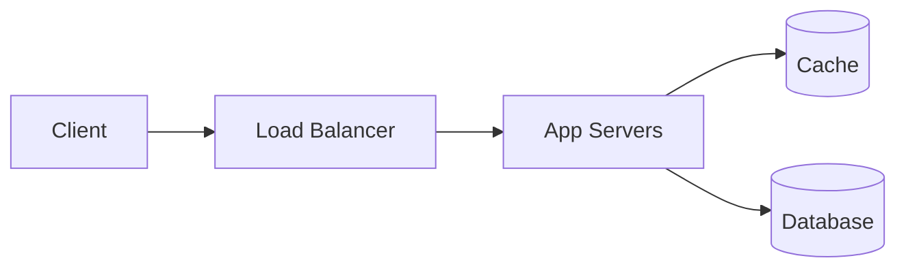
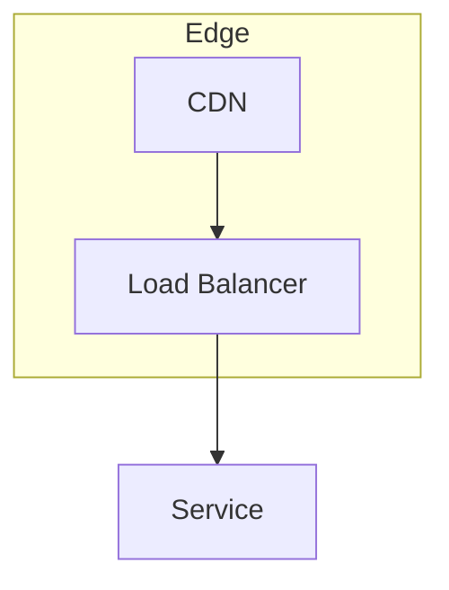

## Problem Statement

What are we building and why is it interesting at scale?

## Requirements

### Functional requirements

- …

### Non-functional requirements

- …

### Constraints & assumptions

- …

## Capacity Estimation

Back-of-the-envelope: traffic, storage, bandwidth, memory.

## High-Level Design

## API Design

| Endpoint | Method | Purpose |
|---|---|---|
| `/v1/...` | POST | … |

## Database Design

Schema, indexes, partitioning strategy.

## Deep Dives

### Scaling strategy

### Bottlenecks

### Trade-offs

> [!NOTE]
> Call out the key interview talking points here.

## Monitoring & Security

## Final Architecture

## References

- …

## Lessons Learned

- …
